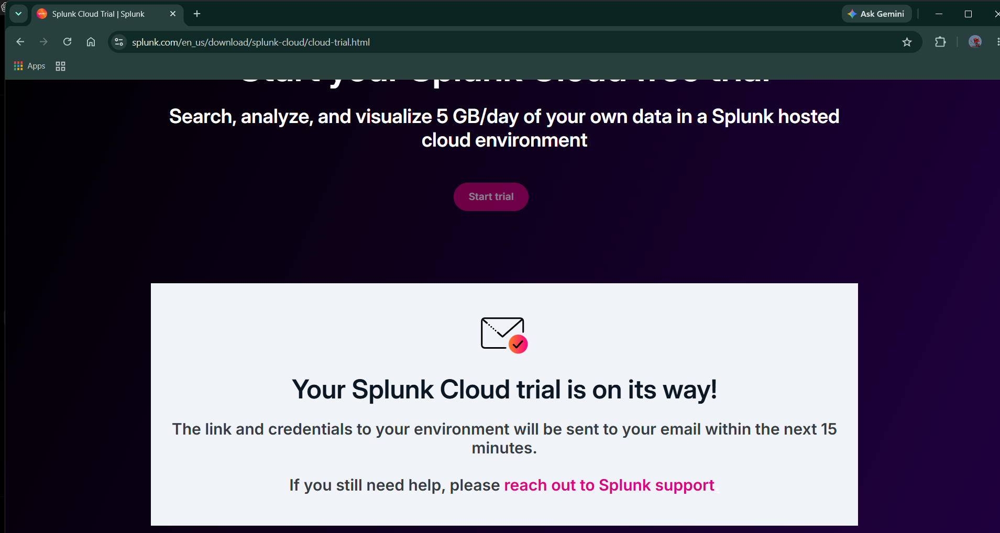
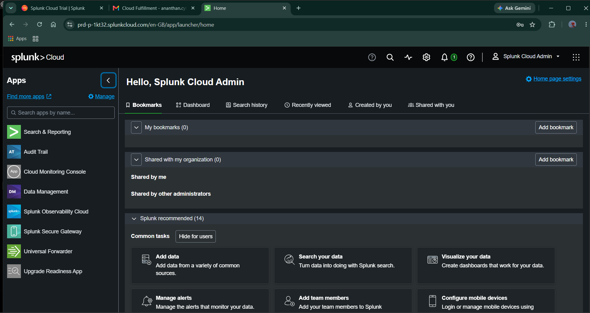
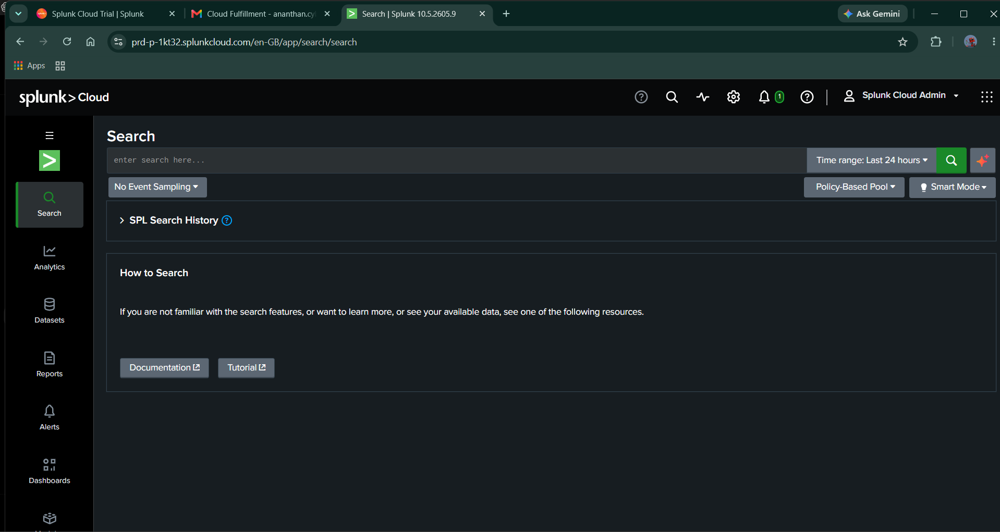
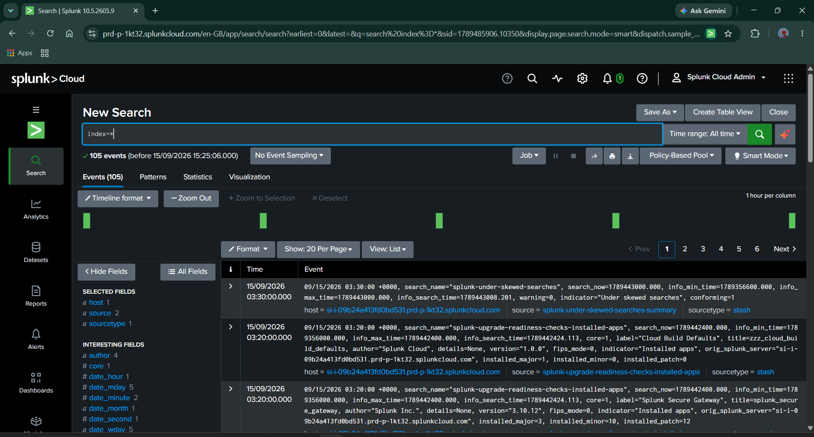
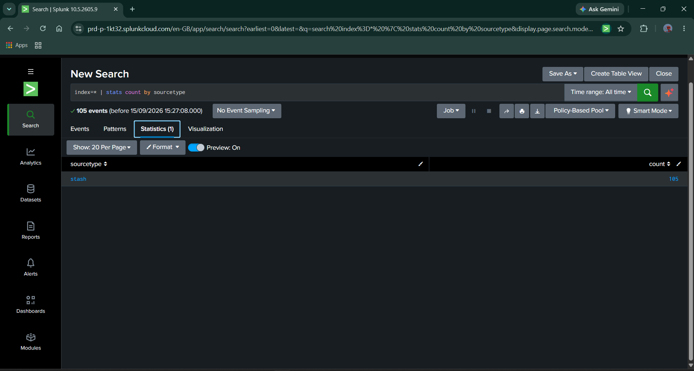

# Day 01 — Splunk Cloud Setup and Initial SPL Validation

## Project

**Project 4: Detection Engineering Lab**

## Objective

Set up and validate the Splunk Cloud environment, perform initial SPL searches, identify available data sources, and prepare for Windows Event Log collection.

---

## 1. Splunk Cloud Trial Request

### Activity

Submitted a request for a Splunk Cloud trial environment.

### Purpose

Splunk Cloud will be used as the central SIEM platform for collecting, searching, and analyzing security logs from the Windows 10 client and Active Directory Domain Controller.

### Evidence



---

## 2. Splunk Cloud Dashboard Access

### Activity

Opened the Splunk Cloud environment using the welcome email and successfully accessed the Splunk Cloud dashboard.

### Result

Splunk Cloud administrative access was successfully confirmed.

### Why This Matters

Splunk Cloud access is required to:

- Configure data collection
- Search security events
- Analyze log fields
- Create detection searches
- Build alerts and dashboards
- Validate detection rules

### Evidence



---

## 3. Search & Reporting Access

### Activity

Opened the **Search & Reporting** application in Splunk Cloud.

### Purpose

Search & Reporting is used to:

- Execute SPL queries
- Search indexed events
- Review event fields
- Identify sourcetypes
- Investigate suspicious activity
- Validate detection logic

### Evidence



---

## 4. First SPL Query

### Query

```spl
index=*
```

### Explanation

The `index=*` query searches all accessible indexes in Splunk.

It was used as an initial test to confirm that Splunk Cloud was accessible and that indexed events were available.

### Result

- **105 events returned**
- Time range: **All time**

### Observation

The returned events were mainly internal Splunk Cloud system events.

Windows Security logs were not available yet because the Windows log collector had not been installed or configured.

### Evidence



---

## 5. Available Sourtype Verification

### Query

```spl
index=* | stats count by sourcetype
```

### Explanation

The `stats count by sourcetype` command groups events by their sourcetype and displays the number of events in each group.

This helps identify the types of data currently available in Splunk.

### Result

| Sourcetype | Event Count |
|---|---:|
| `stash` | 105 |

### Observation

Only the `stash` sourcetype was present.

This indicates that Splunk Cloud currently contains internal Splunk data, but Windows Event Logs have not yet been ingested.

### Evidence



---

## 6. Windows Log Ingestion Method

### Activity

Reviewed the Splunk Cloud onboarding workflow for Microsoft Windows Event Logs.

### Selected Collection Method

**Forward data to Splunk indexers**

### Planned Components

The Windows log collection architecture will use:

1. Splunk Universal Forwarder installed on the Windows 10 client
2. Splunk Add-on for Windows
3. Windows Event Log inputs
4. Secure forwarding to Splunk Cloud
5. SPL searches for validation

### Reason for This Design

The Universal Forwarder is lightweight and suitable for collecting Windows security telemetry without installing another heavy SIEM server on the laptop.

---

## Day 1 Results

| Activity | Status |
|---|---|
| Splunk Cloud trial request | Completed |
| Splunk Cloud dashboard access | Completed |
| Search & Reporting access | Completed |
| First SPL query | Completed |
| Sourcetype verification | Completed |
| Windows ingestion method identified | Completed |
| Universal Forwarder installation | Planned for Day 2 |
| Windows Security log ingestion | Planned for Day 2 |
| Detection rule testing | Planned for later stages |

---

## Key Learnings

- Splunk Cloud will function as the central SIEM platform.
- SPL is used to search and analyze machine-generated data.
- `index=*` searches all accessible indexes.
- `stats count by sourcetype` identifies available log types.
- The `stash` sourcetype represents internal Splunk data in the current environment.
- Windows Security events will appear only after configuring a Windows log collector.
- Detection engineering depends on reliable log collection before detection rules can be tested.

---

## Interview Knowledge

### What is SPL?

Search Processing Language, or SPL, is Splunk's query language used to search, filter, transform, and analyze machine-generated data.

### Why did you run `index=*`?

I used `index=*` as an initial validation query to confirm that Splunk Cloud was accessible and that indexed events were available.

### Why did you check sourcetypes?

I checked sourcetypes to identify the types of data currently available in Splunk and to determine whether Windows security telemetry had been ingested.

### Why were Windows events not visible?

Windows events were not visible because the Windows 10 client had not yet been configured with the Splunk Universal Forwarder and Windows Event Log inputs.

### What is the next step?

The next step is to install and configure the Splunk Universal Forwarder on the Windows 10 client and forward Windows Security, System, and Application logs to Splunk Cloud.

---

## Day 1 Conclusion

Day 1 successfully established the Splunk Cloud environment and confirmed that SPL searches were working.

The environment currently contains internal Splunk events only. Windows security telemetry will be collected and validated during Day 2.

**Day 1 Practical Work: Completed**

**Next Phase: Windows Log Collection and Universal Forwarder Installation**