# Day 02 — Windows Security Log Ingestion and Splunk Validation

## Objective

The objective of Day 02 was to prepare the Windows 10 endpoint for security monitoring, configure the Splunk Universal Forwarder, connect it to Splunk Cloud, and verify that Windows Security Event Logs were successfully indexed and searchable.

---

## Lab Environment

| Component | Details |
|---|---|
| Host Operating System | Windows 11 |
| Monitored Endpoint | Windows 10 Client VM |
| SIEM Platform | Splunk Cloud |
| Log Collection Agent | Splunk Universal Forwarder 10.4.3 |
| Log Source | Windows Security Event Log |
| Splunk Index | `main` |
| Sourcetype | `WinEventLog:Security` |
| Forwarding Port | `9997` over SSL |

---

## What I Learned

### What is Splunk Universal Forwarder?

Splunk Universal Forwarder is a lightweight agent installed on an endpoint to collect and forward machine data to Splunk.

In this project, the Universal Forwarder collects Windows Security Event Logs from the Windows 10 client and sends them to Splunk Cloud.

### Why is log forwarding important?

A SIEM cannot detect suspicious activity if the required logs are not available.

The detection workflow is:

```text
Windows Activity
        ↓
Windows Security Event Logs
        ↓
Splunk Universal Forwarder
        ↓
Splunk Cloud
        ↓
SPL Search
        ↓
Detection Engineering
```

---

## Tasks Completed

### 1. Verified the Windows Operating System

The Windows version was checked to confirm the monitored endpoint.

**Evidence:**

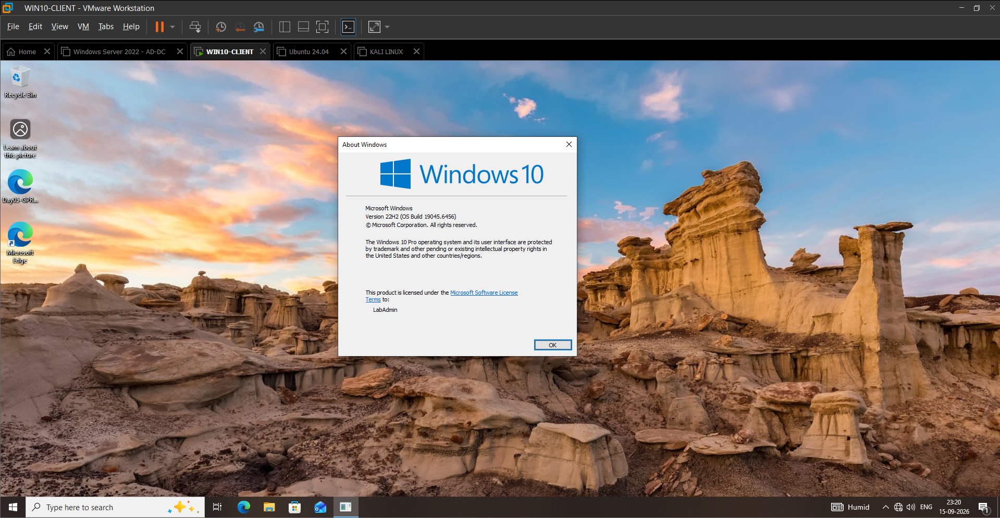

---

### 2. Verified the Windows Event Log Service

The Windows Event Log service was checked because Windows Security events depend on this service.

**Evidence:**

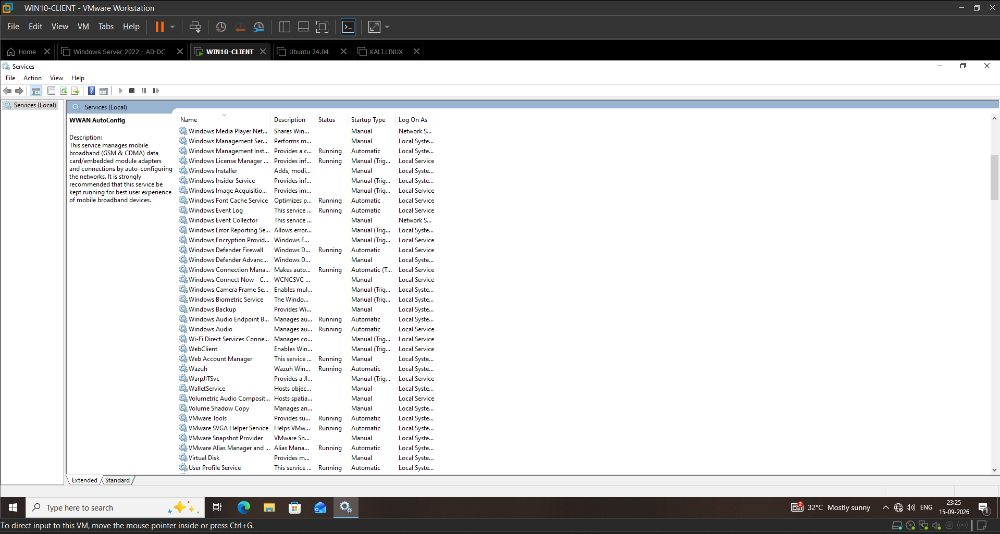

---

### 3. Verified Windows Firewall Status

The Windows Firewall status was checked as part of the endpoint network and security preparation.

**Evidence:**

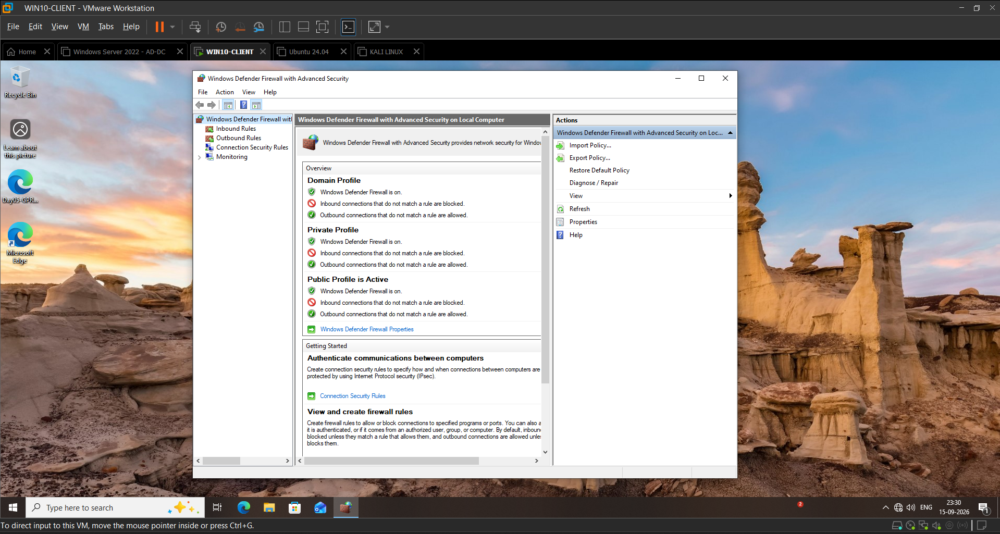

---

### 4. Verified Administrator Access

Administrator access was verified because installing and configuring the Splunk Universal Forwarder requires elevated privileges.

**Evidence:**

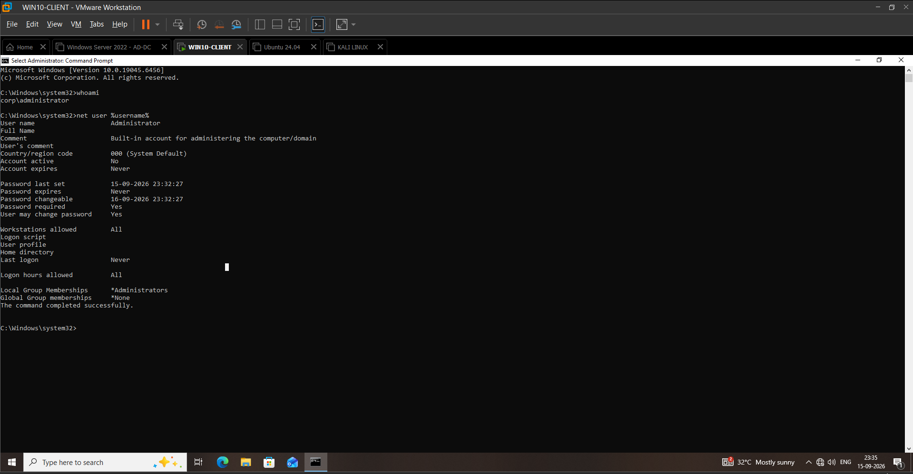

---

### 5. Verified Windows Network Information

The Windows endpoint network configuration was checked to confirm connectivity with the lab environment and Splunk Cloud.

**Evidence:**


---

### 6. Verified Network Connectivity

Network connectivity was tested before configuring the forwarding destination.

**Evidence:**

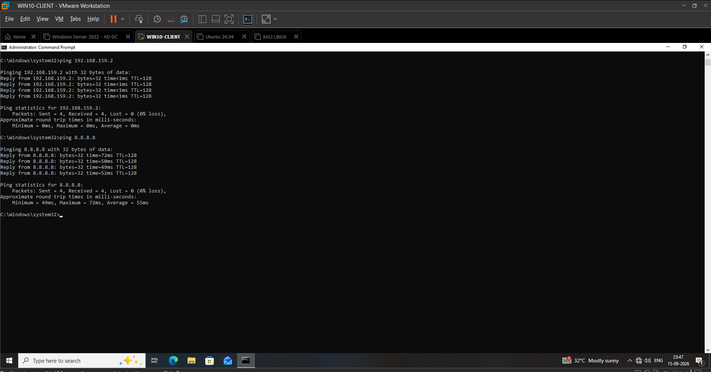

---

### 7. Verified Splunk Universal Forwarder Installation

The Splunk Universal Forwarder installation was verified on the Windows endpoint.

The Splunk Universal Forwarder service was checked using PowerShell:

```powershell
Get-Service SplunkForwarder
```

Result:

```text
Status   Name             DisplayName
Running  SplunkForwarder  SplunkForwarder
```

### Verification

The Splunk Universal Forwarder service was running successfully.

**Evidence:**

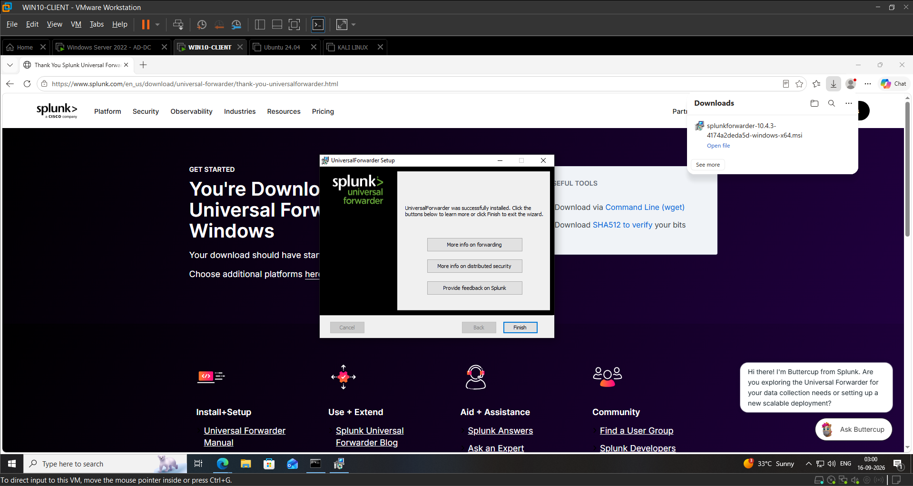

---

### 8. Verified HEC Token Configuration

The HTTP Event Collector configuration was created and verified as part of the Splunk data-ingestion setup.

**Evidence:**

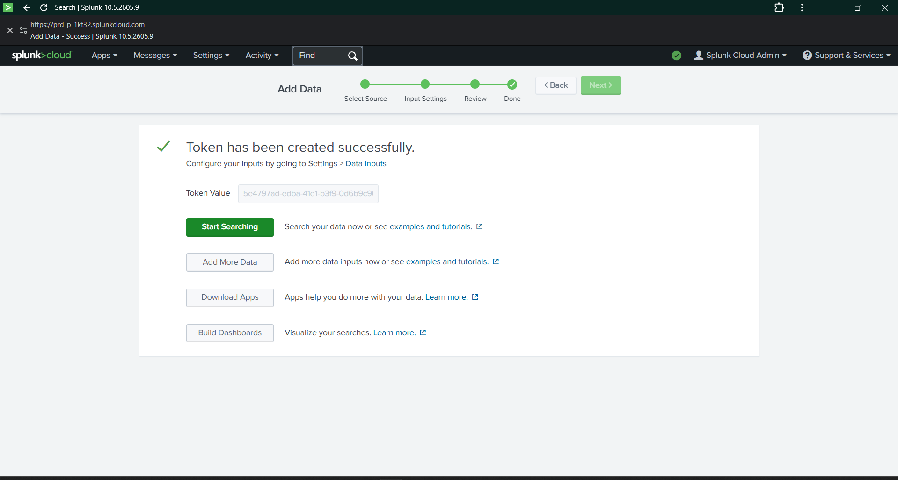

---

### 9. Verified Windows Security Logs in Splunk Cloud

The Splunk Cloud Search & Reporting application was opened to verify that Windows Security logs were being indexed.

The following SPL search was executed:

```spl
index=main sourcetype="WinEventLog:Security"
```

The search returned Windows Security events.

### Verification

Windows Security logs were successfully received and indexed in Splunk Cloud.

**Evidence:**

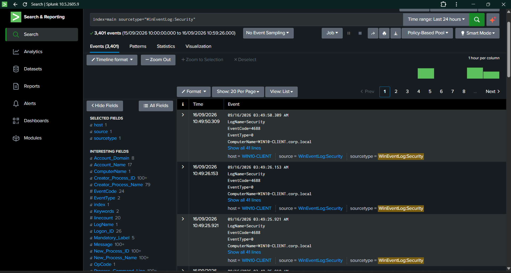

---

## SPL Queries Tested

### 10. Failed Logon Events — Event ID 4625

The following SPL query was used:

```spl
index=main sourcetype="WinEventLog:Security" EventCode=4625
```

Result:

```text
29 events
```

### Meaning

Windows Event ID `4625` represents a failed account logon.

This event can help detect:

- Incorrect password attempts
- Brute-force activity
- Password spraying
- Suspicious authentication attempts

**Evidence:**

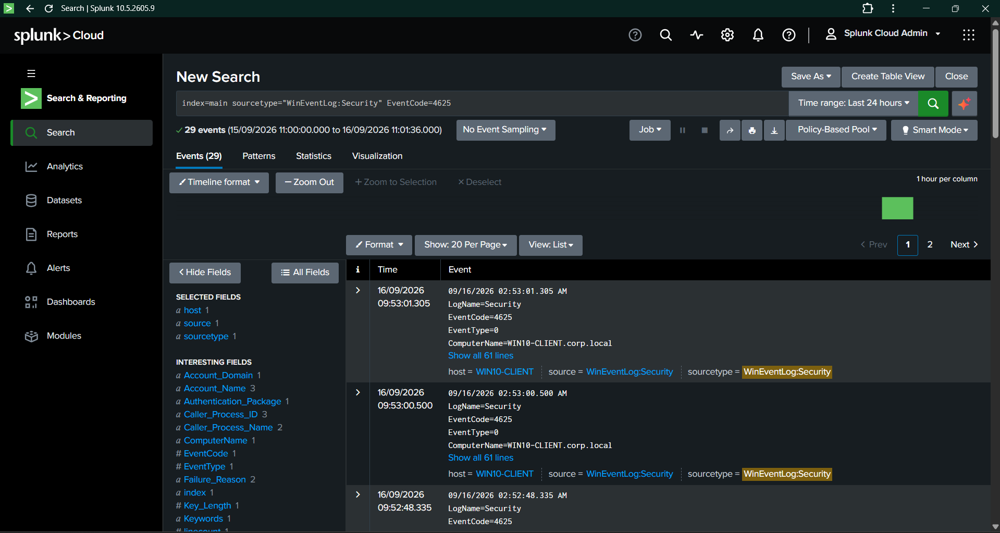

---

### 11. Successful Logon Events — Event ID 4624

The following SPL query was used:

```spl
index=main sourcetype="WinEventLog:Security" EventCode=4624
```

Result:

```text
189 events
```

### Meaning

Windows Event ID `4624` represents a successful account logon.

This event can help investigate:

- User authentication
- Remote logons
- Suspicious successful access
- Possible account compromise
- Lateral movement activity

**Evidence:**

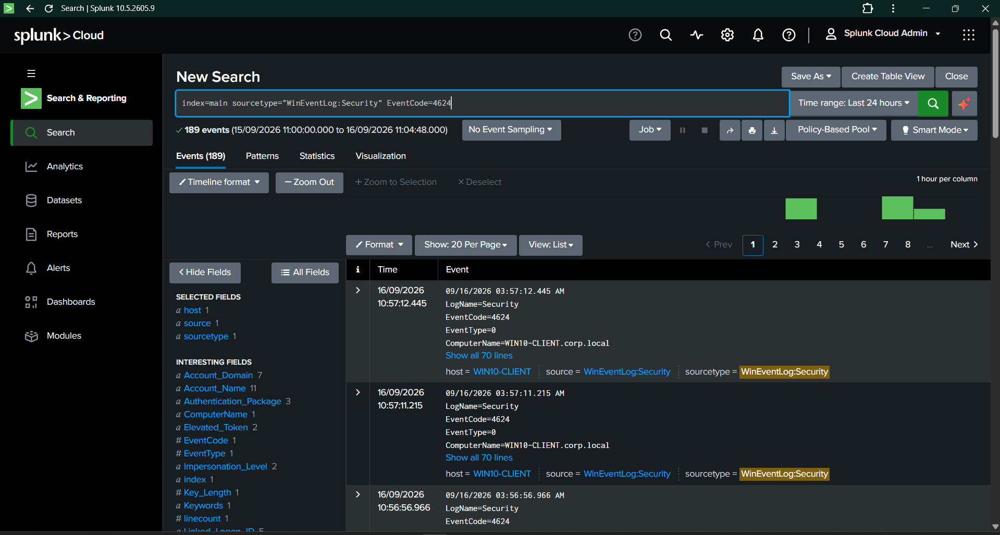

---

### 12. Process Creation Events — Event ID 4688

The following SPL query was used:

```spl
index=main sourcetype="WinEventLog:Security" EventCode=4688
```

Result:

```text
2,528 events
```

### Meaning

Windows Event ID `4688` represents a new process being created.

This event can help detect:

- Suspicious command execution
- PowerShell activity
- Script execution
- Malware execution
- Living-off-the-land techniques
- Unusual parent-child process relationships

**Evidence:**

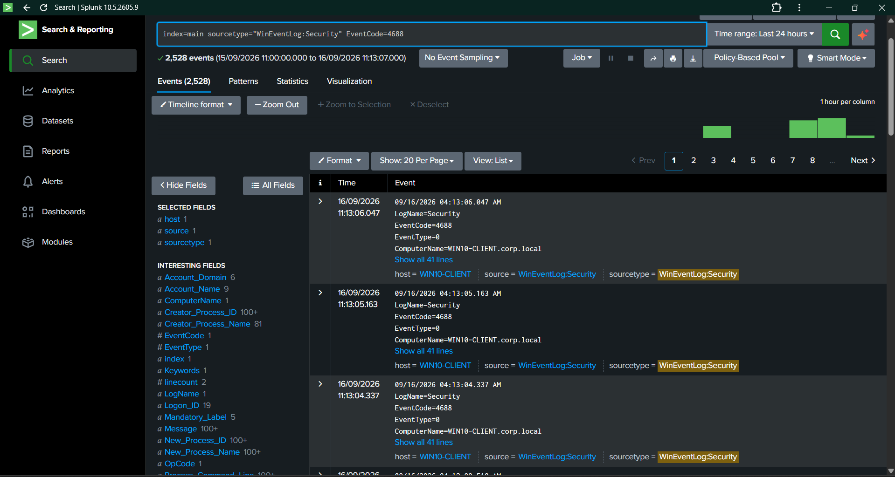

---

## Troubleshooting

### Issue 1: No Active Forwarding Destination

Initially, the forwarding command showed:

```text
Active forwards:
    None
```

### Cause

The Splunk Cloud credentials package and forwarding configuration had not yet been installed.

### Resolution

The customized Splunk Cloud credentials package was installed and the Splunk Universal Forwarder service was restarted.

After restarting, the active forwarding destination appeared successfully.

---

### Issue 2: Splunk Cloud Credentials Package Was Not Found in Downloads

The `.spl` file was not available in the normal Downloads folder.

### Resolution

The file was located inside the Universal Forwarder application directory:

```text
C:\Program Files\SplunkUniversalForwarder\etc\apps\splunkcloud\splunkclouduf.spl
```

The package was then installed from its actual location.

---

## Key Learnings

- Splunk Universal Forwarder collects and forwards endpoint logs.
- The Universal Forwarder service must be running for log forwarding to work.
- Splunk Cloud credentials configure the forwarding destination.
- The active forwarding destination can be verified using the Splunk CLI.
- Windows Security logs are searched using the `WinEventLog:Security` sourcetype.
- Event ID `4624` represents successful logons.
- Event ID `4625` represents failed logons.
- Event ID `4688` represents process creation.
- SPL queries help security analysts filter and investigate events.
- Log ingestion must be verified before creating detection rules.

---

## Interview Knowledge

### How did you connect Windows logs to Splunk Cloud?

I installed the Splunk Universal Forwarder on the Windows 10 endpoint, installed the customized Splunk Cloud credentials package, restarted the forwarding service, and verified the forwarding destination using the Splunk CLI. I then searched the Windows Security sourcetype in Splunk Cloud and confirmed that Windows Security events were indexed successfully.

### How did you verify that the logs were arriving?

I used the following SPL search:

```spl
index=main sourcetype="WinEventLog:Security"
```

The search returned Windows Security events. I then filtered specific event IDs such as `4624`, `4625`, and `4688` to validate successful logons, failed logons, and process creation events.

### Why are Event IDs 4624, 4625, and 4688 important?

- `4624` helps investigate successful authentication.
- `4625` helps identify failed authentication and possible brute-force activity.
- `4688` helps investigate process execution and suspicious command activity.

---

## Day 02 Completion Status

| Area | Status |
|---|---|
| Windows endpoint preparation | Completed |
| Windows Event Log verification | Completed |
| Windows Firewall verification | Completed |
| Administrator access verification | Completed |
| Network connectivity verification | Completed |
| Universal Forwarder installation | Completed |
| Universal Forwarder service verification | Completed |
| HEC token configuration | Completed |
| Splunk Cloud log ingestion | Completed |
| Event ID 4625 search | Completed |
| Event ID 4624 search | Completed |
| Event ID 4688 search | Completed |
| Evidence collection | Completed |
| Day 02 documentation | Completed |

---

## Conclusion

Day 02 successfully established and validated the log collection pipeline from the Windows 10 endpoint to Splunk Cloud.

The Windows endpoint is now sending security telemetry to Splunk Cloud and is ready for the next stage of the project: creating, testing, and improving detection rules using Sigma and SPL.