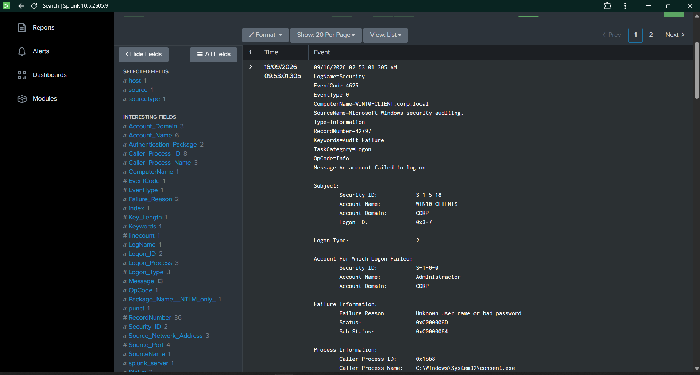
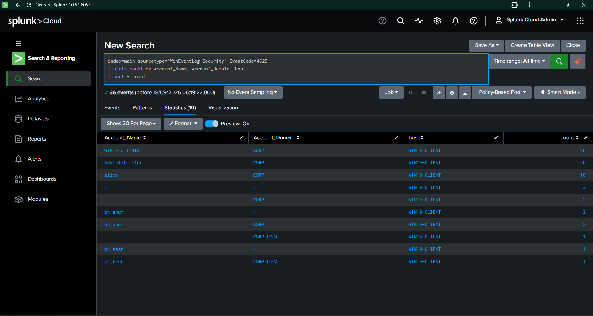
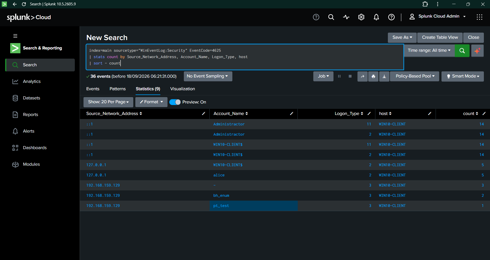
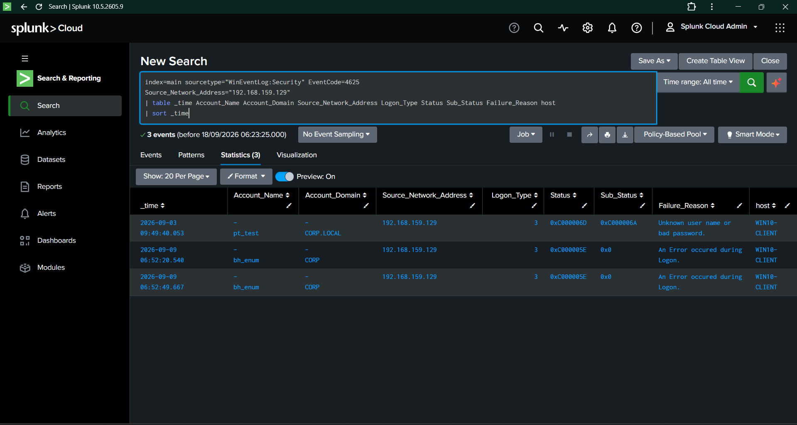
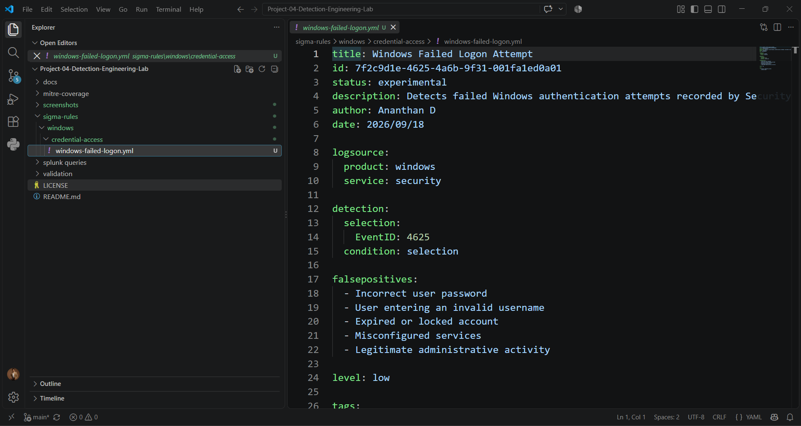
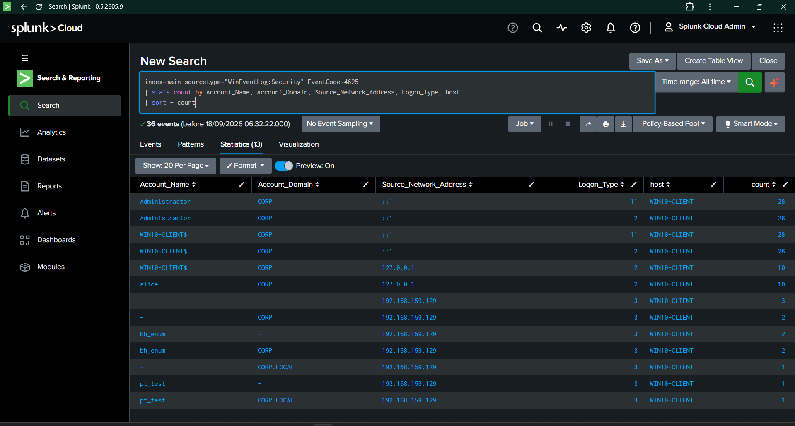
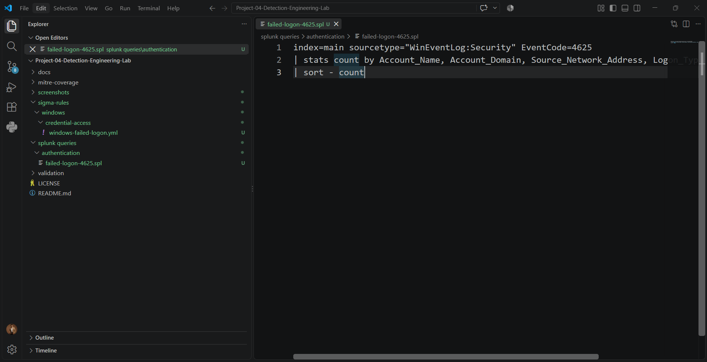
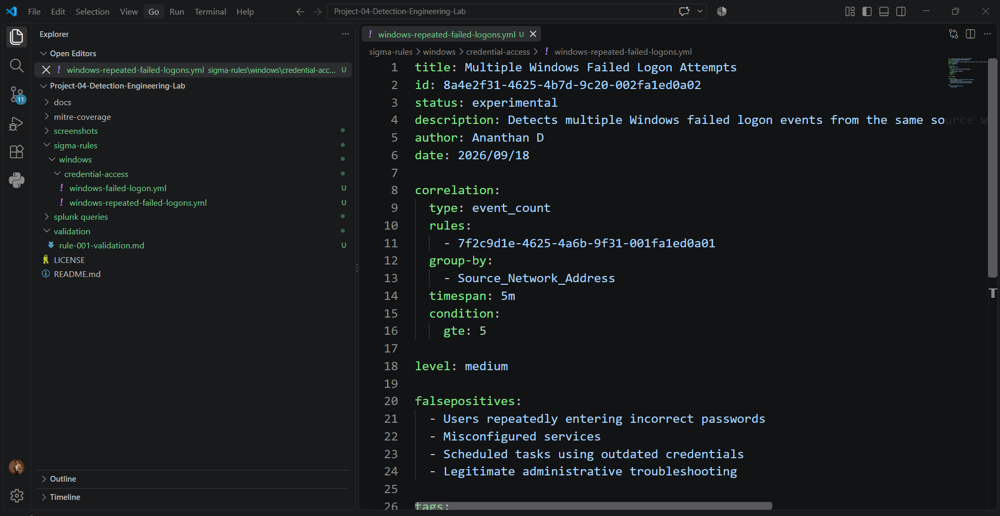
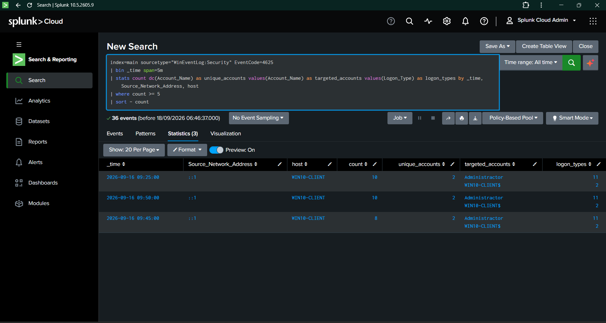

# Day 03 — Authentication Detection Engineering

## Project Information

| Field | Details |
|---|---|
| Project | Project 04 — Detection Engineering Lab |
| Day | Day 03 |
| Focus | Windows Authentication Detection |
| SIEM | Splunk Cloud |
| Log Source | Windows Security Event Logs |
| Main Event ID | `4625` — Failed Logon |
| Detection Format | Sigma |
| Query Language | Splunk SPL |
| Windows Host | `WIN10-CLIENT` |
| Author | Ananthan D |
| Date | 18 September 2026 |

---

## 1. Objective

The objective of Day 03 was to create and validate Windows authentication detections using Windows Security Event ID `4625`.

The following activities were completed:

- Investigated Windows failed logon events.
- Analyzed failed logons by account and source address.
- Created a Sigma rule for failed logon attempts.
- Created a correlation-based Sigma rule for repeated failed logons.
- Created equivalent Splunk SPL queries.
- Validated both detections using collected Windows Security logs.
- Mapped the detections to MITRE ATT&CK.
- Captured screenshots as evidence.
- Documented measurable detection results.

---

## 2. Lab Environment

| Component | Configuration |
|---|---|
| Host Operating System | Windows 11 |
| Windows Client | WIN10-CLIENT |
| Domain Environment | Active Directory Lab |
| SIEM | Splunk Cloud |
| Log Collector | Splunk Universal Forwarder |
| Splunk Index | `main` |
| Sourcetype | `WinEventLog:Security` |
| Primary Event ID | `4625` |
| Detection Format | Sigma |
| Query Language | Splunk SPL |

---

## 3. Detection Engineering Process

The following detection engineering workflow was followed:

1. Identify the relevant Windows Security Event ID.
2. Review the available event fields.
3. Search the event data in Splunk.
4. Analyze authentication activity by account and source.
5. Create the initial Sigma rule.
6. Create the equivalent SPL query.
7. Validate the rule using real log data.
8. Create a repeated-event correlation rule.
9. Validate the correlation query.
10. Document the results and MITRE ATT&CK mapping.

---

# 4. Windows Event ID 4625 Analysis

## 4.1 Event Description

Windows Security Event ID `4625` is generated when an account fails to log on successfully.

A failed logon may be caused by:

- Incorrect username or password.
- Expired password.
- Disabled account.
- Invalid credentials.
- Misconfigured services.
- Scheduled tasks using outdated credentials.
- Repeated authentication attempts.
- Possible brute-force or password-spraying activity.

Event ID `4625` becomes more valuable when analyzed with:

- Account name.
- Account domain.
- Source network address.
- Logon type.
- Hostname.
- Event frequency.
- Related authentication events.

## 4.2 Important Event Fields

| Field | Description | Investigation Purpose |
|---|---|---|
| `EventCode` | Windows event identifier | Confirms the event type |
| `Account_Name` | Account targeted by the logon attempt | Identifies targeted accounts |
| `Account_Domain` | Domain or authority of the account | Identifies account context |
| `Source_Network_Address` | Origin of the authentication attempt | Identifies the source |
| `Logon_Type` | Authentication method | Helps classify the logon |
| `host` | System generating the event | Identifies the affected endpoint |
| `_time` | Event timestamp | Supports timeline analysis |

## 4.3 Evidence

**Evidence:** `screenshots/Day03/Day03-01-Event-4625-Analysis.png`

The screenshot shows the investigation of Windows Security Event ID `4625` in Splunk.

---

# 5. Failed Logon Account Analysis

## 5.1 Purpose

Failed logon events were grouped by account to identify accounts receiving repeated authentication failures.

Account-level analysis helps identify:

- Repeated attempts against a single account.
- Multiple accounts targeted by authentication attempts.
- Possible password-spraying behavior.
- User authentication problems.
- Misconfigured services or scheduled tasks.

## 5.2 Evidence

**Evidence:** `screenshots/Day03/Day03-02-Failed-Logon-Account-Analysis.png`

The screenshot shows the account-level analysis of failed Windows logon events.

---

# 6. Failed Logon Source Analysis

## 6.1 Purpose

Failed logon events were grouped by source address to identify systems generating authentication failures.

Source-based analysis helps identify:

- Repeated authentication attempts from one source.
- Internal systems generating failures.
- Remote authentication activity.
- Local authentication activity.
- Possible brute-force sources.
- Possible password-spraying sources.

## 6.2 Evidence

**Evidence:** `screenshots/Day03/Day03-03-Failed-Logon-Source-Analysis.png`

The screenshot shows the source-based analysis of failed authentication attempts.

---

# 7. Non-Local Failed Logon Analysis

## 7.1 Purpose

A focused search was used to identify failed logon events originating from non-local addresses.

This analysis helps separate:

- Local authentication activity.
- IPv6 loopback activity.
- Remote authentication attempts.
- Internal network authentication attempts.

## 7.2 Evidence

**Evidence:** `screenshots/Day03/Day03-04-Non-Local-Failed-Logon-Analysis.png`

The screenshot shows the focused analysis of non-local failed logon activity.

---

# 8. Sigma Rule 001 — Windows Failed Logon Attempt

## 8.1 Detection Objective

The first Sigma rule detects Windows failed logon events using Security Event ID `4625`.

## 8.2 Rule Location

~~~text
sigma-rules/windows/credential-access/windows-failed-logon.yml
~~~

## 8.3 Sigma Rule

~~~yaml
title: Windows Failed Logon Attempt
id: 7f2c9d1e-4625-4a6b-9f31-001fa1ed0a01
status: experimental
description: Detects Windows failed logon events that may indicate incorrect credentials, unauthorized access attempts, or brute-force activity.
author: Ananthan D
date: 2026/09/18

logsource:
  product: windows
  service: security

detection:
  selection:
    EventID: 4625

  condition: selection

level: low

falsepositives:
  - Users entering incorrect passwords
  - Expired passwords
  - Disabled accounts
  - Misconfigured services
  - Scheduled tasks using outdated credentials
  - Legitimate administrative troubleshooting

tags:
  - attack.credential_access
  - attack.t1110
~~~

## 8.4 Detection Logic

The rule matches Windows Security events where:

~~~text
EventID = 4625
~~~

This rule provides a foundational detection for failed Windows authentication attempts.

## 8.5 Evidence

**Evidence:** `screenshots/Day03/Day03-05-First-Sigma-Rule.png`

The screenshot shows the first Sigma rule created for failed Windows logons.

---

# 9. SPL Query 001 — Failed Logon Detection

## 9.1 Query Location

~~~text
splunk-queries/authentication/failed-logon-4625.spl
~~~

## 9.2 SPL Query

~~~spl
index=main sourcetype="WinEventLog:Security" EventCode=4625
| stats count by Account_Name, Account_Domain, Source_Network_Address, Logon_Type, host
| sort - count
~~~

## 9.3 Query Explanation

| SPL Component | Function |
|---|---|
| `index=main` | Searches the main Splunk index |
| `sourcetype="WinEventLog:Security"` | Searches Windows Security logs |
| `EventCode=4625` | Filters failed logon events |
| `stats count by` | Groups events by selected fields |
| `sort - count` | Displays the highest counts first |

## 9.4 Detection Value

The query helps analysts identify:

- Accounts with repeated failed logons.
- Sources generating authentication failures.
- Hosts receiving failed logon events.
- Logon types associated with the activity.
- Possible authentication attack patterns.

## 9.5 Evidence

**Evidence:** `screenshots/Day03/Day03-06-SPL-Failed-Logon-Detection.png`

The screenshot shows the SPL query and its results in Splunk.

**Evidence:** `screenshots/Day03/Day03-07-SPL-Query-File.png`

The screenshot shows the saved SPL query file in the project repository.

---

# 10. Validation Results for Rule 001

## 10.1 Validation File

~~~text
validation/rule-001-validation.md
~~~

## 10.2 Validation Results

The failed logon Sigma rule was validated against Windows Security logs collected in Splunk.

| Validation Metric | Result |
|---|---:|
| Event analyzed | `4625` |
| Total failed-logon events analyzed | `36` |
| Log source | Windows Security Event Log |
| Splunk index | `main` |
| Sourcetype | `WinEventLog:Security` |

## 10.3 Validation Outcome

The rule successfully matched Windows failed logon events.

The collected events were grouped and analyzed using:

- Account name.
- Account domain.
- Source network address.
- Logon type.
- Hostname.

The validation confirmed that the rule can identify failed authentication activity in the Windows environment.

---

# 11. Sigma Rule 002 — Multiple Windows Failed Logon Attempts

## 11.1 Detection Objective

The second Sigma rule detects repeated Windows failed logon attempts from the same source within a five-minute time window.

The rule is designed to identify behavior that may be associated with:

- Brute-force authentication.
- Password spraying.
- Automated credential testing.
- Repeated authentication failures.
- Misconfigured services.

## 11.2 Rule Location

~~~text
sigma-rules/windows/credential-access/windows-repeated-failed-logons.yml
~~~

## 11.3 Sigma Rule

~~~yaml
title: Multiple Windows Failed Logon Attempts
id: 8a4e2f31-4625-4b7d-9c20-002fa1ed0a02
status: experimental
description: Detects multiple Windows failed logon events from the same source within a short time window.
author: Ananthan D
date: 2026/09/18

correlation:
  type: event_count
  rules:
    - 7f2c9d1e-4625-4a6b-9f31-001fa1ed0a01
  group-by:
    - Source_Network_Address
  timespan: 5m
  condition:
    gte: 5

level: medium

falsepositives:
  - Users repeatedly entering incorrect passwords
  - Misconfigured services
  - Scheduled tasks using outdated credentials
  - Legitimate administrative troubleshooting

tags:
  - attack.credential_access
  - attack.t1110
~~~

## 11.4 Correlation Logic

The rule triggers when:

- The base failed-logon rule matches Event ID `4625`.
- Events are grouped by `Source_Network_Address`.
- At least `5` matching events occur.
- The events occur within `5 minutes`.

## 11.5 Evidence

**Evidence:** `screenshots/Day03/Day03-08-Repeated-Failed-Logon-Sigma-Rule.png`

The screenshot shows the correlation-based Sigma rule.

---

# 12. SPL Query 002 — Repeated Failed Logons

## 12.1 Query Location

~~~text
splunk-queries/authentication/repeated-failed-logons-5min.spl
~~~

## 12.2 SPL Query

~~~spl
index=main sourcetype="WinEventLog:Security" EventCode=4625
| bin _time span=5m
| stats count dc(Account_Name) as unique_accounts values(Account_Name) as targeted_accounts values(Logon_Type) as logon_types by _time, Source_Network_Address, host
| where count >= 5
| sort - count
~~~

## 12.3 Query Explanation

| SPL Component | Function |
|---|---|
| `EventCode=4625` | Selects failed logon events |
| `bin _time span=5m` | Groups events into five-minute windows |
| `stats count` | Counts failed logon events |
| `dc(Account_Name)` | Counts unique targeted accounts |
| `values(Account_Name)` | Lists targeted accounts |
| `values(Logon_Type)` | Lists observed logon types |
| `where count >= 5` | Displays windows with at least five events |
| `sort - count` | Sorts results by event count |

## 12.4 Detection Value

The query adds behavioral context to the basic failed-logon detection.

It helps identify:

- Repeated failures from one source.
- Multiple accounts targeted within one time window.
- Potential brute-force behavior.
- Potential password-spraying behavior.
- Repeated local authentication failures.

## 12.5 Evidence

**Evidence:** `screenshots/Day03/Day03-09-Repeated-Failed-Logon-SPL-Results.png`

The screenshot shows the repeated failed-logon detection results in Splunk.

---

# 13. Validation Results for Rule 002

## 13.1 Validation File

~~~text
validation/rule-002-validation.md
~~~

## 13.2 Observed Results

The repeated failed-logon SPL query returned three matching five-minute windows.

| Source Address | Host | Failed Logons | Unique Accounts |
|---|---|---:|---:|
| `::1` | `WIN10-CLIENT` | 10 | 2 |
| `::1` | `WIN10-CLIENT` | 10 | 2 |
| `::1` | `WIN10-CLIENT` | 8 | 2 |

## 13.3 Quantified Validation Results

| Metric | Result |
|---|---:|
| Matching five-minute windows | `3` |
| Highest failed-logon count in one window | `10` |
| Total events across matching windows | `28` |
| Unique targeted accounts per window | `2` |
| Detection threshold | `5 events` |
| Detection time window | `5 minutes` |

## 13.4 Investigation Result

The source address `::1` represents the IPv6 loopback address.

The observed results therefore represent repeated local or loopback authentication activity on `WIN10-CLIENT`.

The detection successfully identified repeated failed-logon behavior according to the configured threshold.

The results require analyst investigation to determine the exact cause of the authentication failures.

---

# 14. False Positive Scenarios

The detections may identify legitimate authentication failures caused by:

- Users entering incorrect passwords.
- Expired passwords.
- Disabled accounts.
- Scheduled tasks using outdated credentials.
- Windows services using invalid credentials.
- Administrative troubleshooting.
- Local loopback authentication.
- Application authentication errors.

The following contextual fields can be used by an analyst during investigation:

- Source network address.
- Account name.
- Logon type.
- Hostname.
- Event timestamp.
- Related successful logons.
- Process creation events.
- Account lockout events.

---

# 15. MITRE ATT&CK Mapping

## 15.1 Technique Mapping

| Detection | MITRE ATT&CK ID | Technique |
|---|---|---|
| Rule 001 — Windows Failed Logon Attempt | `T1110` | Brute Force |
| Rule 002 — Multiple Windows Failed Logon Attempts | `T1110` | Brute Force |

## 15.2 Technique Description

MITRE ATT&CK technique `T1110 — Brute Force` covers attempts to gain access to accounts through repeated or systematic authentication attempts.

The Day 03 detections provide visibility into failed authentication activity that may support:

- Password guessing.
- Brute-force attempts.
- Password spraying.
- Automated credential testing.

## 15.3 MITRE Documentation File

~~~text
mitre-coverage/day03-authentication-detections.md
~~~

---

# 16. Evidence Register

| Evidence ID | Description | Screenshot |
|---|---|---|
| Day03-01 | Windows Event ID 4625 analysis | `Day03-01-Event-4625-Analysis.png` |
| Day03-02 | Failed logon account analysis | `Day03-02-Failed-Logon-Account-Analysis.png` |
| Day03-03 | Failed logon source analysis | `Day03-03-Failed-Logon-Source-Analysis.png` |
| Day03-04 | Non-local failed logon analysis | `Day03-04-Non-Local-Failed-Logon-Analysis.png` |
| Day03-05 | First Sigma rule | `Day03-05-First-Sigma-Rule.png` |
| Day03-06 | SPL failed logon detection | `Day03-06-SPL-Failed-Logon-Detection.png` |
| Day03-07 | SPL query file | `Day03-07-SPL-Query-File.png` |
| Day03-08 | Repeated failed-logon Sigma rule | `Day03-08-Repeated-Failed-Logon-Sigma-Rule.png` |
| Day03-09 | Repeated failed-logon SPL results | `Day03-09-Repeated-Failed-Logon-SPL-Results.png` |

---

# 17. Files Created

## Sigma Rules

~~~text
sigma-rules/windows/credential-access/windows-failed-logon.yml
sigma-rules/windows/credential-access/windows-repeated-failed-logons.yml
~~~

## Splunk Queries

~~~text
splunk-queries/authentication/failed-logon-4625.spl
splunk-queries/authentication/repeated-failed-logons-5min.spl
~~~

## Validation Reports

~~~text
validation/rule-001-validation.md
validation/rule-002-validation.md
~~~

## MITRE ATT&CK Documentation

~~~text
mitre-coverage/day03-authentication-detections.md
~~~

## Evidence Screenshots

~~~text
screenshots/Day03/Day03-01-Event-4625-Analysis.png
screenshots/Day03/Day03-02-Failed-Logon-Account-Analysis.png
screenshots/Day03/Day03-03-Failed-Logon-Source-Analysis.png
screenshots/Day03/Day03-04-Non-Local-Failed-Logon-Analysis.png
screenshots/Day03/Day03-05-First-Sigma-Rule.png
screenshots/Day03/Day03-06-SPL-Failed-Logon-Detection.png
screenshots/Day03/Day03-07-SPL-Query-File.png
screenshots/Day03/Day03-08-Repeated-Failed-Logon-Sigma-Rule.png
screenshots/Day03/Day03-09-Repeated-Failed-Logon-SPL-Results.png
~~~

---

# 18. Quantified Outcomes

| Metric | Result |
|---|---:|
| Sigma rules created | `2` |
| SPL queries created | `2` |
| Validation reports created | `2` |
| Windows failed-logon events analyzed | `36` |
| Matching five-minute detection windows | `3` |
| Highest event count in one window | `10` |
| Total events across matching windows | `28` |
| MITRE ATT&CK techniques mapped | `1` |
| Evidence screenshots captured | `9` |

---

# 19. Skills Demonstrated

Day 03 demonstrates practical experience in:

- Windows Security Event Log analysis.
- Windows authentication monitoring.
- Event ID `4625` investigation.
- Splunk Cloud searching.
- Splunk SPL query development.
- Sigma rule creation.
- Correlation-based detection engineering.
- Detection threshold configuration.
- Account and source analysis.
- False-positive identification.
- MITRE ATT&CK mapping.
- Evidence-based validation.
- SOC investigation documentation.

---

# 20. Day 03 Completion Checklist

- [x] Windows Event ID `4625` analyzed.
- [x] Failed logon account analysis completed.
- [x] Failed logon source analysis completed.
- [x] Non-local failed logon analysis completed.
- [x] Sigma Rule 001 created.
- [x] SPL Query 001 created.
- [x] Rule 001 validated.
- [x] Sigma Rule 002 created.
- [x] SPL Query 002 created.
- [x] Rule 002 validated.
- [x] False-positive scenarios documented.
- [x] MITRE ATT&CK mapping completed.
- [x] Evidence screenshots added.
- [x] Quantified outcomes documented.
- [x] Day 03 documentation completed.

---

# 21. Final Summary

Day 03 focused on authentication detection engineering using Windows Security Event ID `4625`.

Two Sigma rules and two Splunk SPL queries were created and validated against real Windows Security logs.

The first detection identifies individual failed logon events.

The second detection identifies repeated failed logon activity from the same source within a five-minute window.

The validation produced the following measurable results:

- `36` failed-logon events analyzed.
- `3` matching five-minute detection windows.
- Maximum of `10` failed-logon events in one window.
- `2` targeted accounts in each matching window.
- `2` Sigma rules created.
- `2` SPL queries created.
- `1` MITRE ATT&CK technique mapped.
- `9` evidence screenshots captured.

This work demonstrates the complete detection engineering workflow:

~~~text
Windows Telemetry
       ↓
Event Analysis
       ↓
Sigma Rule Creation
       ↓
Splunk SPL Query
       ↓
Detection Validation
       ↓
Evidence Collection
       ↓
MITRE ATT&CK Mapping
       ↓
Professional Documentation
~~~
