# Day 05 — Windows Scheduled Task Detection

## Overview

Day 05 focused on developing a Windows persistence detection for **Scheduled Task creation** using Windows Security Event ID **4698**, Splunk Cloud, Sigma, and MITRE ATT&CK.

The detection was developed using a telemetry-first approach.

Instead of immediately creating a persistence rule, the available telemetry was first assessed. Registry Run Keys / Startup Folder persistence was initially considered, but the required registry telemetry was not available in the current Splunk environment.

The detection scope was therefore changed to **Windows Scheduled Task Creation**, where the required telemetry could be enabled, observed, analyzed, and validated end-to-end.

---

## Objectives

The objectives for Day 05 were:

- Assess available Windows security telemetry.
- Determine whether registry persistence telemetry was available.
- Verify Sysmon telemetry availability.
- Select a persistence technique supported by the available telemetry.
- Enable Windows auditing for scheduled-task creation.
- Generate controlled scheduled-task activity.
- Analyze Windows Event ID 4698.
- Establish a scheduled-task baseline.
- Develop a Sigma detection rule.
- Develop a Splunk SPL detection.
- Validate the detection using a controlled test.
- Map the detection to MITRE ATT&CK.
- Document the complete detection engineering workflow.

---

# 1. Lab Environment

| Component | Configuration |
|---|---|
| SIEM | Splunk Cloud |
| Log Collection | Splunk Universal Forwarder |
| Endpoint | Windows 10 |
| Host | WIN10-CLIENT |
| Domain | corp.local |
| Account Used for Test | Administrator |
| Detection Source | Windows Security Event Log |
| Primary Event | 4698 |
| MITRE ATT&CK | T1053.005 |

---

# 2. Detection Engineering Approach

The Day 05 workflow followed:

    Telemetry Assessment
            ↓
    Detection Scope Selection
            ↓
    Audit Configuration
            ↓
    Controlled Activity
            ↓
    Event Generation
            ↓
    Raw Event Verification
            ↓
    Baseline Analysis
            ↓
    Detection Development
            ↓
    Sigma Rule
            ↓
    Splunk SPL
            ↓
    Controlled Validation
            ↓
    MITRE ATT&CK Mapping
            ↓
    Evidence Documentation

This approach was used to ensure the final detection was based on telemetry that was actually available and validated in the lab.

---

# 3. Initial Windows Security Telemetry Assessment

The first step was to identify the Windows Security Event IDs currently available in Splunk.

The query used was:

    index=main sourcetype="WinEventLog:Security"
    | stats count by EventCode
    | sort EventCode

The search returned:

- 24,936 Windows Security events
- Event ID 4624 — 1,059 events
- Event ID 4625 — 36 events
- Event ID 4688 — 12,783 events
- Event ID 4672 — 925 events
- Event ID 4798 — 393 events
- Event ID 4799 — 544 events
- Event ID 4648 — 157 events
- Additional Windows Security events

This confirmed that the Windows endpoint was providing substantial security telemetry to Splunk.

### Evidence

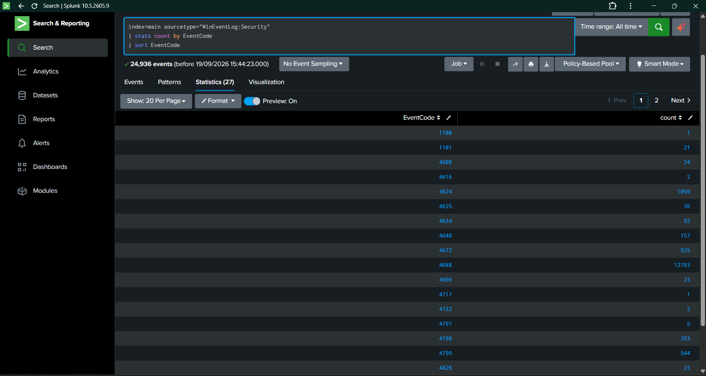

---

# 4. Initial Registry Persistence Investigation

Registry Run Keys / Startup Folder persistence was initially selected as the Day 05 detection topic.

The first telemetry check searched for Windows Security Event ID 4657:

    index=main sourcetype="WinEventLog:Security" EventCode=4657
    | stats count by host

Result:

    0 events

This indicated that Windows Security registry-value modification telemetry was not available in the current dataset.

### Evidence

The absence of Event ID 4657 was recorded during the telemetry assessment.

---

# 5. Sysmon Registry Telemetry Investigation

Because Sysmon Event ID 13 can provide Registry Value Set telemetry, the next step was to determine whether Sysmon registry events were available in Splunk.

The query used was:

    index=main EventCode=13
    | stats count by sourcetype, host
    | sort - count

The search returned:

- 12 events
- Sourcetype: `WinEventLog:System`
- Host: `WIN10-CLIENT`

However, these events were not Sysmon Event ID 13 events.

The actual events contained:

- SourceName: `Microsoft-Windows-Kernel-General`
- EventType: `4`
- Message indicating operating-system shutdown activity

### Evidence

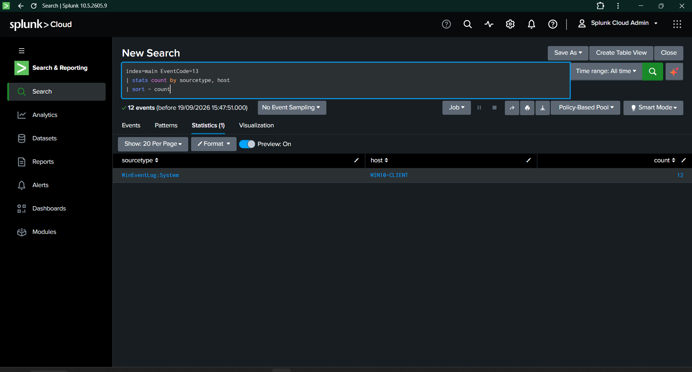

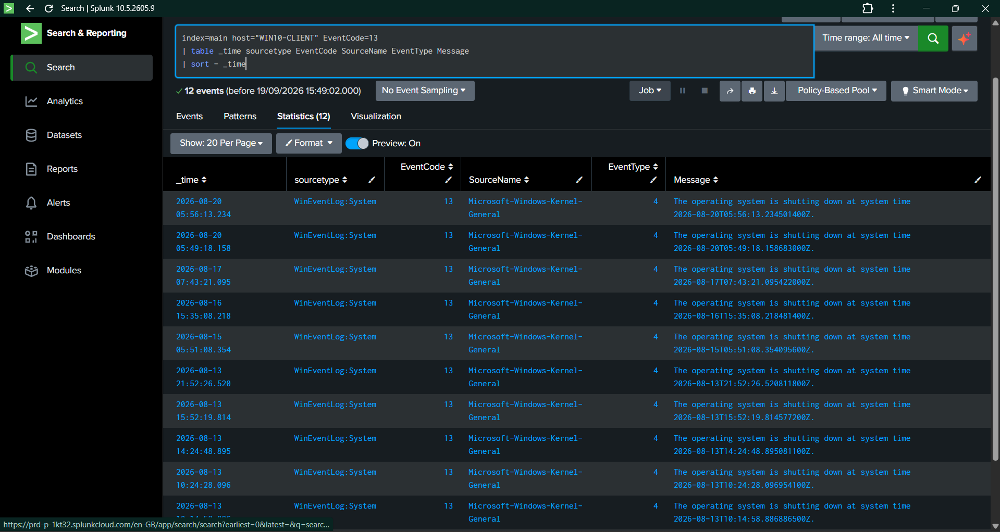

---

# 6. Sysmon Telemetry Availability Check

A broader search was performed to determine whether Sysmon telemetry was reaching Splunk.

The query used was:

    index=main
    | search sourcetype="*Sysmon*" OR source="*Sysmon*"
    | stats count by sourcetype, source, host
    | sort - count

Result:

    0 events

This confirmed that Sysmon telemetry was not currently available in Splunk for the Windows client.

### Detection Scope Decision

Based on the telemetry assessment:

- Event ID 4657 was unavailable.
- EventCode 13 was confirmed to be unrelated Kernel-General telemetry.
- Sysmon telemetry was not reaching Splunk.

Therefore, Registry Run Keys / Startup Folder persistence was not selected for the final detection.

The detection scope was changed to **Scheduled Task Creation**, which could be supported using Windows Security Event ID 4698.

### Evidence

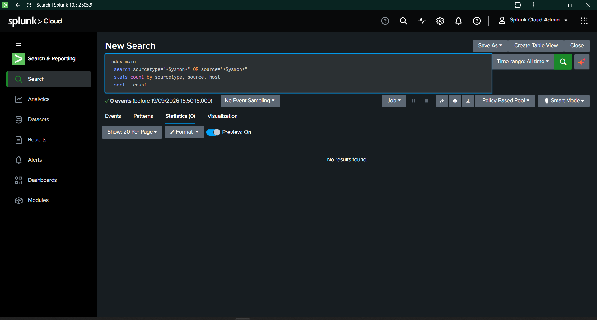

---

# 7. Scheduled Task Detection Selection

The selected detection technique was:

**MITRE ATT&CK T1053.005 — Scheduled Task/Job: Scheduled Task**

The relevant Windows Security event is:

    Event ID 4698 — A scheduled task was created.

Scheduled-task creation was selected because the required Windows telemetry could be enabled and validated directly on the Windows client.

---

# 8. Initial Event 4698 Check

Before enabling the required auditing, the following Splunk query was executed:

    index=main sourcetype="WinEventLog:Security" EventCode=4698
    | stats count by host

Initial result:

    0 events

This established the pre-validation baseline.

The required Windows auditing was then enabled for:

    Other Object Access Events

The audit configuration was verified successfully with:

    Other Object Access Events    Success

### Evidence

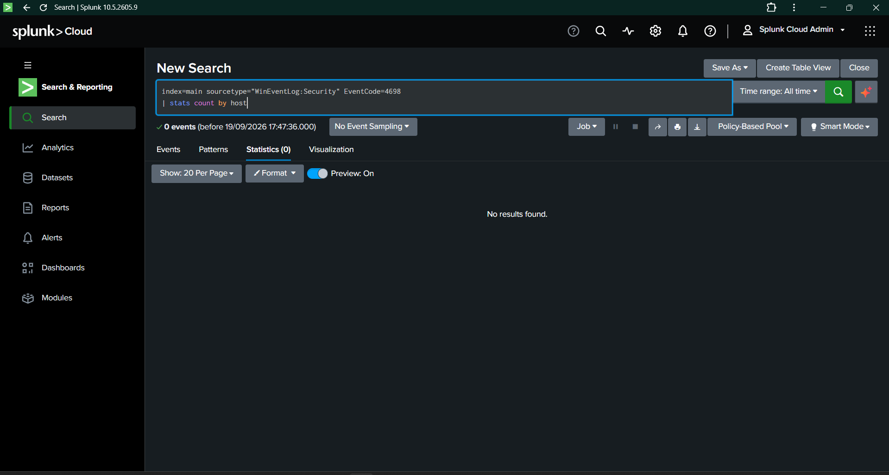

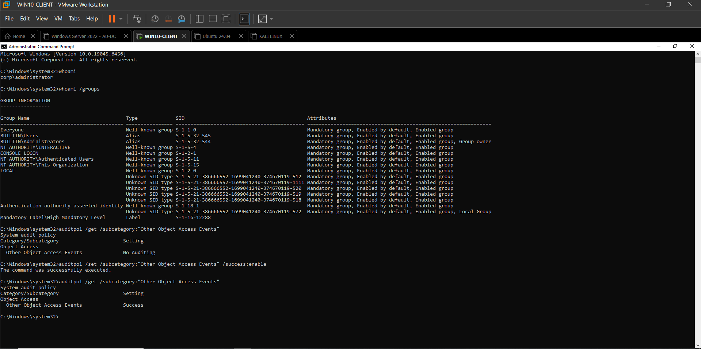

---

# 9. Controlled Scheduled Task Creation

A harmless scheduled task was created on WIN10-CLIENT for detection validation.

Test task:

    \DetectionEngineering-Day05-Test

The task was configured as a one-time scheduled task.

The purpose of the task was to generate known Windows Security telemetry and validate the complete detection pipeline.

The task was not created for malicious activity.

### Evidence

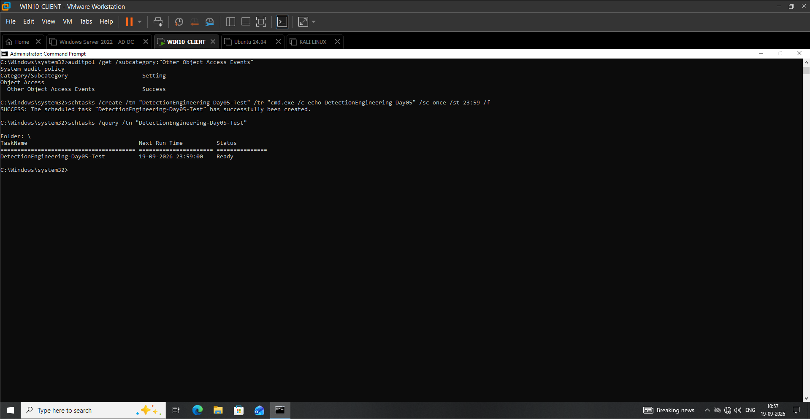

---

# 10. Event ID 4698 Verification

After the controlled task was created, Splunk was searched for Event ID 4698.

The search successfully identified scheduled-task creation telemetry.

Observed information included:

- Event ID: 4698
- Host: WIN10-CLIENT
- Account: Administrator
- Task name information
- Task XML content
- Security auditing metadata
- Message: A scheduled task was created

### Evidence

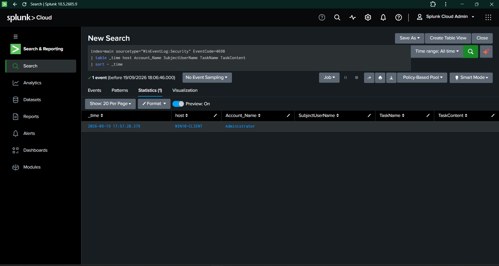

---

# 11. Event 4698 Field Analysis

The Event ID 4698 event was inspected to identify useful investigation fields.

Observed telemetry included:

| Field | Description |
|---|---|
| EventCode | Windows event identifier |
| host | Endpoint generating the event |
| Account_Name | Account associated with the event |
| TaskName | Scheduled task name |
| TaskContent | Scheduled task XML |
| Message | Event description |
| TaskCategory | Other Object Access Events |
| Keywords | Audit Success |

The extracted TaskName and TaskContent fields were not consistently populated in the initial table view.

The raw event was therefore inspected to confirm the information existed in the original telemetry.

### Evidence

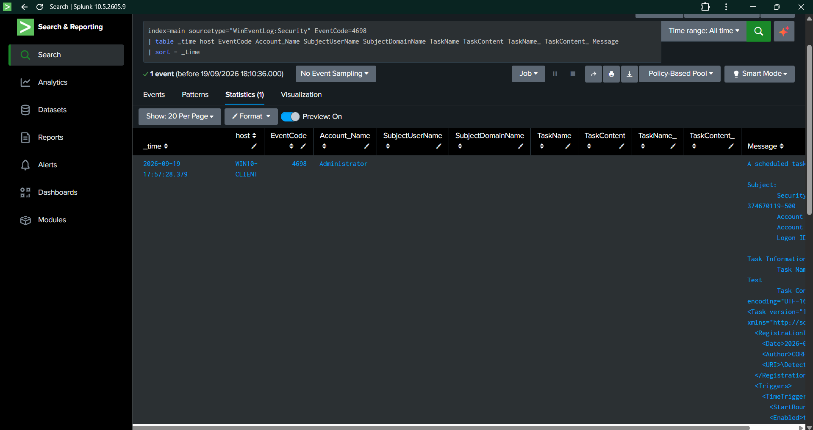

---

# 12. Raw Event Verification

The raw Event ID 4698 record confirmed that the scheduled-task information was present in the underlying Windows event.

The raw event contained:

    Task Name:
    \DetectionEngineering-Day05-Test

It also contained the scheduled-task XML configuration.

This confirmed that the required task information could be extracted from `_raw` even where automatic field extraction was incomplete.

### Evidence

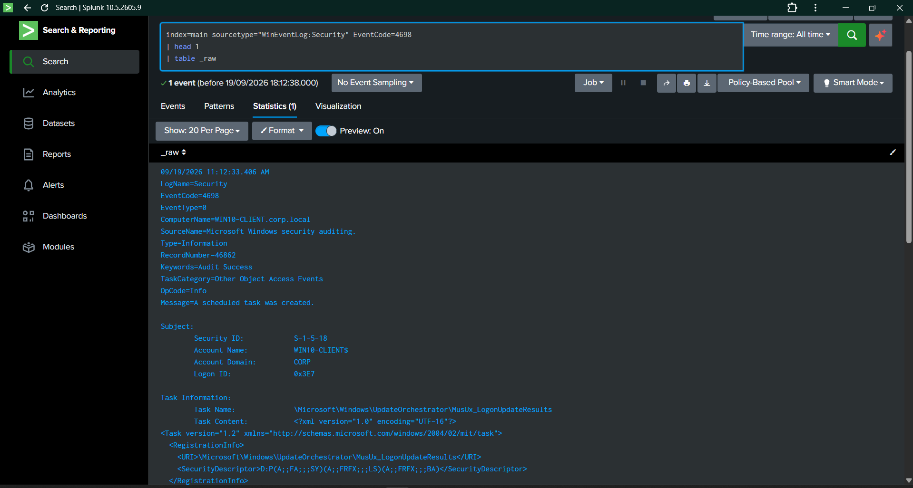

---

# 13. Scheduled Task Baseline

A baseline analysis was performed against Event ID 4698.

The search returned:

    2 events

The observed activity was:

| Host | Account | Count |
|---|---|---:|
| WIN10-CLIENT | Administrator | 1 |
| WIN10-CLIENT | WIN10-CLIENT$ | 1 |

The observed scheduled tasks included:

    \DetectionEngineering-Day05-Test

    \Microsoft\Windows\UpdateOrchestrator\MusUx_LogonUpdateResults

The second task represents legitimate Windows operating-system activity.

This baseline was important because it demonstrated that scheduled-task creation is not inherently malicious.

### Evidence

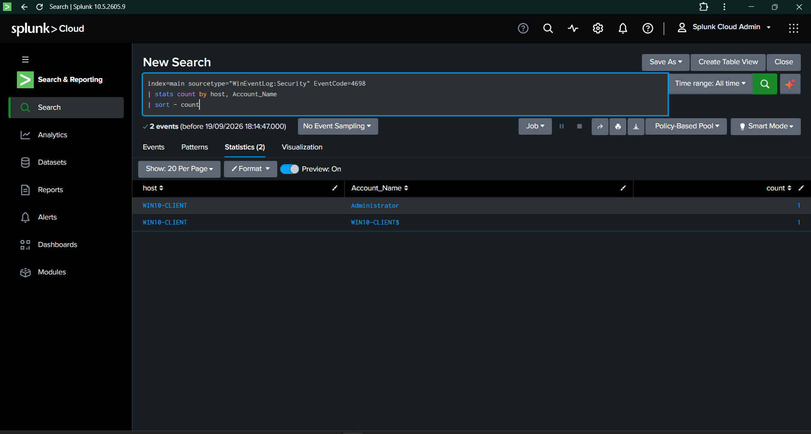

---

# 14. Scheduled Task Name Extraction

The scheduled task name was extracted from the raw Windows Security event using Splunk `rex`.

The extraction logic was:

    | rex field=_raw "Task Name:\s+(?<ScheduledTaskName>[^\r\n]+)"

The extraction successfully identified the observed scheduled-task names.

Observed values included:

    \DetectionEngineering-Day05-Test

    \Microsoft\Windows\UpdateOrchestrator\MusUx_LogonUpdateResults

### Evidence

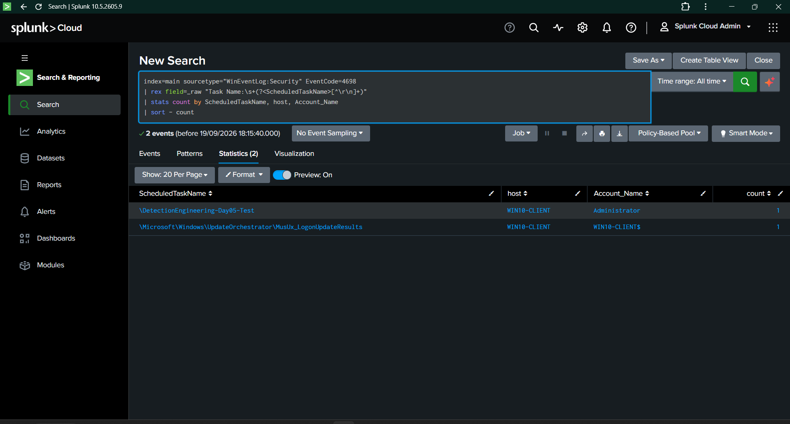

---

# 15. Rule 004 — Sigma Detection

The fourth Sigma detection rule created in the project is:

    sigma-rules/windows/persistence/windows-scheduled-task-created.yml

Rule title:

    Windows Scheduled Task Created

The rule detects:

    EventID: 4698

The detection is mapped to:

    T1053.005 — Scheduled Task/Job: Scheduled Task

The rule is intentionally broad at the event level because legitimate Windows and administrative processes can create scheduled tasks.

---

# 16. Rule 004 — Splunk Detection

The corresponding Splunk detection query is stored at:

    splunk-queries/persistence/scheduled-task-created-4698.spl

The final SPL logic is:

    index=main sourcetype="WinEventLog:Security" EventCode=4698
    | rex field=_raw "Task Name:\s+(?<ScheduledTaskName>[^\r\n]+)"
    | table _time host Account_Name ScheduledTaskName EventCode Message
    | sort - _time

The query:

1. Searches Windows Security Event ID 4698.
2. Extracts the scheduled task name from the raw event.
3. Displays investigation-relevant fields.
4. Sorts results by event time.

### Evidence

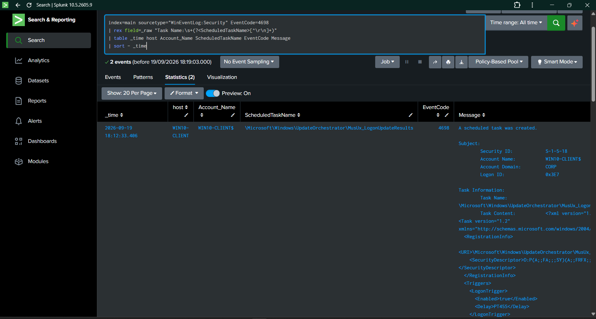

---

# 17. Controlled Detection Validation

A focused validation search was performed against:

    \DetectionEngineering-Day05-Test

The search returned:

    1 matching event

Observed values:

| Field | Result |
|---|---|
| Host | WIN10-CLIENT |
| Account | Administrator |
| Scheduled Task | `\DetectionEngineering-Day05-Test` |
| Event ID | 4698 |
| Message | A scheduled task was created |

The complete detection path was therefore validated:

    Scheduled Task Created
            ↓
    Windows Event ID 4698
            ↓
    Windows Security Log
            ↓
    Splunk Universal Forwarder
            ↓
    Splunk Cloud
            ↓
    SPL Detection
            ↓
    Controlled Task Identified

### Evidence

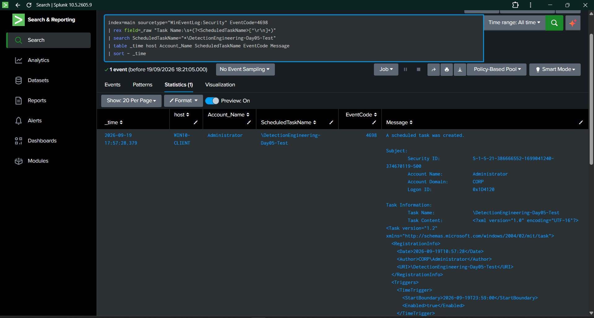

---

# 18. Detection Validation Results

| Metric | Result |
|---|---:|
| Controlled scheduled tasks created | 1 |
| Expected Event ID | 4698 |
| Matching Event 4698 events | 1 |
| Detection matches | 1 |
| Controlled-test detection rate | 100% |
| Baseline Event 4698 events | 2 |
| MITRE ATT&CK techniques covered | 1 |

### Validation Result

**PASS**

The controlled scheduled-task creation generated Event ID 4698, the event was ingested into Splunk, the scheduled task name was extracted from the raw telemetry, and the final SPL detection successfully identified the controlled activity.

---

# 19. False-Positive Context

Scheduled-task creation can be legitimate system or administrative activity.

Observed legitimate activity included:

    \Microsoft\Windows\UpdateOrchestrator\MusUx_LogonUpdateResults

Potential legitimate sources include:

- Windows Update
- Windows operating-system components
- Enterprise software
- Security software
- Software deployment systems
- IT management tools
- Administrative automation

Therefore, the detection should be treated as an investigation signal rather than an automatic malicious classification.

Useful investigation context includes:

- Scheduled task name
- Creating account
- Host
- Task XML
- Configured executable or command
- Creation timestamp
- Parent process
- Related authentication activity

---

# 20. MITRE ATT&CK Mapping

## T1053.005 — Scheduled Task/Job: Scheduled Task

**Tactic:** Persistence

The detection provides visibility into Windows scheduled-task creation.

The detection identifies the creation event and provides task and account context that can support further investigation into potential persistence or automated execution.

MITRE coverage documentation:

    mitre-coverage/day05-scheduled-task-detection.md

---

# 21. Evidence Register

| Evidence | Purpose |
|---|---|
| [Day05-01 — Windows Security Event Baseline](../screenshots/Day05/Day05-01-Windows-Security-Event-Baseline.png) | Establishes available Windows Security telemetry |
| [Day05-02 — Sysmon Registry Value Set Baseline](../screenshots/Day05/Day05-02-Sysmon-Registry-Value-Set-Baseline.png) | Documents initial registry telemetry investigation |
| [Day05-03 — EventCode 13 Event Analysis](../screenshots/Day05/Day05-03-EventCode-13-Event-Analysis.png) | Confirms EventCode 13 represented unrelated Kernel-General telemetry |
| [Day05-04 — Sysmon Telemetry Check](../screenshots/Day05/Day05-04-Sysmon-Telemetry-Check.png) | Confirms Sysmon telemetry was unavailable in Splunk |
| [Day05-05 — Scheduled Task Event Baseline](../screenshots/Day05/Day05-05-Scheduled-Task-Event-Baseline.png) | Establishes initial Event 4698 availability |
| [Day05-06 — Scheduled Task Audit Policy Enabled](../screenshots/Day05/Day05-06-Scheduled-Task-Audit-Policy-Enabled.png) | Confirms successful audit configuration |
| [Day05-07 — Scheduled Task Creation Test](../screenshots/Day05/Day05-07-Scheduled-Task-Creation-Test.png) | Shows controlled scheduled-task creation |
| [Day05-08 — Scheduled Task Event 4698](../screenshots/Day05/Day05-08-Scheduled-Task-Event-4698.png) | Confirms Event 4698 reached Splunk |
| [Day05-09 — Scheduled Task Event Details](../screenshots/Day05/Day05-09-Scheduled-Task-Event-Details.png) | Shows detailed Event 4698 telemetry |
| [Day05-10 — Scheduled Task Raw Event](../screenshots/Day05/Day05-10-Scheduled-Task-Raw-Event.png) | Confirms task information exists in raw telemetry |
| [Day05-11 — Scheduled Task Baseline](../screenshots/Day05/Day05-11-Scheduled-Task-Baseline.png) | Establishes scheduled-task creation baseline |
| [Day05-12 — Scheduled Task Name Extraction](../screenshots/Day05/Day05-12-Scheduled-Task-Name-Extraction.png) | Validates task-name extraction |
| [Day05-13 — Scheduled Task Detection Results](../screenshots/Day05/Day05-13-Scheduled-Task-Detection-Results.png) | Shows final SPL detection results |
| [Day05-14 — Controlled Scheduled Task Detection](../screenshots/Day05/Day05-14-Controlled-Scheduled-Task-Detection.png) | Provides focused 1/1 validation evidence |

---

# 22. Repository Artifacts

## Sigma Rule

    sigma-rules/windows/persistence/windows-scheduled-task-created.yml

## Splunk Query

    splunk-queries/persistence/scheduled-task-created-4698.spl

## Validation Report

    validation/rule-004-validation.md

## MITRE ATT&CK Coverage

    mitre-coverage/day05-scheduled-task-detection.md

## Daily Documentation

    docs/Day05.md

---

# 23. Skills Demonstrated

## Detection Engineering

- Telemetry assessment
- Detection scope selection
- Security event analysis
- Behavioral baselining
- Detection logic development
- Controlled validation
- False-positive analysis

## SIEM

- Splunk Cloud
- Splunk SPL
- Windows Security Event analysis
- Raw event analysis
- Field extraction
- Event filtering

## Windows Security

- Windows Security auditing
- Scheduled Task monitoring
- Event ID 4698 analysis
- Windows task configuration analysis

## Detection-as-Code

- Sigma rule development
- Repository-based detection management
- Structured detection documentation

## Threat Detection

- Persistence detection
- Scheduled Task monitoring
- Legitimate activity differentiation
- Controlled security testing

## Threat Framework

- MITRE ATT&CK
- T1053.005 — Scheduled Task/Job: Scheduled Task

## Documentation

- Detection validation
- Evidence collection
- Baseline documentation
- MITRE ATT&CK mapping
- Quantified detection outcomes

---

# 24. Day 05 Quantified Outcomes

| Metric | Result |
|---|---:|
| Windows Security events initially analyzed | 24,936 |
| Registry Security Event 4657 events | 0 |
| Sysmon-related events found | 0 |
| Event ID 4698 baseline events | 2 |
| Controlled scheduled tasks created | 1 |
| Controlled Event 4698 matches | 1 |
| Detection rate for controlled test | 100% |
| Sigma rules added | 1 |
| SPL detection queries added | 1 |
| Validation reports added | 1 |
| MITRE ATT&CK techniques mapped | 1 |
| Evidence screenshots | 14 |

---

# 25. Key Detection Engineering Decision

One of the main outcomes of Day 05 was the telemetry-driven change in detection scope.

The initial plan focused on Registry Run Keys / Startup Folder persistence.

The telemetry assessment showed:

    Windows Security Event 4657
    → 0 events

    Sysmon telemetry
    → 0 events

    EventCode 13
    → Kernel-General shutdown events, not Sysmon Registry Value Set events

Rather than creating an unvalidated registry persistence rule, the project moved to Scheduled Task detection because Windows Security Event 4698 could be enabled, observed, analyzed, and validated.

This demonstrates a practical detection engineering principle:

    Detection logic should be based on verified telemetry,
    not assumptions about what the environment should collect.

---

# 26. Final Summary

Day 05 successfully implemented and validated a Windows Scheduled Task creation detection.

The final detection workflow was:

    Telemetry Assessment
            ↓
    Scheduled Task Detection Selected
            ↓
    Windows Auditing Enabled
            ↓
    Controlled Scheduled Task Created
            ↓
    Event ID 4698 Generated
            ↓
    Event Forwarded to Splunk
            ↓
    Raw Event Investigated
            ↓
    Baseline Established
            ↓
    Task Name Extracted
            ↓
    Sigma Rule Created
            ↓
    SPL Detection Created
            ↓
    Controlled Test Detected
            ↓
    MITRE T1053.005 Mapped
            ↓
    Evidence Documented

### Final Detection Result

**Rule 004 — Windows Scheduled Task Created**

**Event ID:** 4698

**MITRE ATT&CK:** T1053.005 — Scheduled Task/Job: Scheduled Task

**Controlled Validation:** 1/1

**Detection Rate:** 100%

**Status:** Completed

---
