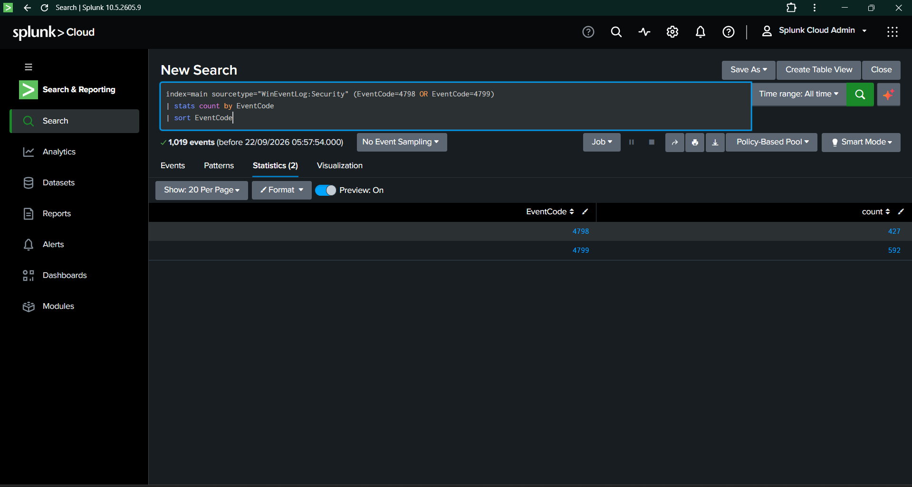
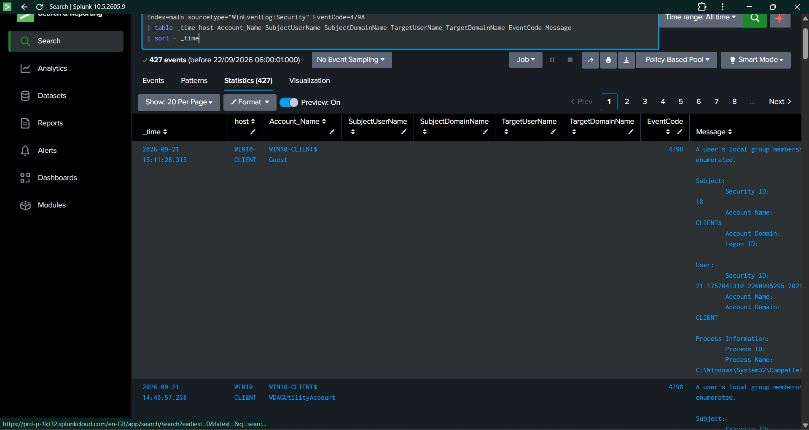
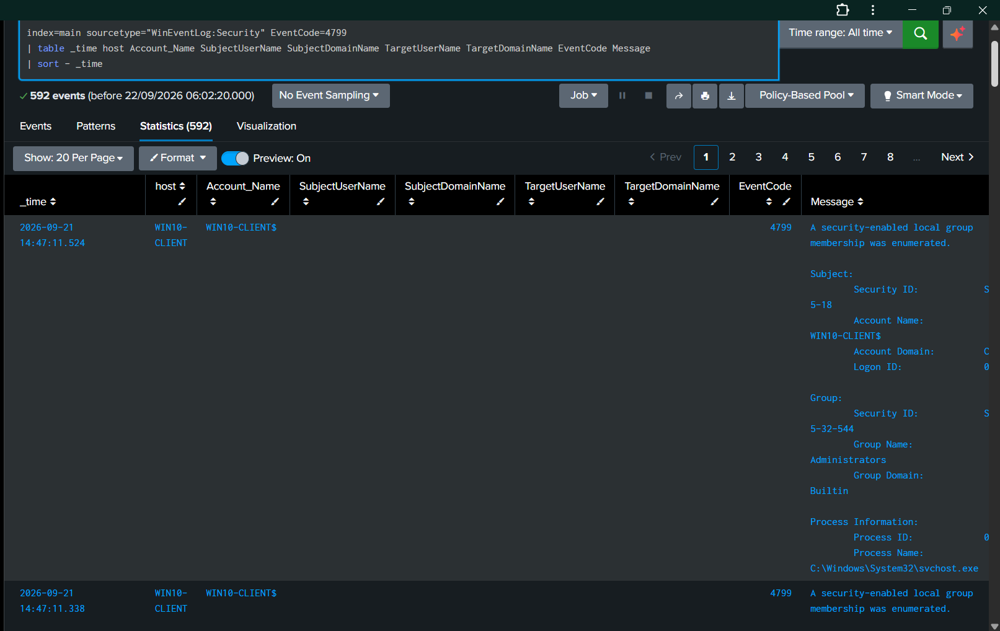
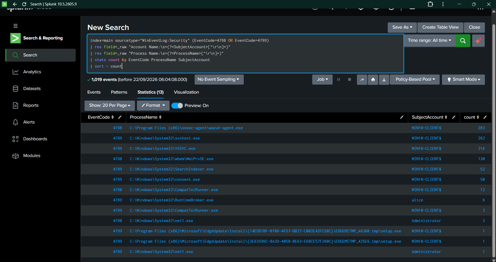
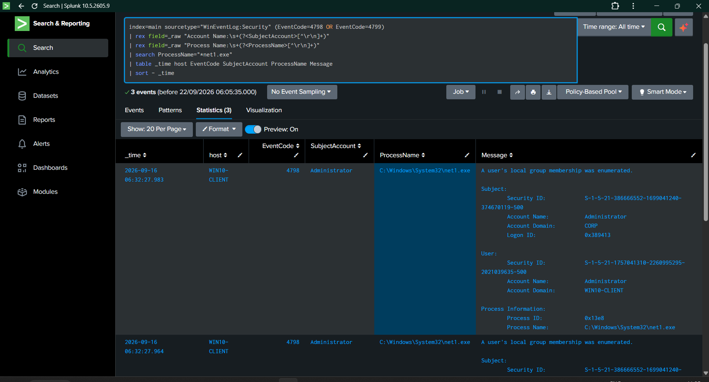
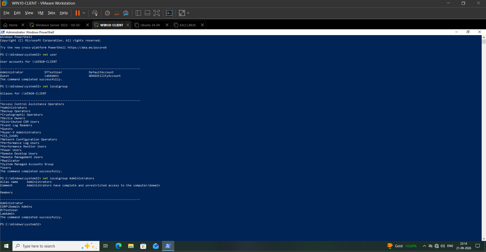
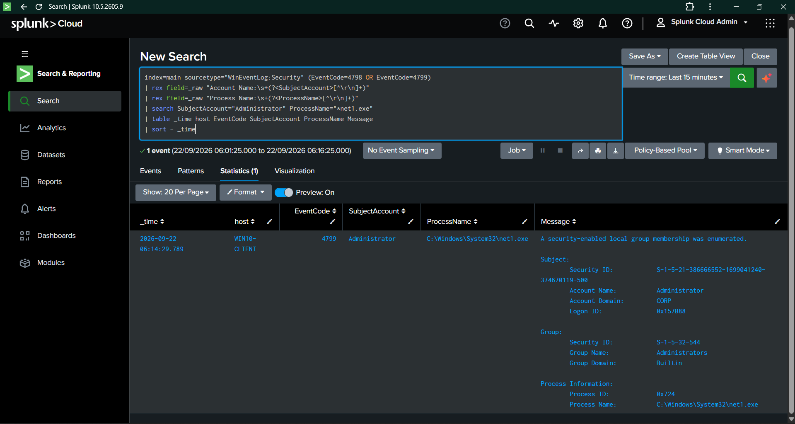
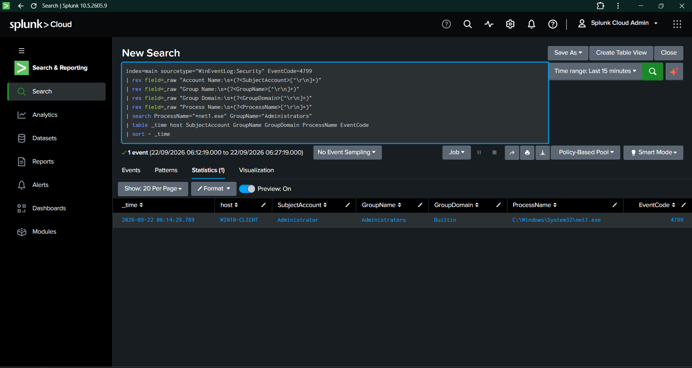
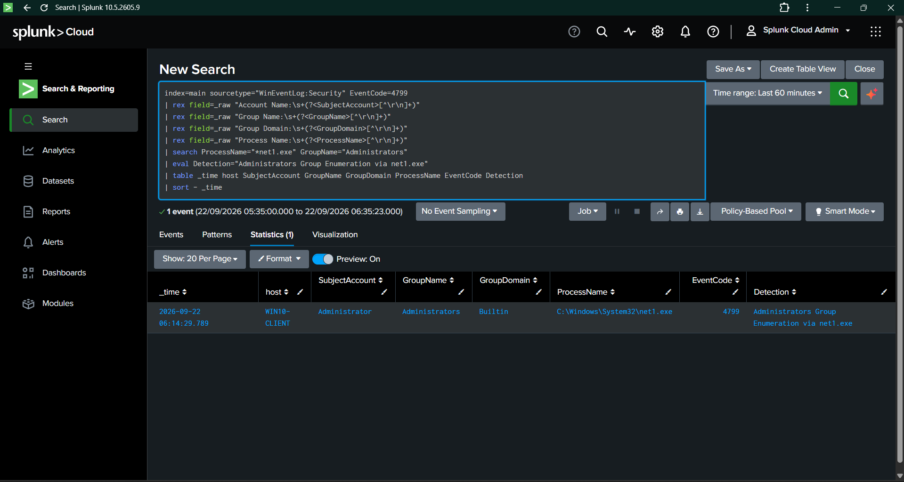
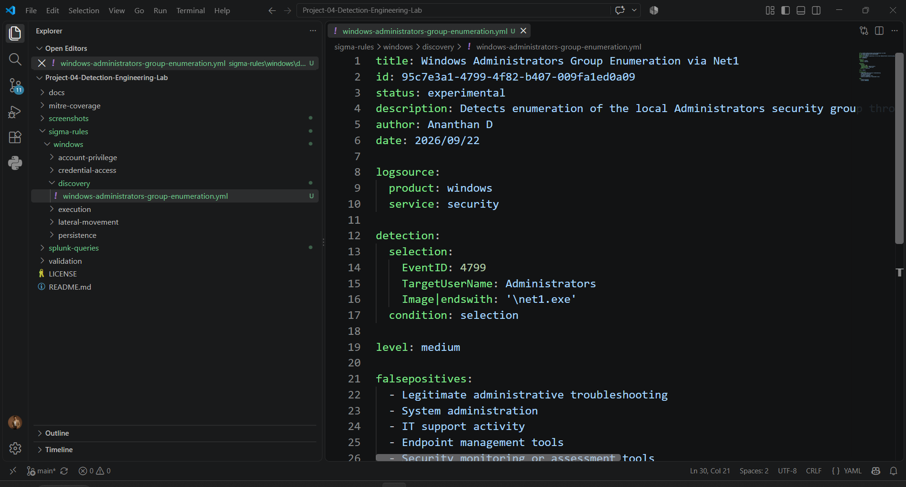

# Day 08 — Windows Discovery Detection

**Project:** Detection Engineering Lab  
**Day:** 08  
**Focus:** Windows Local Group Discovery  
**Platform:** Windows 10 · Splunk Cloud · Sigma  
**Primary Detection:** Administrators Group Enumeration via `net1.exe`  
**Primary Event:** Windows Security Event ID 4799  
**MITRE ATT&CK:** T1069.001 — Permission Groups Discovery: Local Groups  
**Detection Rule:** Rule 007  
**Status:** Completed and Validated

---

## 1. Overview

Day 08 focused on detecting **Windows local permission-group discovery activity**.

The detection engineering process began with an assessment of Windows Security Event IDs **4798** and **4799**, which record local user and security-enabled group membership enumeration.

The initial telemetry showed a high volume of legitimate discovery-related activity generated by Windows services, system processes, Wazuh, and other endpoint components.

Instead of creating a broad detection for every Event ID 4799 event, process-level analysis was performed to identify a more specific and investigation-relevant behavior.

The analysis identified:

- `net1.exe`
- `Administrator`
- `Administrators` group
- Event ID `4799`

A controlled discovery test was then performed using Windows built-in commands. The resulting Event ID 4799 was successfully ingested into Splunk and detected by the final SPL query.

Rule 007 was subsequently implemented as a Sigma detection.

---

# 2. Objectives

The objectives for Day 08 were:

- Assess Windows discovery-related security telemetry.
- Analyze Event IDs 4798 and 4799.
- Establish a process-level discovery baseline.
- Identify legitimate background enumeration.
- Identify a focused discovery behavior suitable for detection.
- Analyze `net1.exe` enumeration activity.
- Perform controlled local user and group discovery.
- Validate Event ID 4799 generation.
- Detect Administrators group enumeration in Splunk.
- Develop Rule 007 using SPL.
- Implement Rule 007 as a Sigma rule.
- Validate the detection using controlled activity.
- Map the detection to MITRE ATT&CK.
- Document all detection evidence and results.

---

# 3. Lab Environment

| Component | Configuration |
|---|---|
| Endpoint | WIN10-CLIENT |
| Operating System | Windows 10 |
| Domain | CORP |
| SIEM | Splunk Cloud |
| Log Source | Windows Security Event Log |
| Log Collection | Splunk Universal Forwarder |
| Primary Event | Event ID 4799 |
| Supporting Event | Event ID 4798 |
| Detection Format | Sigma |
| Query Language | SPL |
| Primary Process | `net1.exe` |
| Target Group | `Administrators` |
| MITRE ATT&CK | T1069.001 |

---

# 4. Detection Engineering Approach

Day 08 followed a telemetry-driven detection engineering workflow:

~~~text
Windows Security Telemetry
        ↓
4798 / 4799 Baseline
        ↓
Event Analysis
        ↓
Process-Level Baseline
        ↓
Legitimate Activity Assessment
        ↓
net1.exe Identification
        ↓
Controlled Discovery Test
        ↓
Event 4799 Validation
        ↓
Field Extraction
        ↓
SPL Detection
        ↓
Sigma Rule 007
        ↓
Controlled Detection Validation
        ↓
MITRE ATT&CK Mapping
~~~

The key principle was to avoid treating every discovery event as suspicious.

The baseline demonstrated that Windows routinely generates legitimate 4798/4799 events. Therefore, process and group context were incorporated into the final detection.

---

# 5. Discovery Event Baseline

The following SPL query was used:

~~~spl
index=main sourcetype="WinEventLog:Security" (EventCode=4798 OR EventCode=4799)
| stats count by EventCode
| sort EventCode
~~~

The telemetry baseline returned:

| Event ID | Count | Activity |
|---:|---:|---|
| 4798 | 427 | User local group membership enumeration |
| 4799 | 592 | Security-enabled local group membership enumeration |
| **Total** | **1,019** | Discovery-related events |

The baseline demonstrated that discovery-related activity was already common in the environment.

### Evidence

**Evidence:** `Day08-01-Discovery-Event-Baseline.png`

---

# 6. Event ID 4798 Analysis

Event ID 4798 was analyzed to understand user local group membership enumeration.

The investigation showed that the event contains important contextual information including:

- Host
- Subject account
- User information
- Process information
- Process ID
- Process name
- Enumeration activity

The raw event structure was reviewed before designing detection logic.

### Evidence

**Evidence:** `Day08-02-User-Group-Enumeration-Analysis.png`

---

# 7. Event ID 4799 Analysis

Event ID 4799 was analyzed because it records enumeration of security-enabled local group membership.

An observed event contained:

- Host: `WIN10-CLIENT`
- Subject Account: `WIN10-CLIENT$`
- Group: `Administrators`
- Group Domain: `Builtin`
- Process: `C:\Windows\System32\svchost.exe`

The event confirmed that legitimate Windows processes can generate Event ID 4799.

Therefore:

~~~text
EventCode=4799
~~~

alone was not considered sufficiently specific for the final detection.

### Evidence

**Evidence:** `Day08-03-Security-Group-Enumeration-Analysis.png`

---

# 8. Enumeration Process Baseline

A process-level baseline was created to determine which processes were responsible for the 4798 and 4799 events.

The analysis identified several high-volume legitimate processes.

| Event ID | Process | Account | Count |
|---:|---|---|---:|
| 4798 | `wazuh-agent.exe` | `WIN10-CLIENT$` | 283 |
| 4799 | `svchost.exe` | `WIN10-CLIENT$` | 262 |
| 4799 | `VSSVC.exe` | `WIN10-CLIENT$` | 216 |
| 4798 | `WmiPrvSE.exe` | `WIN10-CLIENT$` | 130 |
| 4799 | `SearchIndexer.exe` | `WIN10-CLIENT$` | 52 |
| 4799 | `consent.exe` | `WIN10-CLIENT$` | 50 |
| 4798 | `CompatTelRunner.exe` | `WIN10-CLIENT$` | 12 |
| 4799 | `RuntimeBroker.exe` | `alice` | 6 |
| 4798 | `net1.exe` | `Administrator` | 2 |
| 4799 | `net1.exe` | `Administrator` | 1 |

This analysis demonstrated that the environment contains substantial legitimate enumeration activity.

The `net1.exe` activity performed under the `Administrator` account provided a focused behavior for controlled investigation.

### Evidence

**Evidence:** `Day08-04-Enumeration-Process-Baseline.png`

---

# 9. Net1.exe Enumeration Analysis

The identified `net1.exe` activity was investigated separately.

The query returned **3 events** associated with:

~~~text
C:\Windows\System32\net1.exe
~~~

The events included:

- Host: `WIN10-CLIENT`
- Subject Account: `Administrator`
- Event ID: `4798`
- Process: `C:\Windows\System32\net1.exe`
- Activity: User local group membership enumeration

This established that `net1.exe` was producing Windows Security discovery telemetry in the environment.

### Evidence

**Evidence:** `Day08-05-Net1-Enumeration-Analysis.png`

---

# 10. Controlled Discovery Test

A controlled discovery activity was performed on `WIN10-CLIENT`.

The following Windows commands were executed:

~~~powershell
net user

net localgroup

net localgroup Administrators
~~~

The commands successfully enumerated:

- Local user accounts
- Local groups
- Members of the local Administrators group

The final command directly exercised the discovery behavior that Rule 007 was designed to detect.

### Evidence

**Evidence:** `Day08-06-Controlled-Discovery-Test.png`

---

# 11. Controlled Event 4799 Detection

After the controlled discovery commands were executed, Splunk was searched for the resulting Windows Security events.

The detected event contained:

| Field | Value |
|---|---|
| Event ID | `4799` |
| Host | `WIN10-CLIENT` |
| Subject Account | `Administrator` |
| Group | `Administrators` |
| Group Domain | `Builtin` |
| Process | `C:\Windows\System32\net1.exe` |

The event message stated:

~~~text
A security-enabled local group membership was enumerated.
~~~

This confirmed that the controlled discovery activity generated the expected Windows Security telemetry.

### Evidence

**Evidence:** `Day08-07-Controlled-Discovery-Detection.png`

---

# 12. Discovery Field Extraction

The raw Event 4799 event was parsed to extract the fields required by the detection.

The final extraction produced:

| Field | Value |
|---|---|
| Subject Account | `Administrator` |
| Group Name | `Administrators` |
| Group Domain | `Builtin` |
| Process Name | `C:\Windows\System32\net1.exe` |
| Event Code | `4799` |

This demonstrated that the required detection context could be reliably extracted from the Windows Security event.

### Evidence

**Evidence:** `Day08-08-Discovery-Field-Extraction.png`

---

# 13. Rule 007 — SPL Detection

The final Splunk detection was created at:

~~~text
splunk-queries/discovery/administrators-group-enumeration.spl
~~~

Detection query:

~~~spl
index=main sourcetype="WinEventLog:Security" EventCode=4799
| rex field=_raw "Account Name:\s+(?<SubjectAccount>[^\r\n]+)"
| rex field=_raw "Group Name:\s+(?<GroupName>[^\r\n]+)"
| rex field=_raw "Group Domain:\s+(?<GroupDomain>[^\r\n]+)"
| rex field=_raw "Process Name:\s+(?<ProcessName>[^\r\n]+)"
| search ProcessName="*net1.exe" GroupName="Administrators"
| eval Detection="Administrators Group Enumeration via net1.exe"
| table _time host SubjectAccount GroupName GroupDomain ProcessName EventCode Detection
| sort - _time
~~~

The detection requires:

~~~text
Event ID 4799
        AND
Group Name = Administrators
        AND
Process Name = net1.exe
~~~

This provides focused detection coverage instead of generating a signal for every 4799 event.

---

# 14. Rule 007 SPL Validation

The final SPL query returned exactly **1 matching event** from the controlled validation.

Detection result:

| Field | Result |
|---|---|
| Host | `WIN10-CLIENT` |
| Subject Account | `Administrator` |
| Group Name | `Administrators` |
| Group Domain | `Builtin` |
| Process | `C:\Windows\System32\net1.exe` |
| Event ID | `4799` |
| Detection | `Administrators Group Enumeration via net1.exe` |

Event timestamp:

~~~text
2026-09-22 06:14:29.789
~~~

### Evidence

**Evidence:** `Day08-09-Administrators-Enumeration-Detection.png`

---

# 15. Rule 007 — Sigma Detection

The Sigma rule was created at:

~~~text
sigma-rules/windows/discovery/windows-administrators-group-enumeration.yml
~~~

Rule ID:

~~~text
95c7e3a1-4799-4f82-b407-009fa1ed0a09
~~~

The rule uses:

~~~yaml
title: Windows Administrators Group Enumeration via Net1
id: 95c7e3a1-4799-4f82-b407-009fa1ed0a09
status: experimental
description: Detects enumeration of the local Administrators security group through Windows Security Event ID 4799 when performed by net1.exe.
author: Ananthan D
date: 2026/09/22

logsource:
  product: windows
  service: security

detection:
  selection:
    EventID: 4799
    TargetUserName: Administrators
    Image|endswith: '\net1.exe'
  condition: selection

level: medium

falsepositives:
  - Legitimate administrative troubleshooting
  - System administration
  - IT support activity
  - Endpoint management tools
  - Security monitoring or assessment tools

tags:
  - attack.discovery
  - attack.t1069.001
~~~

The Sigma rule represents the detection in a platform-independent format.

The Splunk implementation uses the corresponding fields extracted from the raw Windows Security event.

### Evidence

**Evidence:** `Day08-10-Administrators-Enumeration-Sigma-Rule.png`

---

# 16. Detection Validation

The controlled discovery activity successfully generated the expected Windows Security event.

The final detection successfully identified the event.

| Validation Item | Result |
|---|---|
| Event ID 4799 generated | Yes |
| Administrators group identified | Yes |
| `net1.exe` identified | Yes |
| Administrator account identified | Yes |
| Required fields extracted | Yes |
| SPL detection executed | Yes |
| Matching events | 1 |
| Sigma Rule 007 created | Yes |
| Controlled detection coverage | **100%** |

### Validation Calculation

~~~text
Expected controlled detection events = 1

Detected events = 1

Detection coverage = 1 / 1 × 100

Detection coverage = 100%
~~~

---

# 17. Detection Quality Assessment

The initial baseline contained **1,019 combined Event ID 4798 and 4799 events**.

Several high-volume processes were identified as legitimate sources of enumeration activity, including:

- `wazuh-agent.exe`
- `svchost.exe`
- `VSSVC.exe`
- `WmiPrvSE.exe`
- `SearchIndexer.exe`
- `consent.exe`
- `CompatTelRunner.exe`

Because of this baseline, a generic:

~~~spl
EventCode=4799
~~~

detection would be overly broad for this lab environment.

Rule 007 instead focuses on:

~~~text
Event ID 4799
+
Administrators
+
net1.exe
~~~

This demonstrates practical detection engineering based on observed telemetry, process context, and controlled validation.

---

# 18. SOC Investigation Perspective

An alert for local Administrators group enumeration provides a useful starting point for SOC investigation.

An analyst should investigate:

### Account Context

- Which account performed the enumeration?
- Is the account expected to perform administrative discovery?
- Is the account associated with a legitimate administrative task?

### Group Context

- Which local group was enumerated?
- Was the group privileged?
- Was the `Administrators` group specifically targeted?

### Process Context

- Which process performed the enumeration?
- Was `net1.exe` launched as part of an expected administrative action?
- What process activity occurred around the same timestamp?

### Authentication Context

Correlate the event with:

- Successful logons
- Failed logons
- Network authentication
- Privileged logons

### Follow-on Activity

Investigate for subsequent:

- Account manipulation
- Privilege changes
- Process creation
- Scheduled task creation
- Additional discovery
- Lateral movement-related activity

The detection should therefore be treated as an **investigation signal**, with surrounding telemetry used to establish context.

---

# 19. False Positive Considerations

Potential legitimate sources of Administrators group enumeration include:

- System administration
- IT support
- Endpoint management
- Security monitoring
- Security assessment
- Administrative troubleshooting
- Automated administrative tooling

The initial baseline confirmed that Windows generates substantial legitimate group enumeration activity.

The use of process and target-group context helps reduce unnecessary detection noise.

---

# 20. MITRE ATT&CK Mapping

## T1069.001 — Permission Groups Discovery: Local Groups

Rule 007 maps to:

**MITRE ATT&CK Technique:** T1069 — Permission Groups Discovery

**Sub-technique:** T1069.001 — Permission Groups Discovery: Local Groups

**Tactic:** Discovery

The validated behavior involved enumerating the local `Administrators` security group.

The detection therefore provides coverage for local permission-group discovery activity.

### Detection Mapping

| ATT&CK ID | Technique | Detection |
|---|---|---|
| T1069.001 | Permission Groups Discovery: Local Groups | Event 4799 + Administrators + `net1.exe` |

---

# 21. Quantified Outcomes

| Metric | Result |
|---|---:|
| Event ID 4798 baseline | 427 |
| Event ID 4799 baseline | 592 |
| Combined discovery events | 1,019 |
| `net1.exe` enumeration events identified | 3 |
| Controlled discovery tests | 1 |
| Controlled Event 4799 detected | 1 |
| Final SPL detection matches | 1 |
| Controlled detection coverage | **100%** |
| Sigma rules created | 1 |
| MITRE ATT&CK sub-techniques mapped | 1 |

---

# 22. Evidence Register

All Day 08 evidence is stored under:

~~~text
screenshots/Day08/
~~~

| # | Evidence File | Purpose |
|---:|---|---|
| 01 | `Day08-01-Discovery-Event-Baseline.png` | Baseline of Windows discovery events 4798 and 4799 |
| 02 | `Day08-02-User-Group-Enumeration-Analysis.png` | Event ID 4798 user/group enumeration analysis |
| 03 | `Day08-03-Security-Group-Enumeration-Analysis.png` | Event ID 4799 security-group enumeration analysis |
| 04 | `Day08-04-Enumeration-Process-Baseline.png` | Process-level discovery baseline |
| 05 | `Day08-05-Net1-Enumeration-Analysis.png` | `net1.exe` enumeration investigation |
| 06 | `Day08-06-Controlled-Discovery-Test.png` | Controlled Windows discovery commands |
| 07 | `Day08-07-Controlled-Discovery-Detection.png` | Controlled Event ID 4799 detection |
| 08 | `Day08-08-Discovery-Field-Extraction.png` | Extracted detection fields |
| 09 | `Day08-09-Administrators-Enumeration-Detection.png` | Final SPL detection result |
| 10 | `Day08-10-Administrators-Enumeration-Sigma-Rule.png` | Sigma Rule 007 implementation |

---

# 23. Repository Artifacts

### Sigma Rule

~~~text
sigma-rules/windows/discovery/windows-administrators-group-enumeration.yml
~~~

### Splunk Detection

~~~text
splunk-queries/discovery/administrators-group-enumeration.spl
~~~

### Validation Report

~~~text
validation/rule-007-validation.md
~~~

### MITRE Coverage

~~~text
mitre-coverage/day08-windows-discovery-detection.md
~~~

### Main Day Documentation

~~~text
docs/Day08.md
~~~

### Evidence

~~~text
screenshots/Day08/
~~~

---

# 24. Detection Engineering Skills Demonstrated

### Windows Security Monitoring

- Windows Security Event Log analysis
- Event ID 4798 analysis
- Event ID 4799 analysis
- Local group enumeration monitoring
- Privileged group discovery analysis

### Detection Engineering

- Telemetry baseline development
- Process-level baseline analysis
- Raw event analysis
- SPL field extraction
- Detection tuning
- Sigma rule development
- Controlled detection validation

### SOC Investigation

- Baseline analysis
- Process and account context analysis
- Privileged group investigation
- False-positive assessment
- Evidence-based detection development
- Follow-on investigation planning

### Threat Detection

- Windows discovery detection
- Local permission-group discovery
- Administrators group enumeration
- `net1.exe` activity analysis

### Framework Knowledge

- MITRE ATT&CK
- T1069 — Permission Groups Discovery
- T1069.001 — Permission Groups Discovery: Local Groups

---

# 25. Final Day 08 Outcome

Day 08 successfully implemented and validated a focused **Windows Administrators Group Enumeration detection**.

The detection was developed from verified Windows Security telemetry rather than assuming that every discovery event represented suspicious activity.

The investigation began with **1,019 Event ID 4798/4799 events**, followed by process-level analysis that identified legitimate background enumeration and a smaller set of `net1.exe` activity associated with the `Administrator` account.

A controlled discovery test using:

~~~powershell
net user
net localgroup
net localgroup Administrators
~~~

successfully generated Event ID 4799 for enumeration of the local `Administrators` group.

The final SPL detection identified **1 matching controlled event**, resulting in **100% detection coverage for the controlled validation case**.

The detection was also implemented as **Sigma Rule 007** and mapped to **MITRE ATT&CK T1069.001 — Permission Groups Discovery: Local Groups**.

Day 08 demonstrates the complete detection engineering lifecycle:

~~~text
Telemetry
   ↓
Baseline
   ↓
Behavior Analysis
   ↓
Process Context
   ↓
Controlled Validation
   ↓
SPL Detection
   ↓
Sigma Rule
   ↓
MITRE ATT&CK
   ↓
Evidence-Based Validation
~~~

**Day 08 Status: COMPLETE**