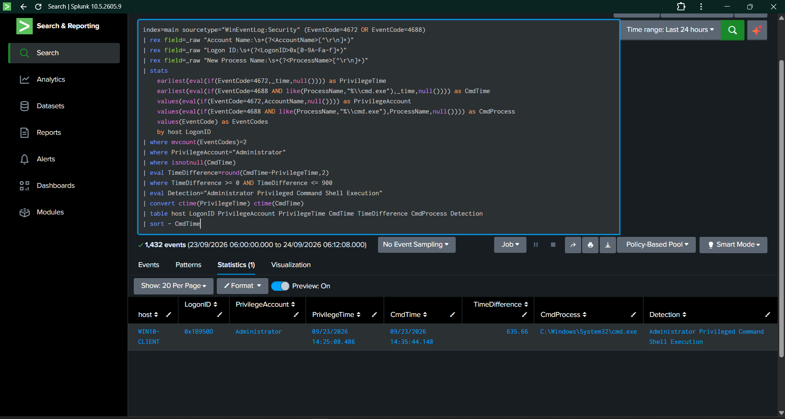
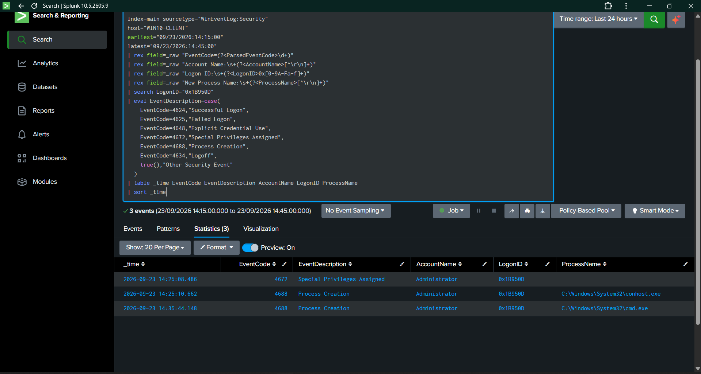
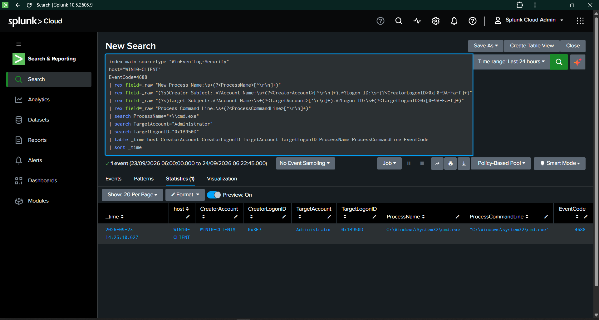
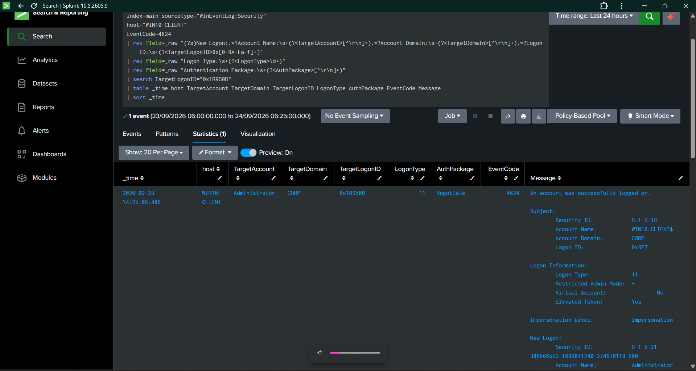

# Day 10 — SOC Investigation Workflow

## 1. Overview

**Project:** Detection Engineering Lab  
**Day:** 10  
**Focus:** SOC Alert Triage and Investigation Workflow  
**Detection Investigated:** Rule 008 — Windows Administrator Privileged Command Shell Execution  
**Platform:** Windows 10  
**SIEM:** Splunk Cloud  
**Status:** Complete

Day 10 focused on demonstrating how a SOC analyst investigates a detection after it has triggered.

Instead of creating another detection, the existing Rule 008 alert was investigated through a structured workflow covering alert triage, timeline reconstruction, process context, authentication context, evidence analysis, and analyst disposition.

---

## 2. Investigation Objective

The objective was to demonstrate a complete SOC investigation workflow from an alert through evidence-based assessment.

The investigation followed:

~~~text
Detection Alert
      ↓
Alert Triage
      ↓
Timeline Reconstruction
      ↓
Process Context Analysis
      ↓
Authentication Context
      ↓
Evidence Correlation
      ↓
Analyst Assessment
      ↓
Investigation Conclusion
~~~

The investigation used Windows Security telemetry collected in Splunk Cloud.

---

## 3. Detection Under Investigation

**Detection:** Administrator Privileged Command Shell Execution

**Rule:** Rule 008

**Primary Events:**

~~~text
Event ID 4672 — Special Privileges Assigned
Event ID 4688 — Process Creation
~~~

**Correlation Context:**

~~~text
Host: WIN10-CLIENT
Account: Administrator
Logon ID: 0x1B950D
Process: C:\Windows\System32\cmd.exe
~~~

The alert identifies `cmd.exe` execution occurring within an Administrator privileged-session context.

---

## 4. Alert Triage

The first investigation step was to review the Rule 008 detection result and establish the basic alert context.

### Observed Alert

~~~text
Host:               WIN10-CLIENT
Account:            Administrator
Logon ID:           0x1B950D
Privilege Event:    4672
Privilege Time:     2026-09-23 14:25:08.486
Process Event:      4688
Process:            C:\Windows\System32\cmd.exe
Command Time:       2026-09-23 14:35:44.148
Time Difference:    635.66 seconds
Detection:          Administrator Privileged Command Shell Execution
~~~

### Evidence

**File:** `Day10-01-Rule-008-Alert-Triage.png`

The alert provided the initial investigation context and identified the host, account, Logon ID, process, and event timing.

---

## 5. Timeline Reconstruction

The next investigation step was to reconstruct activity associated with the specific Windows Logon ID rather than reviewing unrelated Windows Security events.

The investigation focused on:

~~~text
Logon ID: 0x1B950D
Host: WIN10-CLIENT
Account: Administrator
~~~

### Reconstructed Timeline

~~~text
14:25:08.486
Event 4672
Special privileges assigned
Administrator
Logon ID: 0x1B950D
        ↓
14:25:10.662
Event 4688
conhost.exe process creation
Administrator
Logon ID: 0x1B950D
        ↓
14:35:44.148
Event 4688
cmd.exe process creation
Administrator
Logon ID: 0x1B950D
~~~

The timeline demonstrates that the `cmd.exe` process occurred within the same investigated Windows session.

### Evidence

**File:** `Day10-02-Alert-Timeline.png`

This evidence provides the chronological view used during alert investigation.

---

## 6. Process Context Analysis

The `cmd.exe` Event ID 4688 was investigated to determine the process and account context associated with the alert.

### Observed Process Context

~~~text
Host:               WIN10-CLIENT
Creator Account:    WIN10-CLIENT$
Creator Logon ID:   0x3E7
Target Account:     Administrator
Target Logon ID:    0x1B950D
Process:            C:\Windows\System32\cmd.exe
Command Line:       "C:\Windows\system32\cmd.exe"
Event ID:            4688
~~~

The Event ID 4688 record contains separate creator and target security contexts. The **Target Logon ID `0x1B950D`** matches the Administrator session identified by the Rule 008 investigation.

This distinction was important because Windows Event 4688 contains multiple account and Logon ID fields.

### Evidence

**File:** `Day10-03-Cmd-Process-Context.png`

---

## 7. Authentication Context

The investigation then examined the Windows successful-logon event associated with the same Administrator Logon ID.

### Observed Authentication Context

~~~text
Event ID:           4624
Account:            Administrator
Domain:             CORP
Target Logon ID:    0x1B950D
Logon Type:         11
Authentication:     Negotiate
Time:               2026-09-23 14:25:08.486
~~~

The matching Logon ID connects the authentication event to the privileged session investigated by Rule 008.

The investigation therefore established the following sequence:

~~~text
4624
Administrator authentication
        ↓
4672
Special privileges assigned
        ↓
4688
cmd.exe process creation
        ↓
Rule 008 detection
~~~

### Evidence

**File:** `Day10-04-Privileged-Session-Authentication.png`

---

## 8. Controlled Activity Context

The `cmd.exe` activity used for validation was generated through controlled laboratory activity.

The benign test command was:

~~~cmd
cmd.exe /c echo Day09-Administrator-Cmd-Test
~~~

The purpose of the activity was to generate observable Windows process-creation telemetry for detection validation.

The test did not involve:

- Malware
- Persistence
- Credential theft
- Registry modification
- Account creation
- Unauthorized system changes

The resulting telemetry was used to validate the Rule 008 detection and demonstrate the SOC investigation workflow.

---

## 9. Evidence Correlation

The investigation correlated multiple Windows Security events using the Windows Logon ID.

### Correlation Summary

| Event | Event ID | Account | Logon ID | Purpose |
|---|---:|---|---|---|
| Successful Logon | 4624 | Administrator | `0x1B950D` | Authentication context |
| Special Privileges | 4672 | Administrator | `0x1B950D` | Privileged-session context |
| Process Creation | 4688 | Administrator | `0x1B950D` | `cmd.exe` execution |

This provided a connected investigation trail rather than treating each event independently.

---

## 10. SOC Analyst Assessment

The detection successfully identified a privileged Administrator session followed by Windows Command Shell execution.

The investigation confirmed:

- The alert was generated by the expected Rule 008 logic.
- The Administrator Logon ID was consistent across the relevant session events.
- Event ID 4672 established privileged-session context.
- Event ID 4688 identified `cmd.exe`.
- Event ID 4624 provided authentication context.
- The process and authentication events were correlated using the Windows Logon ID.
- The activity was reproduced as controlled benign laboratory activity.

### Investigation Disposition

~~~text
Disposition: Benign / Controlled Validation Activity
Detection Status: Correctly Triggered
Investigation Status: Complete
~~~

This disposition is based on the controlled nature of the laboratory activity and the documented validation procedure.

---

## 11. Investigation Workflow Demonstrated

Day 10 demonstrates the following practical SOC workflow:

~~~text
1. Alert Identification
        ↓
2. Alert Triage
        ↓
3. Host and Account Identification
        ↓
4. Logon ID Identification
        ↓
5. Timeline Reconstruction
        ↓
6. Process Investigation
        ↓
7. Authentication Investigation
        ↓
8. Cross-Event Correlation
        ↓
9. Evidence Review
        ↓
10. Analyst Disposition
~~~

This workflow demonstrates how a SOC analyst can move from an initial SIEM alert to an evidence-backed investigation conclusion.

---

## 12. Key Investigation Findings

### Finding 01 — Privileged Session

Event ID 4672 confirmed special privileges assigned to the Administrator session identified by Logon ID `0x1B950D`.

### Finding 02 — Command Shell Execution

Event ID 4688 recorded:

~~~text
C:\Windows\System32\cmd.exe
~~~

within the investigated Administrator session.

### Finding 03 — Authentication Context

Event ID 4624 provided the successful authentication context for the same Administrator Logon ID.

### Finding 04 — Cross-Event Correlation

The same Windows Logon ID connected the authentication, privilege-assignment, and process-creation events.

### Finding 05 — Controlled Validation

The activity was generated as part of controlled laboratory validation rather than an uncontrolled security incident.

---

## 13. Investigation Evidence Summary

| Evidence | Investigation Purpose |
|---|---|
| `Day10-01-Rule-008-Alert-Triage.png` | Initial alert triage |
| `Day10-02-Alert-Timeline.png` | Session timeline reconstruction |
| `Day10-03-Cmd-Process-Context.png` | `cmd.exe` process investigation |
| `Day10-04-Privileged-Session-Authentication.png` | Authentication context |

All evidence is stored under:

~~~text
screenshots/Day10/
~~~

---

## 14. Skills Demonstrated

Day 10 demonstrates practical SOC analyst capabilities in:

- SIEM alert triage
- Windows Security Event investigation
- Event ID 4624 analysis
- Event ID 4672 analysis
- Event ID 4688 analysis
- Process investigation
- Authentication investigation
- Timeline reconstruction
- Logon ID correlation
- Evidence-based analysis
- False-positive assessment
- Alert disposition
- SOC investigation documentation

---

## 15. Quantified Investigation Outcome

~~~text
Windows Security Events Investigated: 3
Primary Correlation Identifier: 1 Logon ID
Primary Host Investigated: 1
Account Investigated: 1
Process Investigated: 1 cmd.exe
Investigation Evidence Items: 4
Detection Under Investigation: Rule 008
Final Disposition: Controlled / Benign Validation
~~~

The investigation successfully connected authentication, privileged-session, and process-creation telemetry into a single analyst workflow.

---

## 16. Repository Evidence

~~~text
docs/
└── Day10.md

screenshots/
└── Day10/
    ├── Day10-01-Rule-008-Alert-Triage.png
    ├── Day10-02-Alert-Timeline.png
    ├── Day10-03-Cmd-Process-Context.png
    └── Day10-04-Privileged-Session-Authentication.png
~~~

---

## 17. Day 10 Outcome

Day 10 transformed the Rule 008 detection from a detection-engineering artifact into a complete SOC investigation workflow.

The investigation demonstrated:

~~~text
Alert
  ↓
Triage
  ↓
Timeline
  ↓
Process Context
  ↓
Authentication Context
  ↓
Event Correlation
  ↓
Evidence Review
  ↓
Analyst Disposition
~~~

The investigation was completed using collected Windows Security telemetry in Splunk Cloud and supported by four documented evidence items.

### Day 10 Status

**COMPLETE**

**Investigation:** Rule 008 — Administrator Privileged Command Shell Execution

**Disposition:** Controlled / Benign Validation Activity

**Evidence:** 4 investigation screenshots

**Primary Correlation Identifier:** Windows Logon ID `0x1B950D`