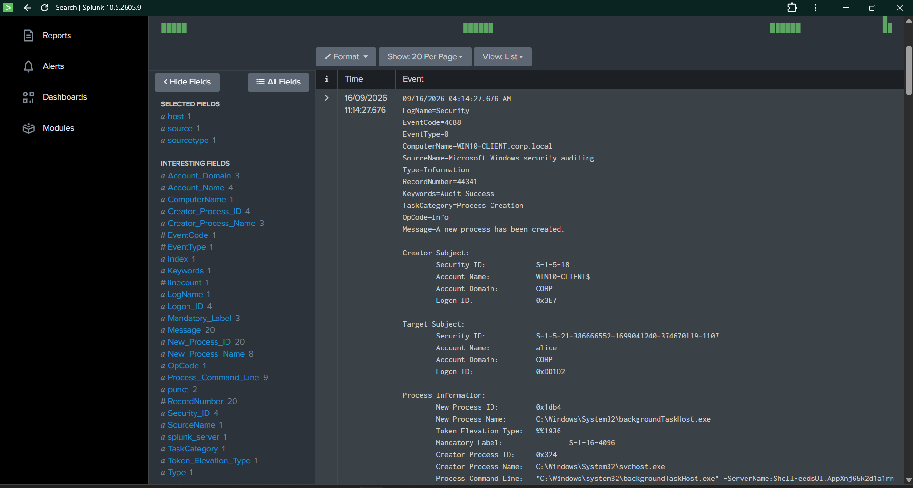
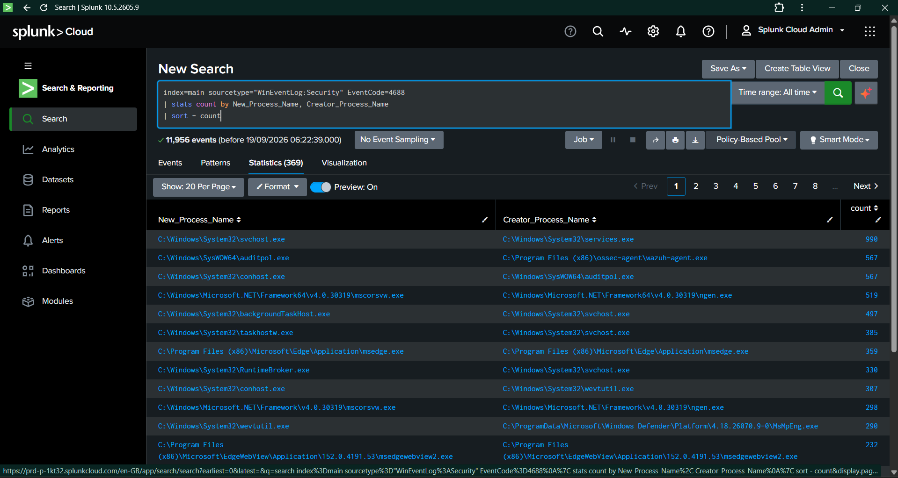
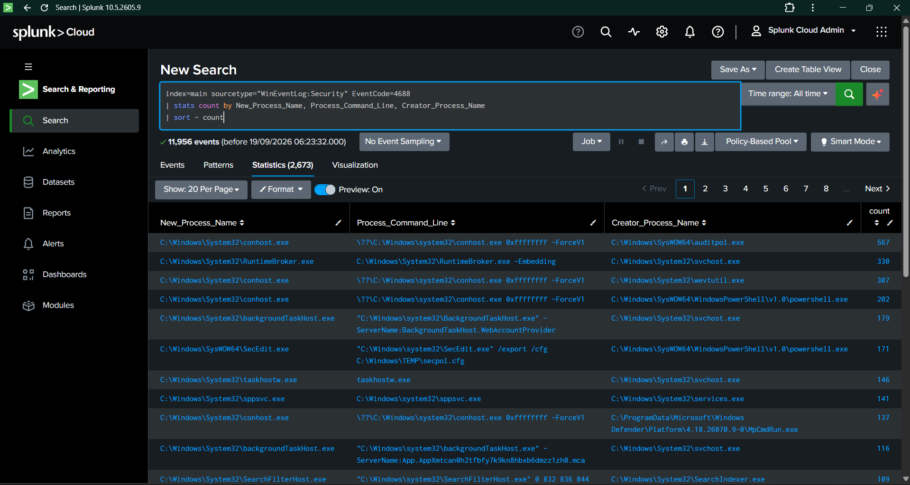
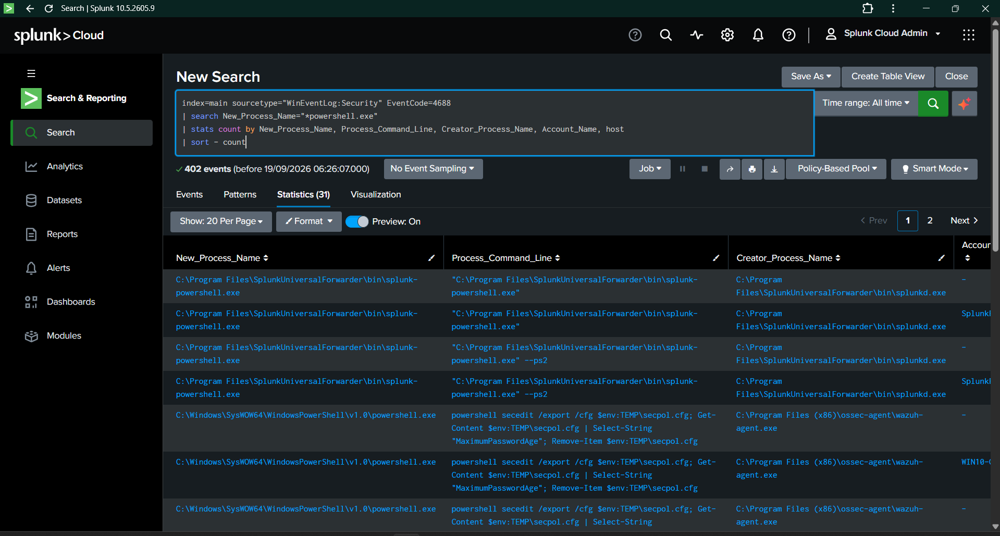
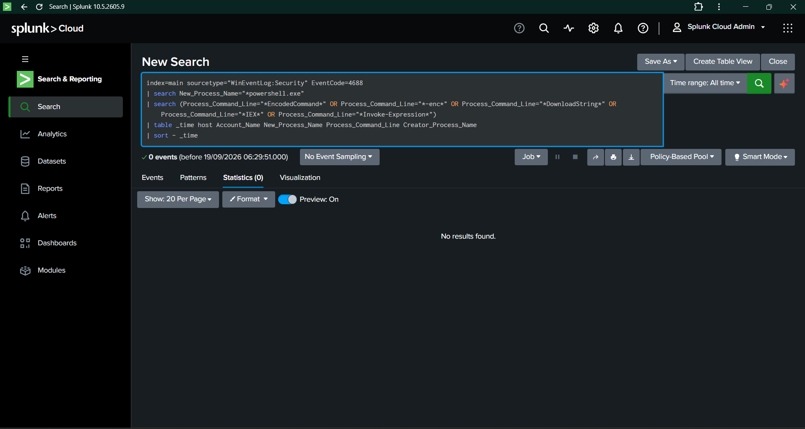
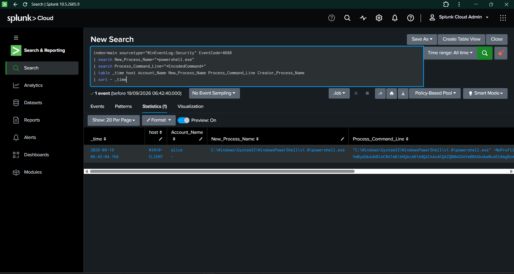
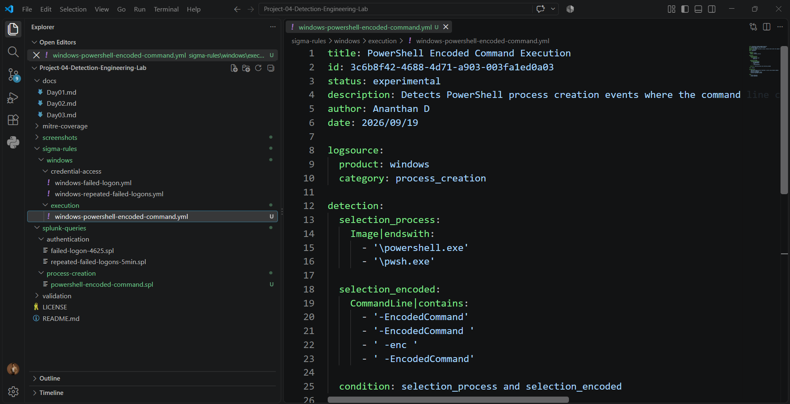
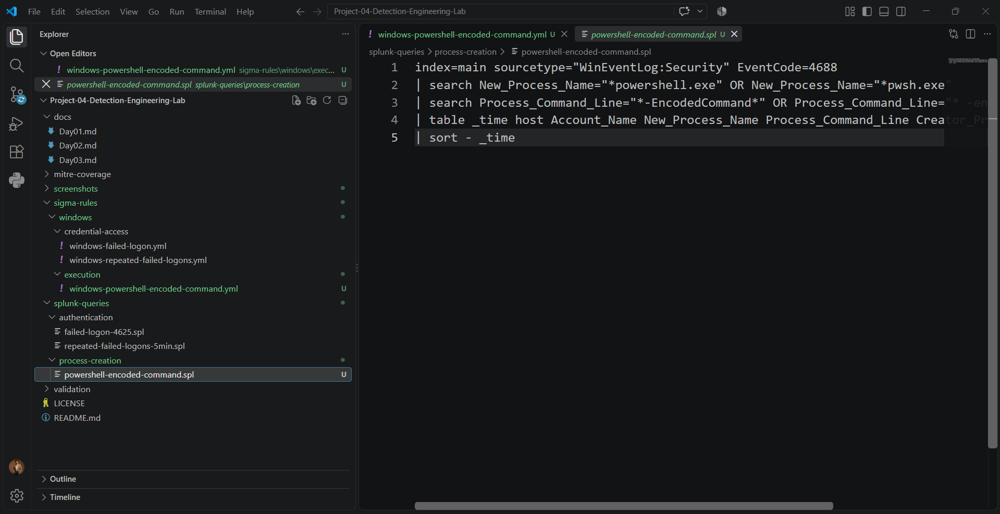
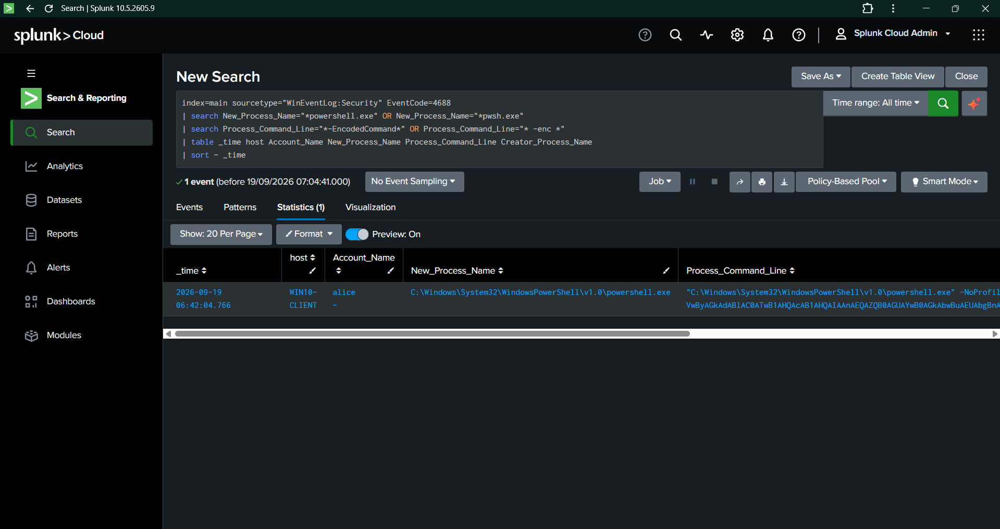

# Day 04 — Process Creation Detection & MITRE ATT&CK Coverage

## Detection Overview

| Field | Details |
|---|---|
| Project | Project 04 — Detection Engineering Lab |
| Day | Day 04 |
| Detection Area | Windows Process Creation |
| Primary Event ID | `4688` |
| Detection | PowerShell Encoded Command Execution |
| Sigma Rule | `windows-powershell-encoded-command.yml` |
| Rule ID | `3c6b8f42-4688-4d71-a903-003fa1ed0a03` |
| Splunk Query | `powershell-encoded-command.spl` |
| MITRE ATT&CK | `T1059.001` |
| Technique | PowerShell |
| Platform | Windows |
| SIEM | Splunk Cloud |
| Host | `WIN10-CLIENT` |
| Validation Status | Successfully validated |
| Date | 19 September 2026 |

---

# 1. Detection Objective

The objective of Day 04 was to develop a process-creation detection using Windows Security Event ID `4688`.

The investigation focused on PowerShell process creation and command-line analysis.

Instead of detecting every PowerShell execution, the detection was designed to identify PowerShell processes where the command line contains encoded-command indicators.

This approach provides additional behavioral context while avoiding a generic detection for all PowerShell activity.

---

# 2. Windows Event ID 4688

Windows Security Event ID `4688` records the creation of a new process.

The event provides valuable process execution telemetry, including:

- New process name.
- Process command line.
- Creator process name.
- Creator process ID.
- New process ID.
- Account information.
- Logon ID.
- Token elevation information.
- Mandatory integrity level.

These fields allow analysts to investigate process execution and parent-child process relationships.

---

# 3. Event 4688 Telemetry Observed

The lab environment successfully provided detailed Event ID `4688` telemetry.

Observed fields included:

| Field | Available |
|---|---|
| `EventCode` | Yes |
| `New_Process_Name` | Yes |
| `Process_Command_Line` | Yes |
| `Creator_Process_Name` | Yes |
| `Creator_Process_ID` | Yes |
| `New_Process_ID` | Yes |
| `Account_Name` | Yes |
| `Account_Domain` | Yes |
| `Logon_ID` | Yes |
| `Token_Elevation_Type` | Yes |
| `Mandatory_Label` | Yes |

### Evidence

**Evidence:** `Day04-01-Event-4688-Analysis.png`

---

# 4. Process Creation Baseline

A baseline search was performed to understand normal process creation behavior within the Windows client.

The search returned:

- `11,956` Event ID `4688` events.
- `369` unique process and parent-process combinations.

### SPL Query

~~~spl
index=main sourcetype="WinEventLog:Security" EventCode=4688
| stats count by New_Process_Name, Creator_Process_Name
| sort - count
~~~

The baseline identified common Windows process relationships such as:

- `services.exe` → `svchost.exe`
- `svchost.exe` → `backgroundTaskHost.exe`
- `auditpol.exe` → `conhost.exe`
- `powershell.exe` → `conhost.exe`

### Evidence

**Evidence:** `Day04-02-Process-Creation-Baseline.png`

---

# 5. Process Command-Line Baseline

Process command-line analysis was performed to identify the level of command-line visibility available in Event ID `4688`.

The search produced:

- `11,956` Event ID `4688` events.
- `2,673` unique process, command-line, and parent-process combinations.

### SPL Query

~~~spl
index=main sourcetype="WinEventLog:Security" EventCode=4688
| stats count by New_Process_Name, Process_Command_Line, Creator_Process_Name
| sort - count
~~~

The results confirmed that command-line telemetry was available for process-creation events.

### Evidence

**Evidence:** `Day04-03-Process-Command-Line-Baseline.png`

---

# 6. PowerShell Process Analysis

PowerShell-specific process creation activity was then analyzed.

The search identified:

- `402` PowerShell-related Event ID `4688` events.
- `31` distinct process and command-line combinations.

The baseline included legitimate PowerShell activity from:

- Splunk Universal Forwarder.
- Wazuh/security tooling.
- Windows administrative activity.

This demonstrated why a generic `powershell.exe` detection would generate significant noise in the lab environment.

### SPL Query

~~~spl
index=main sourcetype="WinEventLog:Security" EventCode=4688
| search New_Process_Name="*powershell.exe"
| stats count by New_Process_Name, Process_Command_Line, Creator_Process_Name, Account_Name, host
| sort - count
~~~

### Evidence

**Evidence:** `Day04-04-PowerShell-Process-Analysis.png`

---

# 7. Suspicious PowerShell Pattern Baseline

A focused search was performed for selected PowerShell command-line indicators:

- `EncodedCommand`
- `-enc`
- `DownloadString`
- `IEX`
- `Invoke-Expression`

### Baseline SPL Query

~~~spl
index=main sourcetype="WinEventLog:Security" EventCode=4688
| search New_Process_Name="*powershell.exe"
| search (Process_Command_Line="*EncodedCommand*" OR Process_Command_Line="*-enc*" OR Process_Command_Line="*DownloadString*" OR Process_Command_Line="*IEX*" OR Process_Command_Line="*Invoke-Expression*")
| table _time host Account_Name New_Process_Name Process_Command_Line Creator_Process_Name
| sort - _time
~~~

### Result

The baseline search returned:

**`0` events**

This established a clean baseline for the selected indicators before controlled validation.

### Evidence

**Evidence:** `Day04-05-PowerShell-Suspicious-Pattern-Baseline.png`

---

# 8. Controlled PowerShell Validation

A controlled PowerShell process was executed to generate a known process-creation event containing an encoded command.

The test payload executed:

~~~text
Write-Output "DetectionEngineering-Day04"
~~~

The activity was designed only to generate controlled telemetry for detection validation.

### Observed Event

| Field | Value |
|---|---|
| Event ID | `4688` |
| Host | `WIN10-CLIENT` |
| Account | `alice` |
| Process | `powershell.exe` |
| Indicator | `-EncodedCommand` |
| Event Count | `1` |
| Timestamp | `2026-09-19 06:42:04.766` |

### Evidence

**Evidence:** `Day04-06-Controlled-PowerShell-EncodedCommand.png`

---

# 9. Sigma Detection

## Rule 003 — PowerShell Encoded Command Execution

### Rule Location

~~~text
sigma-rules/windows/execution/windows-powershell-encoded-command.yml
~~~

### Rule ID

~~~text
3c6b8f42-4688-4d71-a903-003fa1ed0a03
~~~

### Detection Logic

The detection requires:

1. PowerShell process creation.
2. The process must be `powershell.exe` or `pwsh.exe`.
3. The command line must contain an encoded-command indicator.

The rule therefore focuses on a specific PowerShell execution behavior instead of detecting every PowerShell process.

### Evidence

**Evidence:** `Day04-08-PowerShell-EncodedCommand-Sigma-Rule.png`

---

# 10. Splunk Detection

## SPL Query

The Sigma detection was implemented in Splunk using:

~~~spl
index=main sourcetype="WinEventLog:Security" EventCode=4688
| search New_Process_Name="*powershell.exe" OR New_Process_Name="*pwsh.exe"
| search Process_Command_Line="*-EncodedCommand*" OR Process_Command_Line="* -enc *"
| table _time host Account_Name New_Process_Name Process_Command_Line Creator_Process_Name
| sort - _time
~~~

### Query Location

~~~text
splunk-queries/process-creation/powershell-encoded-command.spl
~~~

### Evidence

**Evidence:** `Day04-09-PowerShell-EncodedCommand-SPL-Query.png`

---

# 11. Detection Result

The final SPL detection successfully identified the controlled Event ID `4688`.

### Result

**1 matching event**

The detected event contained:

- Host: `WIN10-CLIENT`
- Account: `alice`
- Process: `powershell.exe`
- Encoded-command indicator: `-EncodedCommand`
- Event ID: `4688`

### Evidence

**Evidence:** `Day04-07-PowerShell-EncodedCommand-Detection.png`

---

# 12. MITRE ATT&CK Mapping

## T1059.001 — PowerShell

| Field | Details |
|---|---|
| MITRE ATT&CK ID | `T1059.001` |
| Technique | PowerShell |
| Tactic | Execution |
| Detection | PowerShell Encoded Command Execution |
| Data Source | Windows Security Event ID `4688` |
| SIEM | Splunk Cloud |

The detection provides visibility into PowerShell execution through Windows process-creation telemetry.

The command-line component provides additional context for identifying specific PowerShell execution patterns.

---

# 13. Detection-to-MITRE Evidence Chain

~~~text
Windows Event ID 4688
        ↓
PowerShell Process Creation
        ↓
Command-Line Telemetry
        ↓
Encoded Command Indicator
        ↓
Sigma Rule 003
        ↓
Splunk SPL Detection
        ↓
MITRE ATT&CK T1059.001
        ↓
PowerShell
~~~

---

# 14. Validation Summary

| Metric | Result |
|---|---:|
| Event ID 4688 events analyzed | `11,956` |
| Unique process/parent combinations | `369` |
| Unique process/command-line/parent combinations | `2,673` |
| PowerShell-related events | `402` |
| PowerShell combinations | `31` |
| Baseline suspicious-pattern matches | `0` |
| Controlled test events | `1` |
| Detection matches | `1` |
| Successful detection rate for controlled test | `1/1` |
| MITRE ATT&CK techniques mapped | `1` |

---

# 15. Evidence Register

| Evidence ID | Description | File |
|---|---|---|
| Day04-01 | Event ID 4688 analysis | `Day04-01-Event-4688-Analysis.png` |
| Day04-02 | Process creation baseline | `Day04-02-Process-Creation-Baseline.png` |
| Day04-03 | Process command-line baseline | `Day04-03-Process-Command-Line-Baseline.png` |
| Day04-04 | PowerShell process analysis | `Day04-04-PowerShell-Process-Analysis.png` |
| Day04-05 | Suspicious PowerShell pattern baseline | `Day04-05-PowerShell-Suspicious-Pattern-Baseline.png` |
| Day04-06 | Controlled encoded-command event | `Day04-06-Controlled-PowerShell-EncodedCommand.png` |
| Day04-07 | Final detection result | `Day04-07-PowerShell-EncodedCommand-Detection.png` |
| Day04-08 | Sigma Rule 003 | `Day04-08-PowerShell-EncodedCommand-Sigma-Rule.png` |
| Day04-09 | Splunk SPL query | `Day04-09-PowerShell-EncodedCommand-SPL-Query.png` |

---

# 16. Detection Coverage

Day 04 adds process-execution visibility to the detection engineering repository.

The detection coverage established during this stage includes:

| Area | Coverage |
|---|---|
| Windows Process Creation | Event ID `4688` |
| PowerShell Execution | `powershell.exe` / `pwsh.exe` |
| Encoded Command Detection | `-EncodedCommand` / `-enc` |
| SIEM Detection | Splunk SPL |
| Detection-as-Code | Sigma |
| MITRE ATT&CK | `T1059.001` |
| Validation | Controlled test |
| Evidence | 9 screenshots |

---

# 17. Repository Artifacts

### Sigma Rule

~~~text
sigma-rules/windows/execution/windows-powershell-encoded-command.yml
~~~

### Splunk Query

~~~text
splunk-queries/process-creation/powershell-encoded-command.spl
~~~

### Validation

~~~text
validation/rule-003-validation.md
~~~

### MITRE Coverage

~~~text
mitre-coverage/day04-process-creation-detection.md
~~~

### Evidence

~~~text
screenshots/Day04/
~~~

---

# 18. Day 04 Detection Engineering Outcome

Day 04 successfully extended the Detection Engineering Lab from authentication monitoring into Windows process-execution monitoring.

The investigation began with `11,956` Event ID `4688` events and established a process-creation baseline.

PowerShell analysis identified `402` PowerShell-related events, demonstrating that generic PowerShell detection would produce substantial normal activity.

A focused baseline search for selected encoded-command indicators returned `0` events.

A controlled PowerShell encoded-command execution was then generated and successfully captured as Event ID `4688`.

The final Splunk detection identified the controlled event with:

**1 controlled test event → 1 detection match**

The resulting detection was mapped to:

**MITRE ATT&CK `T1059.001 — PowerShell`**

This establishes an evidence-backed process-creation detection covering PowerShell execution behavior within the Windows lab environment.