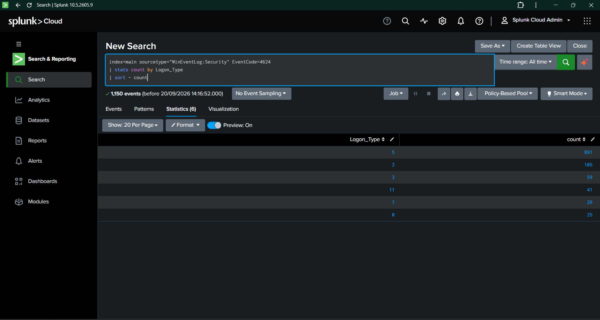
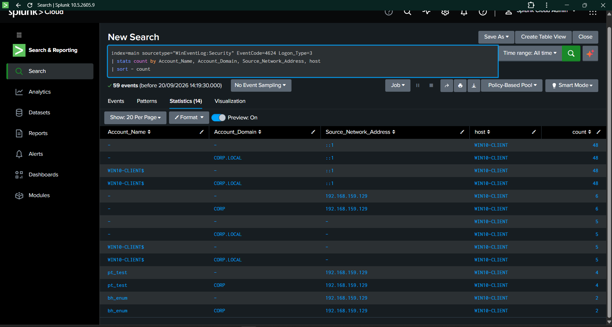
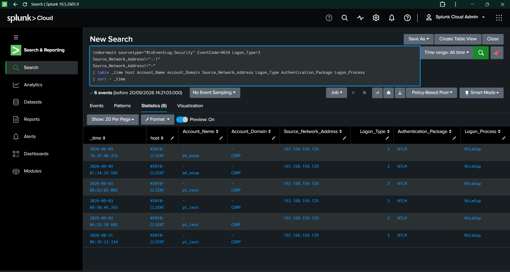
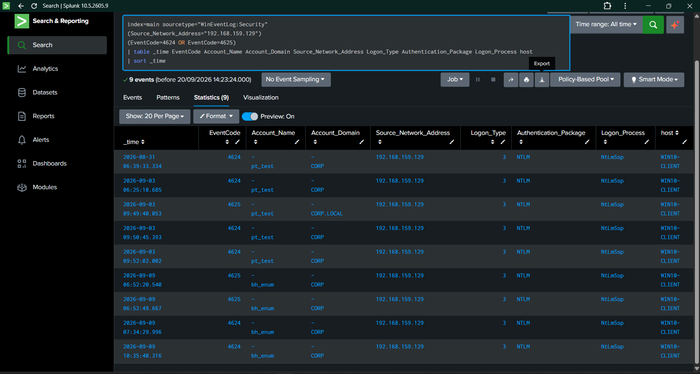
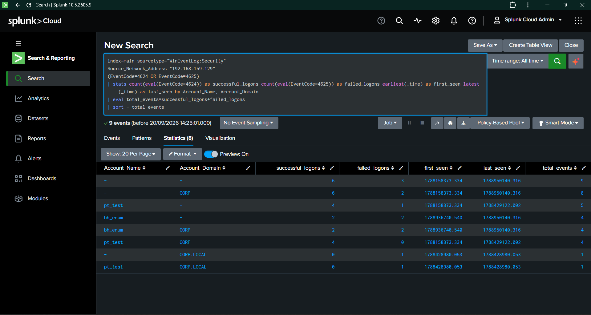
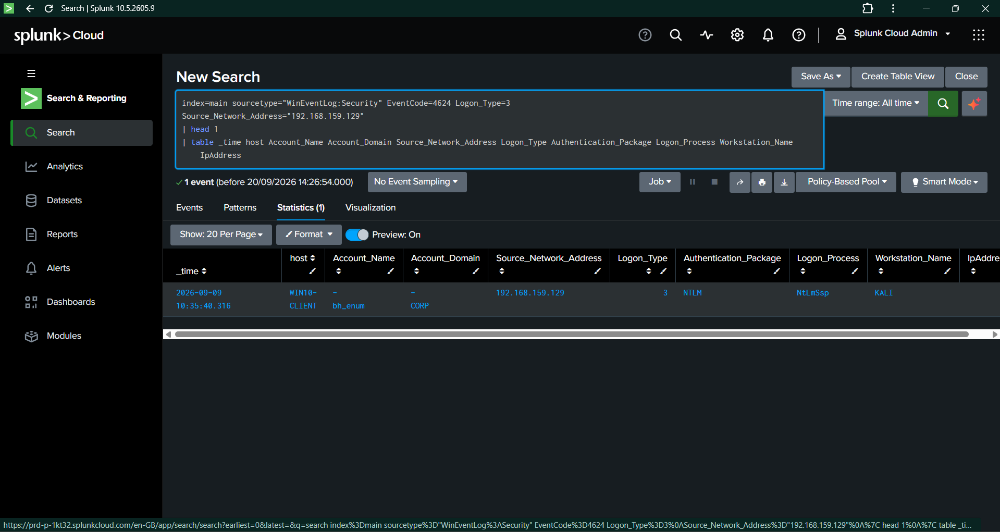
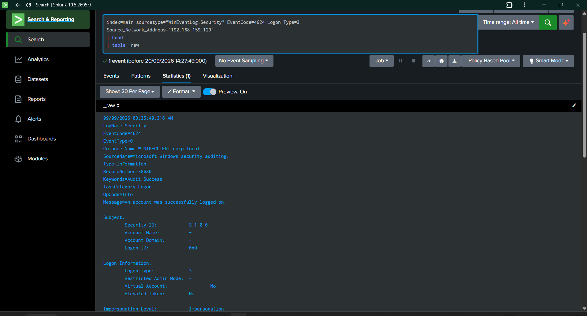
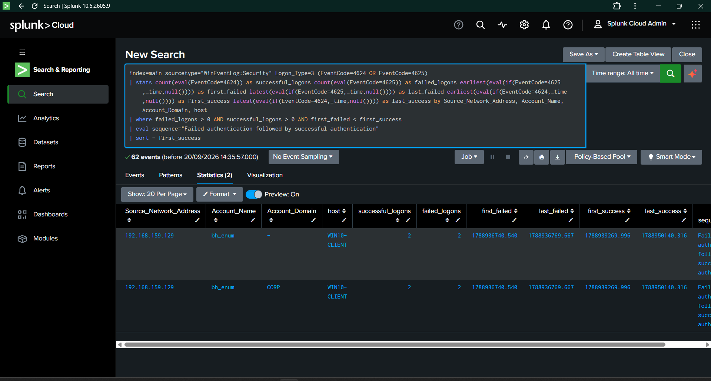
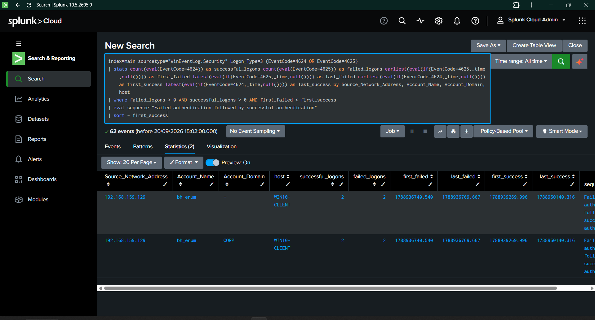

# Day 06 — Network Authentication Detection

## 1. Overview

Day 06 focused on analyzing Windows network authentication activity and developing a detection for a failed network logon followed by a successful network logon.

The detection engineering workflow covered:

- Windows Logon Type analysis
- Network Logon identification
- Event ID 4624 analysis
- Event ID 4625 analysis
- Remote authentication investigation
- Source and account correlation
- Failed-to-successful authentication sequencing
- Sigma correlation rule development
- Splunk SPL detection development
- Detection validation
- MITRE ATT&CK mapping
- Evidence-driven SOC investigation

---

## 2. Detection Objective

The primary objective was to identify authentication sequences where:

~~~
Event ID 4625
Failed Network Logon
        ↓
Same source / account context
        ↓
Event ID 4624
Successful Network Logon
~~~

The detection focuses on:

- Event ID `4625` — Failed logon
- Event ID `4624` — Successful logon
- Logon Type `3` — Network Logon
- Source Network Address
- Account Name
- Account Domain
- Host
- Authentication package
- Logon process
- Temporal ordering

---

## 3. Lab Environment

| Component | Configuration |
|---|---|
| SIEM | Splunk Cloud |
| Endpoint | Windows 10 Client |
| Endpoint Hostname | `WIN10-CLIENT` |
| Log Source | Windows Security Event Log |
| Forwarder | Splunk Universal Forwarder |
| Authentication Events | 4624 / 4625 |
| Network Logon Type | 3 |
| Primary Source | `192.168.159.129` |
| Authentication Package | NTLM |
| Logon Process | NtLmSsp |

---

## 4. Logon Type Baseline

The first stage established a baseline of Windows authentication logon types.

### Evidence

**Evidence:** `Day06-01-Logon-Type-Baseline.png`

The baseline established the available Windows authentication activity before narrowing the investigation to Network Logon events.

---

## 5. Network Logon Analysis

Network authentication activity was isolated using Logon Type `3`.

The analysis identified substantial Event ID `4624` activity, including authentication activity originating from the lab source `192.168.159.129`.

### Evidence

**Evidence:** `Day06-02-Network-Logon-Analysis.png`

The results confirmed that Network Logon telemetry was available for detection engineering.

---

## 6. Remote Network Logon Details

Individual network authentication events were examined to understand the available authentication context.

Relevant fields included:

- Account Name
- Account Domain
- Source Network Address
- Logon Type
- Authentication Package
- Logon Process
- Workstation information

### Evidence

**Evidence:** `Day06-03-Remote-Network-Logon-Details.png`

This analysis established the fields required for authentication correlation.

---

## 7. Remote Authentication Correlation

Authentication events were correlated using the source and account context.

The investigation identified network authentication activity involving:

~~~
Source Network Address: 192.168.159.129
Destination: WIN10-CLIENT
Logon Type: 3
Authentication Package: NTLM
Logon Process: NtLmSsp
~~~

### Evidence

**Evidence:** `Day06-04-Remote-Authentication-Correlation.png`

---

## 8. Network Authentication Summary

Authentication activity was summarized across source, account, domain, and host fields.

Observed accounts included:

- `pt_test`
- `bh_enum`
- `WIN10-CLIENT$`

Observed domains included:

- `CORP`
- `CORP.LOCAL`

### Evidence

**Evidence:** `Day06-05-Network-Authentication-Summary.png`

The summary provided the broader authentication context used to develop the correlation logic.

---

## 9. Network Logon Source Context

The source of the network authentication activity was investigated.

The observed source context included:

~~~
Source IP: 192.168.159.129
Source System Context: KALI
Destination: WIN10-CLIENT
Logon Type: 3
~~~

### Evidence

**Evidence:** `Day06-06-Network-Logon-Source-Context.png`

Source context is important during SOC investigation because authentication activity should be evaluated in relation to the system initiating the connection.

---

## 10. Raw Windows Security Event Validation

The underlying Windows Security event was inspected directly to validate the raw telemetry.

The raw event confirmed:

- `LogName=Security`
- `EventCode=4624`
- `TaskCategory=Logon`
- `Logon Type=3`
- Microsoft Windows security auditing
- Network authentication information

### Evidence

**Evidence:** `Day06-07-Network-Logon-Raw-Event.png`

This confirmed that the detection was based on actual Windows Security telemetry rather than only derived statistics.

---

## 11. Failed-to-Successful Authentication Sequence

The next stage correlated failed and successful Network Logon events.

The observed authentication pattern included:

~~~
Source: 192.168.159.129
Account: bh_enum
Logon Type: 3

4625 — Failed Network Logon
        ↓
4625 — Failed Network Logon
        ↓
4624 — Successful Network Logon
        ↓
4624 — Successful Network Logon
~~~

This demonstrated the temporal pattern targeted by Rule 005.

### Evidence

**Evidence:** `Day06-08-Failed-to-Successful-Authentication-Sequence.png`

---

## 12. Rule 005 Detection Logic

Rule 005 was designed as a temporal correlation between failed and successful Network Logon events.

### Supporting Rule — Failed Network Logon

~~~
Event ID: 4625
Logon Type: 3
~~~

### Supporting Rule — Successful Network Logon

~~~
Event ID: 4624
Logon Type: 3
~~~

### Correlation

~~~
Failed Network Logon
        ↓
Successful Network Logon
~~~

The correlation uses:

- `Source_Network_Address`
- `Account_Name`
- `Account_Domain`

with a defined temporal window.

---

## 13. Sigma Implementation

### Failed Network Logon

`../sigma-rules/windows/lateral-movement/windows-failed-network-logon.yml`

### Successful Network Logon

`../sigma-rules/windows/lateral-movement/windows-successful-network-logon.yml`

### Rule 005 Correlation

`../sigma-rules/windows/lateral-movement/windows-failed-to-successful-network-logon.yml`

Rule 005:

~~~
Rule ID: 5d8e7c41-4624-4f92-a105-005fa1ed0a05
Severity: Medium
Correlation Type: Temporal Ordered
Timespan: 10 minutes
~~~

---

## 14. Splunk SPL Detection

The validated Splunk detection correlated Event IDs `4624` and `4625` using Logon Type `3`.

~~~spl
index=main sourcetype="WinEventLog:Security" Logon_Type=3 (EventCode=4624 OR EventCode=4625)
| stats count(eval(EventCode=4624)) as successful_logons count(eval(EventCode=4625)) as failed_logons earliest(eval(if(EventCode=4625,_time,null()))) as first_failed latest(eval(if(EventCode=4625,_time,null()))) as last_failed earliest(eval(if(EventCode=4624,_time,null()))) as first_success latest(eval(if(EventCode=4624,_time,null()))) as last_success by Source_Network_Address, Account_Name, Account_Domain, host
| where failed_logons > 0 AND successful_logons > 0 AND first_failed < first_success
| eval sequence="Failed authentication followed by successful authentication"
| sort - first_success
~~~

The query:

1. Selects Windows Security telemetry.
2. Restricts the investigation to Network Logon activity.
3. Includes Event IDs 4624 and 4625.
4. Counts successful and failed authentications.
5. Calculates authentication timestamps.
6. Groups authentication activity by source and account context.
7. Verifies that failed authentication occurred before successful authentication.
8. Returns the correlated authentication sequence.

---

## 15. Detection Results

The final Rule 005 SPL query evaluated:

**62 authentication events**

The correlation returned:

**2 matching failed-to-successful authentication sequences**

The primary observed sequence involved:

~~~
Source Network Address: 192.168.159.129
Account: bh_enum
Host: WIN10-CLIENT
Failed Logons: 2
Successful Logons: 2
Logon Type: 3
~~~

### Evidence

**Evidence:** `Day06-09-Rule-005-Detection-Results.png`

This is the primary evidence demonstrating that the completed detection logic successfully returned matching authentication sequences.

---

## 16. Detection Validation

| Validation Area | Result |
|---|---|
| Windows Security telemetry | PASS |
| Event ID 4624 | PASS |
| Event ID 4625 | PASS |
| Logon Type 3 | PASS |
| Source identification | PASS |
| Account identification | PASS |
| Failed authentication detection | PASS |
| Successful authentication detection | PASS |
| Temporal ordering | PASS |
| Source correlation | PASS |
| Account correlation | PASS |
| Splunk detection | PASS |
| Rule 005 validation | PASS |

---

## 17. Quantified Outcomes

| Metric | Result |
|---|---:|
| Authentication events evaluated | 62 |
| Matching sequences | 2 |
| Failed logons in primary sequence | 2 |
| Successful logons in primary sequence | 2 |
| Primary source IP | `192.168.159.129` |
| Primary account | `bh_enum` |
| Endpoint | `WIN10-CLIENT` |
| Logon Type | 3 |
| Supporting Sigma rules | 2 |
| Correlation Sigma rule | 1 |
| Splunk detection | 1 |
| Evidence screenshots | 9 |

---

## 18. SOC Investigation Perspective

A failed Network Logon followed by a successful Network Logon should be treated as a detection signal requiring contextual investigation.

Potential legitimate explanations include:

- Incorrect credentials followed by a successful retry
- Automated authentication retries
- Administrative troubleshooting
- Legitimate service authentication
- Normal domain authentication activity

The same pattern may warrant additional investigation when associated with:

- Unexpected source systems
- Unusual accounts
- Multiple targeted accounts
- Abnormal authentication times
- Suspicious endpoint activity
- Other lateral-movement indicators
- Potential credential misuse

The detection therefore provides an actionable authentication correlation point rather than automatically classifying the activity as malicious.

---

## 19. MITRE ATT&CK Mapping

### T1110 — Brute Force

The detection identifies a failed network authentication followed by a successful network authentication from the same source and account context within a defined time window.

This behavior is mapped to MITRE ATT&CK T1110 because repeated authentication failures followed by a successful authentication can represent a brute-force-related authentication pattern requiring further investigation.

The detection does not by itself establish malicious activity. Analysts should review the source, account, authentication context, timing, and surrounding activity before determining the cause.

**MITRE ATT&CK Tactic:** Credential Access
---

## 20. Evidence Register

| Evidence | Purpose |
|---|---|
| `Day06-01-Logon-Type-Baseline.png` | Windows authentication logon-type baseline |
| `Day06-02-Network-Logon-Analysis.png` | Network Logon analysis |
| `Day06-03-Remote-Network-Logon-Details.png` | Individual network authentication details |
| `Day06-04-Remote-Authentication-Correlation.png` | Authentication correlation |
| `Day06-05-Network-Authentication-Summary.png` | Authentication activity summary |
| `Day06-06-Network-Logon-Source-Context.png` | Source and workstation context |
| `Day06-07-Network-Logon-Raw-Event.png` | Raw Windows Security event |
| `Day06-08-Failed-to-Successful-Authentication-Sequence.png` | Failed-to-successful authentication sequence |
| `Day06-09-Rule-005-Detection-Results.png` | Final Rule 005 detection results |

---

## 21. Repository Artifacts

### Sigma Rules

`../sigma-rules/windows/lateral-movement/windows-failed-network-logon.yml`

`../sigma-rules/windows/lateral-movement/windows-successful-network-logon.yml`

`../sigma-rules/windows/lateral-movement/windows-failed-to-successful-network-logon.yml`

### Splunk Query

`../splunk-queries/authentication/failed-to-successful-network-logon.spl`

### Validation

`../validation/rule-005-validation.md`

### Evidence

`../screenshots/Day06/`

---

## 22. Day 06 Outcome

Day 06 established a complete network authentication detection workflow:

~~~
Windows Security Telemetry
        ↓
Logon Type Analysis
        ↓
Network Logon Investigation
        ↓
Source & Account Correlation
        ↓
4625 Failed Authentication
        ↓
4624 Successful Authentication
        ↓
Temporal Correlation
        ↓
Sigma Rule
        ↓
Splunk SPL Detection
        ↓
Validation
        ↓
MITRE ATT&CK Mapping
~~~

The completed detection identified **2 matching failed-to-successful authentication sequences from 62 evaluated authentication events**, providing measurable evidence that the Rule 005 detection logic operates against the collected Windows Security telemetry.

**Day 06 Status: COMPLETE**

**Rule 005 Status: VALIDATED**