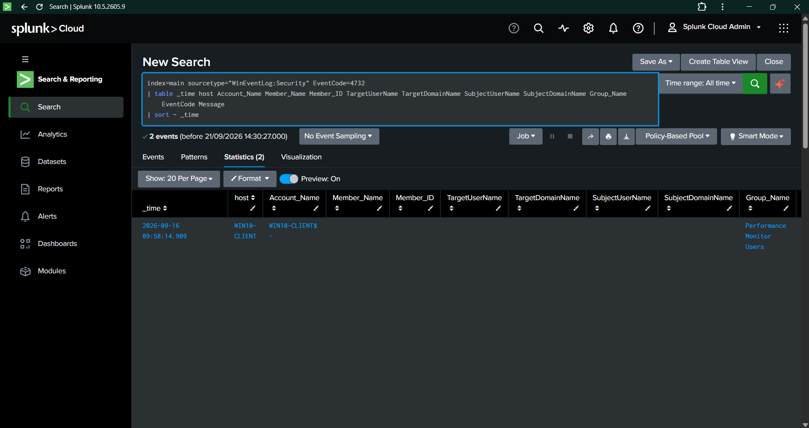
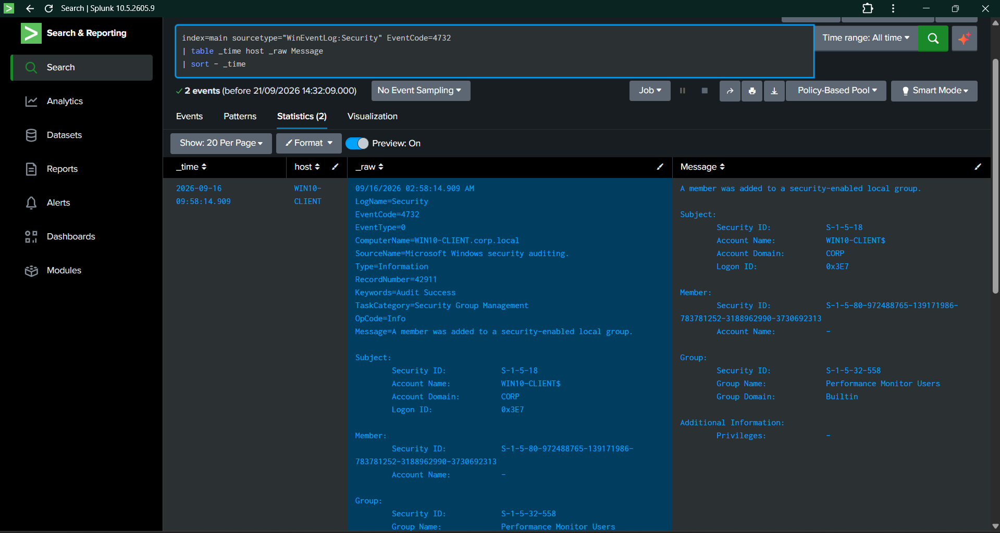
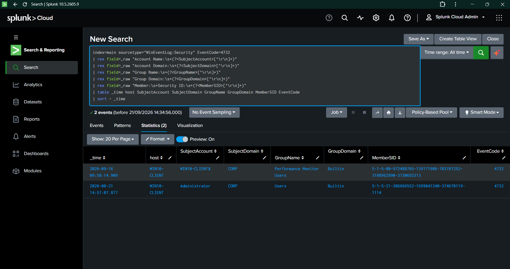
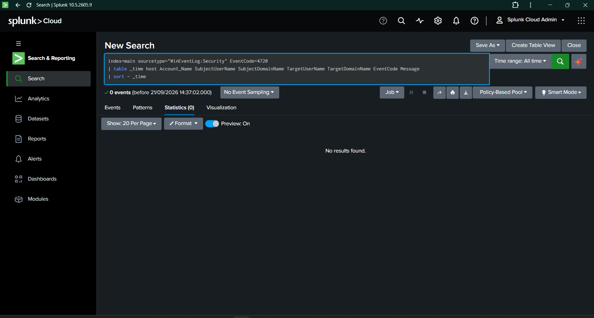
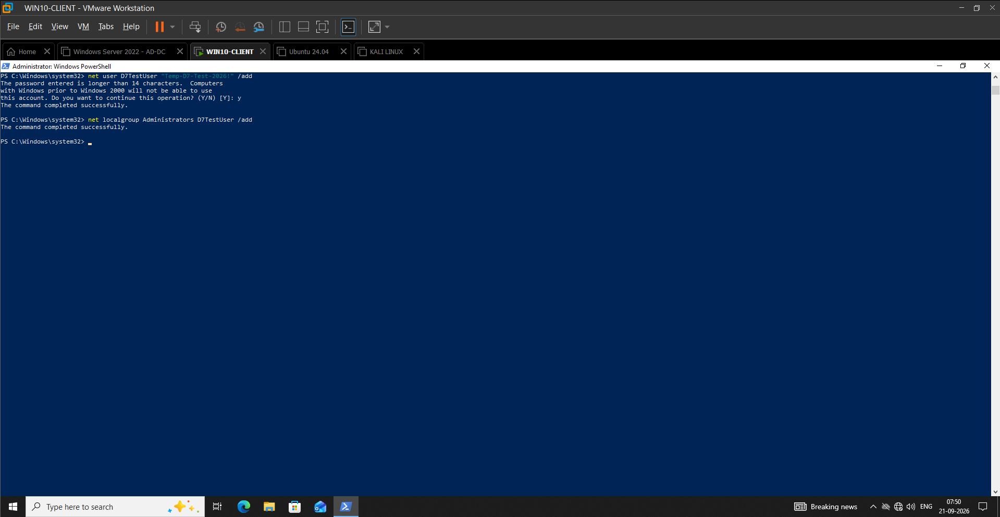
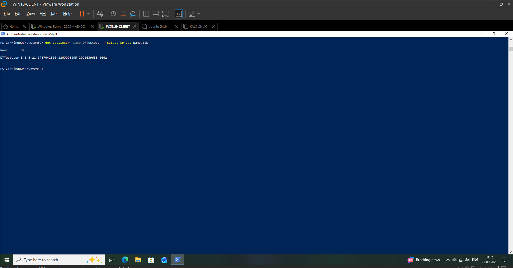
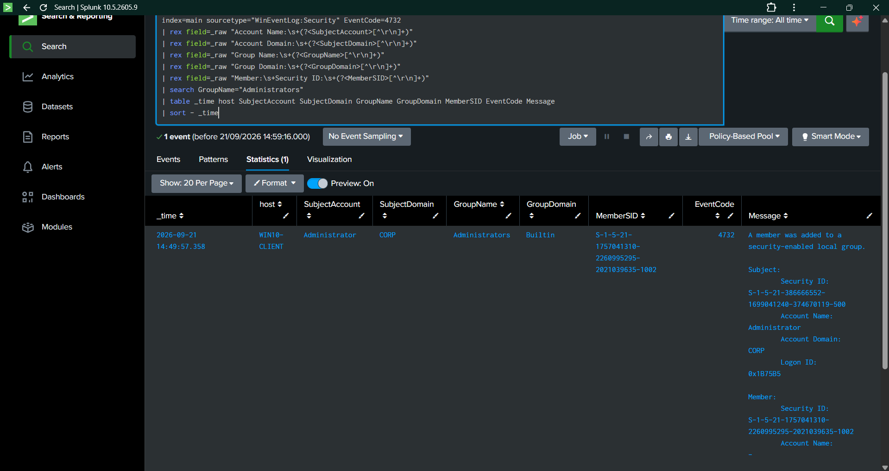
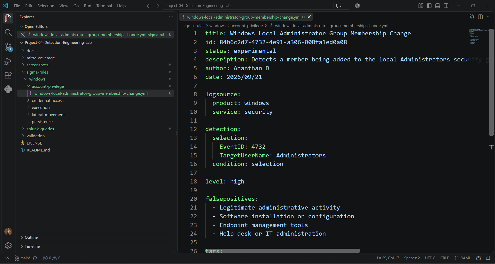

# Day 07 — Account & Privilege Activity Detection

## 1. Overview

Day 07 focused on detecting security-relevant account and privilege activity on the Windows endpoint.

The primary detection scenario was the addition of an account to the local `Administrators` group using Windows Security Event ID `4732`.

The detection was developed using a telemetry-first approach:

~~~text
Telemetry Assessment
        ↓
Event 4732 Validation
        ↓
Raw Event Analysis
        ↓
Field Extraction
        ↓
Controlled Privileged-Group Change
        ↓
SID Correlation
        ↓
Splunk SPL Detection
        ↓
Sigma Rule 006
        ↓
Detection Validation
        ↓
MITRE ATT&CK Mapping
~~~

### Environment

| Component | Value |
|---|---|
| Endpoint | `WIN10-CLIENT` |
| Operating System | Windows 10 |
| SIEM | Splunk Cloud |
| Log Source | Windows Security Event Log |
| Splunk Index | `main` |
| Sourcetype | `WinEventLog:Security` |
| Primary Event ID | `4732` |
| Detection Rule | Rule 006 |
| Detection Format | Sigma + SPL |
| Validation Date | 2026-09-21 |

---

## 2. Day 07 Objectives

The objectives were to:

- Identify account and privilege-related Windows Security telemetry.
- Determine which relevant Event IDs were actually available in Splunk.
- Analyze Event ID 4732.
- Validate the raw Windows event structure.
- Extract important fields from the raw event.
- Perform a controlled privileged-group membership change.
- Verify that Windows generated Event ID 4732.
- Confirm successful ingestion into Splunk Cloud.
- Correlate the Windows member SID with the controlled test account.
- Develop an SPL detection.
- Develop Sigma Rule 006.
- Validate the detection using controlled activity.
- Map the behavior to MITRE ATT&CK.
- Preserve reproducible evidence for the detection lifecycle.

---

## 3. Telemetry Assessment

The initial Windows Security Event ID baseline showed several account and privilege-related events.

Relevant observations included:

| Event ID | Observed Count | Relevance |
|---:|---:|---|
| 4662 | 14 | Directory/object access |
| 4672 | 1,011 | Special privileges assigned to new logon |
| 4732 | 2 | Member added to security-enabled local group |
| 4797 | 5 | Blank password query |
| 4798 | 410 | Local group membership enumeration |
| 4799 | 570 | Security-enabled local group membership enumeration |

Event ID `4732` was selected because it provided a directly observable local group membership change that could be safely validated in the lab.

### Evidence

---

## 4. Event ID 4732 Raw Event Analysis

The existing Event ID 4732 events were inspected at the raw-event level before creating the detection.

The raw event contained security-relevant information including:

- Event ID
- Subject account
- Subject domain
- Member Security ID
- Group Security ID
- Group name
- Group domain
- Event message
- Host information

The initial Splunk field extraction did not expose all of these fields directly.

Therefore, the raw event was used as the authoritative source for developing the field extraction logic.

### Evidence

---

## 5. Field Extraction

The required fields were extracted from `_raw` using SPL `rex`.

The extracted fields were:

- `SubjectAccount`
- `SubjectDomain`
- `GroupName`
- `GroupDomain`
- `MemberSID`

### Extraction Logic

~~~spl
| rex field=_raw "Account Name:\s+(?<SubjectAccount>[^\r\n]+)"
| rex field=_raw "Account Domain:\s+(?<SubjectDomain>[^\r\n]+)"
| rex field=_raw "Group Name:\s+(?<GroupName>[^\r\n]+)"
| rex field=_raw "Group Domain:\s+(?<GroupDomain>[^\r\n]+)"
| rex field=_raw "Member:\s+Security ID:\s+(?<MemberSID>[^\r\n]+)"
~~~

The extraction successfully returned structured values from the Windows Security events.

### Evidence

---

## 6. Account Creation Telemetry Assessment

Event ID `4720` was also checked to determine whether Windows user-account creation telemetry was available.

The search returned:

**0 events**

Because the telemetry was not present in the collected dataset, an account-creation detection was not developed.

The project instead focused on the verified Event ID 4732 telemetry.

This demonstrates a telemetry-driven approach in which detection scenarios are selected based on available and validated data rather than assumed event availability.

### Evidence

---

## 7. Controlled Privileged-Group Validation

A controlled test account was created on `WIN10-CLIENT`:

`D7TestUser`

The account was then added to the local:

`Administrators`

group.

The activity was intentionally generated for detection validation in the isolated lab environment.

### Controlled Test

~~~powershell
net user D7TestUser "Temp-D7-Test-2026!" /add

net localgroup Administrators D7TestUser /add
~~~

Both operations completed successfully.

### Evidence

---

## 8. SID Correlation

The Windows 4732 event did not expose the controlled account name directly in the Member Account Name field.

Instead, Windows recorded the member's Security Identifier.

The SID for `D7TestUser` was retrieved from Windows:

~~~powershell
Get-LocalUser -Name D7TestUser | Select-Object Name,SID
~~~

The resulting SID was:

~~~text
D7TestUser
S-1-5-21-1757041310-2260995295-2021039635-1002
~~~

The same SID appeared in the Member field of the corresponding Event ID 4732 in Splunk.

### Correlation Chain

~~~text
D7TestUser
    ↓
S-1-5-21-1757041310-2260995295-2021039635-1002
    ↓
Windows Security Event 4732
    ↓
Administrators Group
    ↓
Splunk Detection
~~~

### Evidence

---

## 9. Event ID 4732 Detection

After the controlled group membership change, the corresponding Windows Security event was successfully ingested into Splunk Cloud.

Observed values included:

| Field | Observed Value |
|---|---|
| Event ID | `4732` |
| Host | `WIN10-CLIENT` |
| Subject Account | `Administrator` |
| Subject Domain | `CORP` |
| Group Name | `Administrators` |
| Group Domain | `Builtin` |
| Member SID | `S-1-5-21-1757041310-2260995295-2021039635-1002` |
| Event Message | A member was added to a security-enabled local group |
| Event Time | `2026-09-21 14:49:57.358` |

### Evidence

---

## 10. SPL Detection Implementation

The validated SPL detection was created at:

`../splunk-queries/account-privilege/local-administrator-group-membership-change.spl`

### Detection Logic

~~~spl
index=main sourcetype="WinEventLog:Security" EventCode=4732
| rex field=_raw "Account Name:\s+(?<SubjectAccount>[^\r\n]+)"
| rex field=_raw "Account Domain:\s+(?<SubjectDomain>[^\r\n]+)"
| rex field=_raw "Group Name:\s+(?<GroupName>[^\r\n]+)"
| rex field=_raw "Group Domain:\s+(?<GroupDomain>[^\r\n]+)"
| rex field=_raw "Member:\s+Security ID:\s+(?<MemberSID>[^\r\n]+)"
| search GroupName="Administrators"
| eval Detection="Local Administrator Group Membership Change"
| table _time host SubjectAccount SubjectDomain GroupName GroupDomain MemberSID EventCode Detection
| sort - _time
~~~

The query returned the controlled Event ID 4732 event.

### Detection Result

The detection identified:

- `WIN10-CLIENT`
- `Administrator`
- `CORP`
- `Administrators`
- `Builtin`
- Controlled test account SID
- Event ID `4732`
- Detection: `Local Administrator Group Membership Change`

### Quantified Result

**1 controlled privileged-group change → 1 matching SPL detection**

**Detection rate: 100%**

---

## 11. Sigma Rule 006

The Sigma detection rule was created at:

`../sigma-rules/windows/account-privilege/windows-local-administrator-group-membership-change.yml`

### Rule Details

| Attribute | Value |
|---|---|
| Rule | Windows Local Administrator Group Membership Change |
| Rule ID | `84b6c2d7-4732-4e91-a306-008fa1ed0a08` |
| Status | Experimental |
| Event ID | `4732` |
| Target Group | `Administrators` |
| Severity | High |
| Log Source | Windows Security |
| Platform | Windows |

### Sigma Detection Logic

~~~yaml
detection:
  selection:
    EventID: 4732
    TargetUserName: Administrators
  condition: selection
~~~

The Sigma rule represents the normalized Windows detection logic.

The Splunk implementation uses the extracted `GroupName` field because the Windows event fields were not fully exposed through the default Splunk extraction.

### Evidence

---

## 12. Detection Validation

The complete detection chain was validated using the controlled test.

| Validation Stage | Expected Result | Actual Result | Status |
|---|---|---|---|
| Event 4732 availability | Event present | 2 baseline events observed | PASS |
| Test account creation | Account created | `D7TestUser` created | PASS |
| Group modification | Account added to Administrators | Successful | PASS |
| Windows telemetry | Event 4732 generated | Confirmed | PASS |
| Splunk ingestion | Event searchable | Confirmed | PASS |
| Group identification | Administrators identified | Confirmed | PASS |
| SID correlation | Test SID matches event | Confirmed | PASS |
| SPL detection | Controlled event detected | 1 detection | PASS |
| Sigma implementation | Rule created | Rule 006 created | PASS |

---

## 13. Quantified Outcomes

Day 07 produced the following measurable outcomes:

- **2** baseline Event ID 4732 events observed before controlled testing
- **1** temporary validation account created
- **1** controlled privileged-group membership change
- **1** Event ID 4732 generated by the controlled change
- **1** matching SPL detection
- **1** Sigma rule created
- **100%** detection rate for the controlled validation event
- **8** documented evidence screenshots
- **1** MITRE ATT&CK sub-technique mapped

### Detection Chain

~~~text
1 Controlled Privileged-Group Change
                ↓
1 Windows Event ID 4732
                ↓
1 Splunk Detection
                ↓
1 Sigma Rule
                ↓
100% Controlled-Test Detection
~~~

---

## 14. SOC Investigation Perspective

An addition to the local `Administrators` group is a security-relevant account-management event.

The detection provides useful investigation context including:

- Timestamp
- Host
- Subject account
- Subject domain
- Target group
- Group domain
- Member SID
- Windows Event ID

An analyst investigating an alert should determine:

1. Which account performed the group membership change?
2. Which account or SID was added?
3. Was the change authorized?
4. Was the target account expected to receive administrative privileges?
5. Was the activity associated with legitimate IT administration?
6. Were there related authentication events around the same timestamp?
7. Were there related process-creation or command-line events?
8. Was the privilege change temporary or persistent?

The detection therefore provides an investigation starting point rather than automatically classifying the activity as malicious.

---

## 15. False-Positive Considerations

Legitimate administrative operations can generate Event ID 4732.

Potential benign activity includes:

- Authorized IT administration
- Endpoint management
- Software installation
- System configuration
- Help-desk activity
- Administrative troubleshooting

Potential tuning approaches include:

- Allowlisting approved administrative accounts.
- Allowlisting known endpoint-management systems.
- Monitoring changes outside approved maintenance windows.
- Prioritizing additions to high-value groups.
- Correlating the group change with process and authentication telemetry.
- Investigating unexpected subjects or unusual source context.

The detection should therefore be treated as a high-value investigation signal rather than an automatic declaration of malicious activity.

---

## 16. MITRE ATT&CK Mapping

### T1098.007 — Account Manipulation: Additional Local or Domain Groups

**Tactic:** Persistence / Privilege Escalation

The validated behavior involved adding an account to the local `Administrators` group.

This behavior is consistent with the ATT&CK sub-technique covering additional local or domain group membership. The mapping is based on the observed behavior rather than the intent of the controlled lab activity.

### Observed Lab Behavior

~~~text
D7TestUser
     ↓
Added to local Administrators group
     ↓
Windows Event ID 4732
     ↓
Detection Rule 006
~~~

The controlled activity itself was intentionally generated for detection validation and was not treated as malicious.

---

## 17. Evidence Register

All Day 07 evidence is stored under:

`../screenshots/Day07/`

| Evidence | Purpose |
|---|---|
| `Day07-01-Local-Group-Membership-Change.png` | Event 4732 baseline |
| `Day07-02-Local-Group-Membership-Raw-Event.png` | Raw Event 4732 analysis |
| `Day07-03-Local-Group-Field-Extraction.png` | SPL field extraction |
| `Day07-04-User-Account-Creation-Baseline.png` | Event 4720 telemetry assessment |
| `Day07-05-Privileged-Group-Change-Test.png` | Controlled group membership test |
| `Day07-06-Test-Account-SID-Correlation.png` | SID-to-account correlation |
| `Day07-07-Administrators-Group-Detection.png` | Validated Splunk detection |
| `Day07-08-Local-Administrator-Sigma-Rule.png` | Sigma Rule 006 implementation |

---

## 18. Repository Artifacts

### Sigma Rule

`../sigma-rules/windows/account-privilege/windows-local-administrator-group-membership-change.yml`

### SPL Query

`../splunk-queries/account-privilege/local-administrator-group-membership-change.spl`

### Validation Report

`../validation/rule-006-validation.md`

### MITRE Coverage

`day07-account-privilege-detection.md`

### Evidence

`../screenshots/Day07/`

---

## 19. Detection Engineering Skills Demonstrated

Day 07 demonstrates the following practical SOC and detection-engineering capabilities:

- Windows Security Event analysis
- Security Event ID 4732 investigation
- Windows account and privilege monitoring
- Splunk Cloud investigation
- Raw event analysis
- SPL field extraction with `rex`
- Detection query development
- Sigma rule development
- Controlled security-event generation
- Detection validation
- SID correlation
- False-positive analysis
- MITRE ATT&CK mapping
- Evidence-driven documentation
- Telemetry-driven detection engineering
- SOC investigation methodology

---

## 20. Day 07 Outcome

Day 07 successfully added **account and privilege activity detection** to the Detection Engineering Lab.

The project moved from simply identifying Windows security events to demonstrating a complete detection lifecycle:

~~~text
Identify Available Telemetry
        ↓
Analyze Windows Security Event
        ↓
Extract Detection-Relevant Fields
        ↓
Generate Controlled Security Activity
        ↓
Validate Windows Telemetry
        ↓
Validate Splunk Ingestion
        ↓
Correlate Account Identity
        ↓
Develop SPL Detection
        ↓
Develop Sigma Rule
        ↓
Validate Detection
        ↓
Map to MITRE ATT&CK
        ↓
Document Evidence
~~~

The final controlled validation demonstrated:

**1 privileged-group membership change → 1 Windows Event 4732 → 1 Splunk detection**

with a **100% detection rate for the controlled validation event**.

**Day 07 — Account & Privilege Activity Detection: COMPLETE**