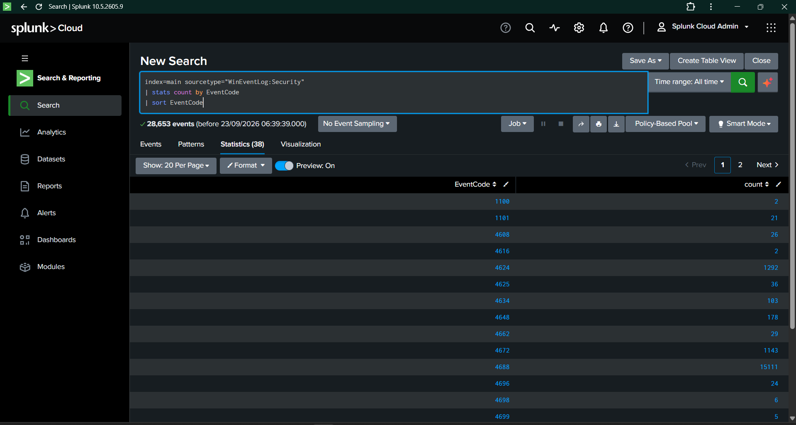
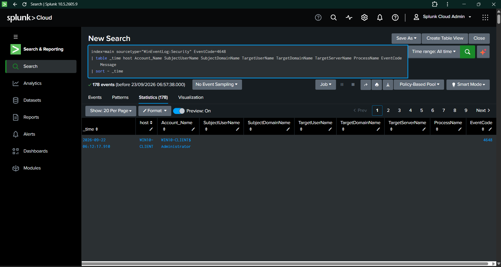
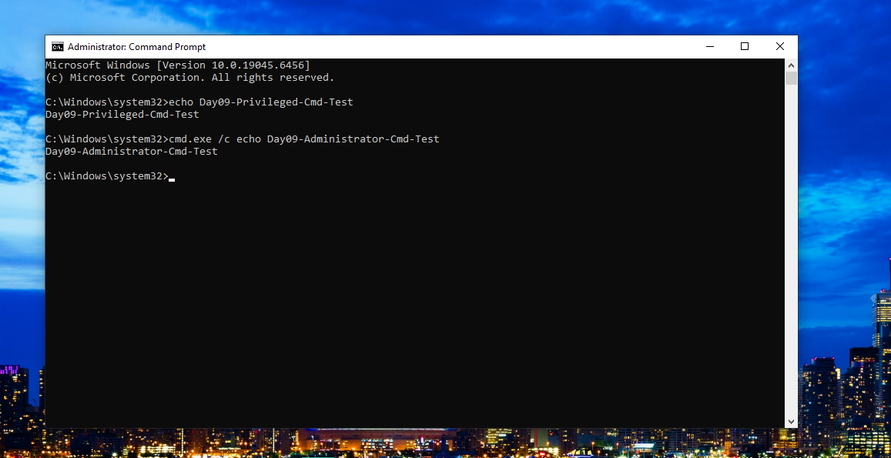
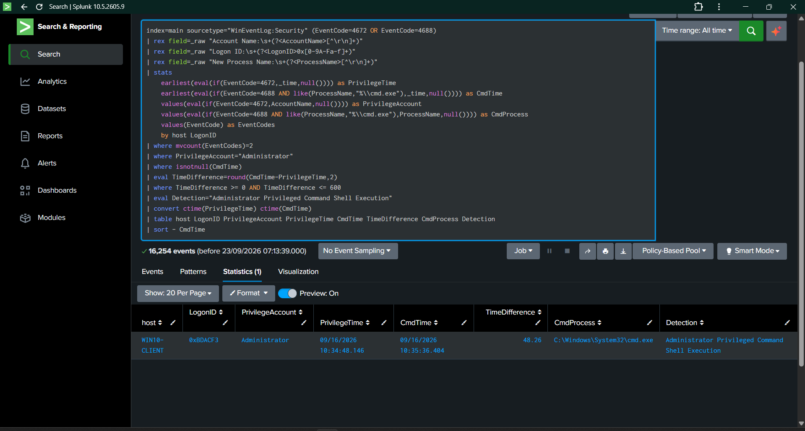
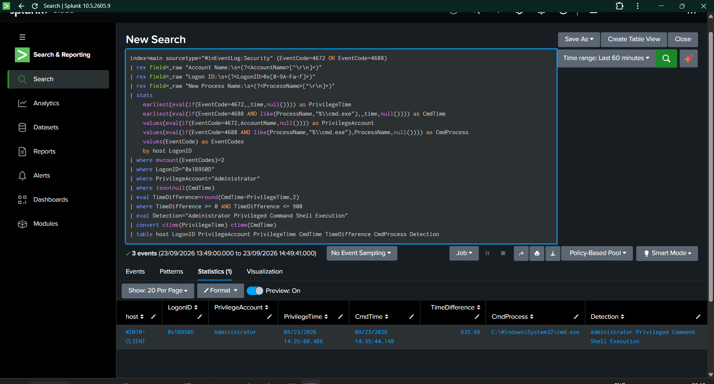

# Rule 008 Validation — Administrator Privileged Command Shell Execution

## 1. Detection Overview

**Rule ID:** Rule 008  
**Detection Name:** Windows Administrator Privileged Command Shell Execution  
**Detection Type:** Multi-event correlation  
**Platform:** Windows 10  
**SIEM:** Splunk Cloud  
**Log Source:** Windows Security Event Log  
**Primary Event IDs:** 4672, 4688  
**MITRE ATT&CK:** T1059.003 — Windows Command Shell  
**Severity:** High  
**Validation Status:** Validated

This detection identifies a Windows Administrator privileged session followed by execution of `cmd.exe` within the same Windows logon context.

The detection correlates:

- **Event ID 4672** — Special privileges assigned to a new logon
- **Event ID 4688** — Process creation
- **Process:** `C:\Windows\System32\cmd.exe`
- **Account:** `Administrator`
- **Correlation key:** Windows Logon ID
- **Correlation window:** 15 minutes

---

## 2. Detection Objective

The objective of Rule 008 is to identify command-shell execution occurring within an Administrator privileged session.

The detection focuses on the relationship between privileged authentication context and subsequent command-shell execution rather than detecting `cmd.exe` execution alone.

### Detection Logic

~~~text
Event ID 4672
Administrator receives special privileges
        ↓
Same Windows Logon ID
        ↓
Event ID 4688
cmd.exe process creation
        ↓
Detection: Administrator Privileged Command Shell Execution
~~~

This correlation provides additional context compared with a standalone process-creation rule.

---

## 3. Detection Artifacts

### Sigma Rules

Supporting rule:

~~~text
sigma-rules/windows/execution/windows-administrator-special-privileges.yml
~~~

Supporting rule:

~~~text
sigma-rules/windows/execution/windows-administrator-command-shell.yml
~~~

Primary Rule 008:

~~~text
sigma-rules/windows/execution/windows-administrator-privileged-command-shell.yml
~~~

### Splunk Query

~~~text
splunk-queries/correlation/administrator-privileged-command-shell.spl
~~~

---

## 4. Validation Methodology

Validation was performed using a controlled Windows 10 laboratory environment.

The validation process consisted of:

1. Establishing a Windows Security Event baseline.
2. Investigating available authentication and process telemetry.
3. Identifying Event ID 4672 privileged-session activity.
4. Identifying Event ID 4688 process-creation telemetry.
5. Correlating events using the Windows Logon ID.
6. Performing controlled Administrator command-shell activity.
7. Confirming the resulting `cmd.exe` Event ID 4688.
8. Correlating the controlled 4672 and 4688 events.
9. Confirming the final Splunk detection result.

---

## 5. Evidence

### Evidence 01 — Windows Security Event Baseline

**File:** `Day09-01-Security-Event-Baseline.png`

This evidence establishes the Windows Security Event Log baseline used during the Day 09 detection-engineering investigation.

---

### Evidence 02 — Explicit Credential Telemetry Investigation

**File:** `Day09-02-Explicit-Credential-Use-Baseline.png`

This evidence documents an alternative telemetry path investigated during detection development.

The Explicit Credential Use approach was evaluated but was not selected as the final Day 09 detection because the observed relationships produced excessive normal Windows authentication activity.

This evidence is retained to demonstrate a telemetry-driven detection engineering process.

> This evidence is investigative context and is **not part of the final Rule 008 detection logic**.

---

### Evidence 03 — Controlled Privileged Command Shell Test

**File:** `Day09-03-Privileged-Command-Shell-Test.png`

A controlled and benign command-shell activity was performed from an Administrator Command Prompt.

The test command was:

~~~cmd
cmd.exe /c echo Day09-Administrator-Cmd-Test
~~~

The activity generated Windows process-creation telemetry without modifying system configuration or establishing persistence.

---

### Evidence 04 — Privileged Command Shell Correlation

**File:** `Day09-04-Privileged-Command-Shell-Correlation.png`

This evidence demonstrates an existing Administrator privileged session correlated with subsequent `cmd.exe` execution using the same Windows Logon ID.

Observed correlation:

~~~text
Host:              WIN10-CLIENT
Account:           Administrator
Logon ID:          0xBDACF3
Privilege Event:   Event ID 4672
Process Event:     Event ID 4688
Process:           C:\Windows\System32\cmd.exe
Time Difference:   5.76 seconds
~~~

This provides baseline evidence that the 4672 → 4688 correlation pattern exists in the collected Windows Security telemetry.

---

### Evidence 05 — Controlled Detection Result

**File:** `Day09-05-Controlled-Privileged-Cmd-Detection.png`

The controlled validation produced a matching Administrator privileged-session and `cmd.exe` execution sequence.

Observed result:

~~~text
Host:              WIN10-CLIENT
Logon ID:          0x1B950D
Privileged Account: Administrator
Privilege Event:   4672
Privilege Time:    2026-09-23 14:25:08.486
Process Event:     4688
Process:           C:\Windows\System32\cmd.exe
Command Time:      2026-09-23 14:35:44.148
Time Difference:   635.66 seconds
Detection:         Administrator Privileged Command Shell Execution
~~~

The 635.66-second interval falls within the 15-minute validation window.

---

## 6. Validation Result

| Validation Metric | Result |
|---|---:|
| Controlled privileged session | 1 |
| Event ID 4672 observed | 1 |
| Event ID 4688 observed | 1 |
| `cmd.exe` execution observed | 1 |
| Matching Logon ID | 1 |
| Detection matches | 1 |
| Validation success rate | 100% |
| False negative during controlled test | 0 |

### Validation Calculation

~~~text
Detection Success Rate =
Matching Detection Events / Controlled Test Events × 100

= 1 / 1 × 100

= 100%
~~~

The controlled activity was successfully correlated from Event ID 4672 to Event ID 4688 using the same Windows Logon ID.

---

## 7. Detection Query

The validated Splunk detection uses the following logic:

~~~spl
index=main sourcetype="WinEventLog:Security" (EventCode=4672 OR EventCode=4688)
| rex field=_raw "Account Name:\s+(?<AccountName>[^\r\n]+)"
| rex field=_raw "Logon ID:\s+(?<LogonID>0x[0-9A-Fa-f]+)"
| rex field=_raw "New Process Name:\s+(?<ProcessName>[^\r\n]+)"
| stats
    earliest(eval(if(EventCode=4672,_time,null()))) as PrivilegeTime
    earliest(eval(if(EventCode=4688 AND like(ProcessName,"%\\cmd.exe"),_time,null()))) as CmdTime
    values(eval(if(EventCode=4672,AccountName,null()))) as PrivilegeAccount
    values(eval(if(EventCode=4688 AND like(ProcessName,"%\\cmd.exe"),ProcessName,null()))) as CmdProcess
    values(EventCode) as EventCodes
    by host LogonID
| where mvcount(EventCodes)=2
| where PrivilegeAccount="Administrator"
| where isnotnull(CmdTime)
| eval TimeDifference=round(CmdTime-PrivilegeTime,2)
| where TimeDifference >= 0 AND TimeDifference <= 900
| eval Detection="Administrator Privileged Command Shell Execution"
| convert ctime(PrivilegeTime) ctime(CmdTime)
| table host LogonID PrivilegeAccount PrivilegeTime CmdTime TimeDifference CmdProcess Detection
| sort - CmdTime
~~~

---

## 8. Detection Conditions

The detection requires all of the following:

- Windows Security Event ID `4672` is present.
- The privileged account is `Administrator`.
- Windows Security Event ID `4688` is present.
- The created process is `cmd.exe`.
- Both events share the same Windows Logon ID.
- The command-shell execution occurs within the configured 15-minute correlation window.

This reduces the context loss associated with detecting every `cmd.exe` execution independently.

---

## 9. False Positive Analysis

Potential legitimate activity includes:

- Authorized Administrator command-line administration
- IT support activity
- Endpoint troubleshooting
- Software deployment
- System maintenance
- Administrative scripts

The detection therefore provides a **high-priority investigation signal**, rather than treating every Administrator `cmd.exe` execution as malicious.

SOC analysts should investigate the surrounding:

- User activity
- Process ancestry
- Command-line arguments
- Authentication events
- Host context
- Administrative change activity
- Related security events

---

## 10. MITRE ATT&CK Mapping

**Technique:** T1059.003 — Windows Command Shell

**Tactic:** Execution

The detection identifies Windows Command Shell execution in the context of an Administrator privileged session.

The privileged-session context is used to strengthen the process-execution signal rather than claiming that the Administrator activity itself is malicious.

---

## 11. Detection Engineering Outcome

Rule 008 demonstrates a multi-event correlation workflow using native Windows Security telemetry.

The project validated the complete detection lifecycle:

~~~text
Telemetry Baseline
      ↓
Event Analysis
      ↓
Detection Scenario Selection
      ↓
Controlled Activity
      ↓
Event 4672 Collection
      ↓
Event 4688 Collection
      ↓
Logon ID Correlation
      ↓
Splunk Detection
      ↓
Evidence Validation
~~~

### Quantified Outcome

- **2 Windows Security Event IDs correlated**
- **1 controlled Administrator session validated**
- **1 `cmd.exe` execution detected**
- **1 matching Logon ID correlation**
- **100% controlled validation success**
- **15-minute detection correlation window**
- **1 primary Rule 008 detection**
- **2 supporting Sigma rules**
- **1 Splunk correlation query**

---

## 12. Repository Evidence

~~~text
sigma-rules/
└── windows/
    └── execution/
        ├── windows-administrator-special-privileges.yml
        ├── windows-administrator-command-shell.yml
        └── windows-administrator-privileged-command-shell.yml

splunk-queries/
└── correlation/
    └── administrator-privileged-command-shell.spl

validation/
└── rule-008-validation.md

screenshots/
└── Day09/
    ├── Day09-01-Security-Event-Baseline.png
    ├── Day09-02-Explicit-Credential-Use-Baseline.png
    ├── Day09-03-Privileged-Command-Shell-Test.png
    ├── Day09-04-Privileged-Command-Shell-Correlation.png
    └── Day09-05-Controlled-Privileged-Cmd-Detection.png
~~~

---

## 13. Final Validation Status

**Rule 008 — Windows Administrator Privileged Command Shell Execution**

**Status: VALIDATED**

The detection successfully correlated Windows Event ID 4672 privileged-session activity with Event ID 4688 `cmd.exe` process creation using the same Windows Logon ID and successfully detected the controlled validation activity.

